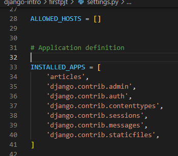
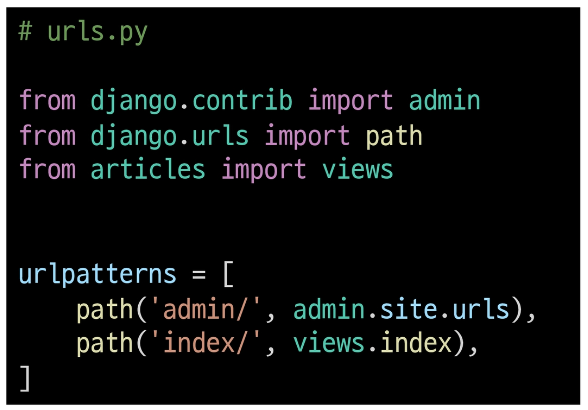
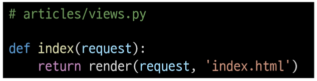
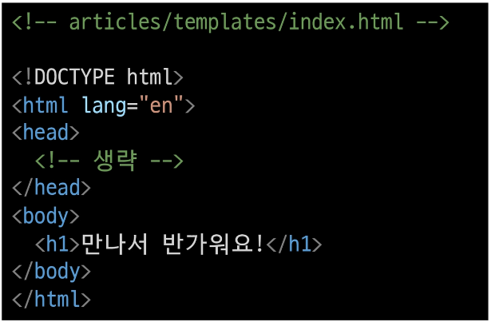
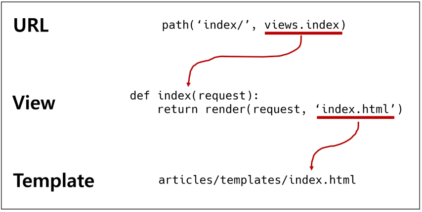
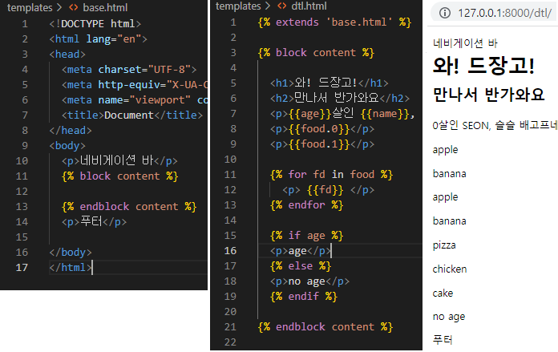

# Django

---

웹 서비스 개발에 필요한 

- 로그인, 로그아웃

- 회원관리, 데이터베이스

- 서버, 클라이언트

- 보안 등  
  을 제공하는 프레임워크 중 하나 (파이썬 기반 클래스 모음)


### ◆ 프레임워크(Framework)란?

- 규격화된 웹서비스의 틀

- 서비스 개발에 필요한 기능들을 미리 구현해서 모아놓은 것
  
  - 특정 프로그램을 개발하기 위한 여러 도구들과 규약을 제공

- 로직에만 집중할 수 있게 해주므로, 소프트웨어의 생산성과 품질을 높임


### ◆ 장고 사용 이점

- 파이썬 프레임워크 : 거대한 커뮤니티

- 유용한 기능들이 많음

- 검증된 웹 프레임워크임
  
  - 화해, Toss, 두나무, 당근마켓, 요기요, 인스타그램 등
    

---

### ◆ 클라이언트와 서버

- 클라이언트가 요청하고, 서버가 그에 응답한다.

- 클라이언트
  
  - 웹 사용자의 인터넷에 연결된 장치
  
  - 서비스를 요청하는 주체

- 서버
  
  - 웹페이지, 사이트 또는 앱을 저장하는 컴퓨터
  
  - 요청에 대해 서비스를 응답하는 주체

- **장고는 서버를 구현하는 웹 프레임워크**

---

### ◆ 웹브라우저와 웹페이지

- 웹 브라우저 
  
  - 페이지를 찾아 보여주고 하이퍼 링크로 다른 페이지로 이동
  
  - 웹 페이지 파일을 우리가 보는 화면을 바꿔주는 렌더링 프로그램

- 웹 페이지
  
  - 웹에 있는 문서
  
  - 정적 웹페이지와 동적 웹페이지

#### ◈ 동적 웹페이지

- 사용자의 요청에 따라 웹페이지에 추가적인 수정이 되어 클라이언트에 전달되는 웹페이지

- 서버가 웹페이지 내용을 바꿔줌

- 서버 사이드 프로그래밍 언어로 파일 처리, 데이터베이스 상호작용 등을 수행

---

---

## 디자인 패턴

- 각기 다른 기능을 가진 다양한 응용 소프트웨어를 개발할 때 생기는 공통적인 설계 문제를 해결하는 해결책 사이의 공통점, 유사점을 패턴이라고 함

- 특정 문맥에서 공통적으로 발생하는 문제에 대해 재사용 가능한 해결책을 제시

- 커뮤니케이션의 효율성을 높임


### ◆ :boom:MTV 패턴:boom:

- 장고의 디자인 패턴으로, MVC 디자인 패턴을 조금 변형한 패턴

- Model - Template(View) - View(Controller)   << 괄호 안은 MTC에서의 명칭
  
  - 데이터 및 논리제어 구현
  
  - 하나의 큰 프로그램을 세 가지 역할로 구분한 개발 방법론
    
    - 모델 : 데이터 관련된 로직 처리
    
    - 템플릿 : 레이아웃과 화면 처리
    
    - 뷰 : 명령을 모델과 뷰 부분으로 연결

- 각 부분을 독립적으로 개발할 수 있어, 하나를 수정할 때 전체를 건들지 않아도 됨
  
  - 개발 효율성 및 유지보수 쉬워짐
  
  - 다수의 멤버로 개발하기 용이
  
  - 더 나은 업무의 분리와 향상된 관리 제공

- ### 모델
  
  - MVC 패턴의 모델의 역할에 해당
  
  - 데이터와 관련된 로직을 관리
  
  - 응용프로그램의 데이터 구조를 정의하고 데이터베이스의 기록을 관리

- ### 템플릿
  
  - MVC 패턴의 View의 역할에 해당
  
  - 레이아웃과 화면을 처리
  
  - 화면상의 사용자 인터페이스 구조와 레이아웃을 정의

- ### 뷰
  
  - MVC 패턴의 Controller의 역할에 해당
  
  - 모델의 데이터를 받아와서 가공한 뒤, 템플릿에 반환한다.


---

---

## ◆ 파이썬 가상환경 구축

- 가상환경 생성
  
  - `python -m venv 가상환경이름`

- 활성화
  
  - `source 가상환경이름/Scripts/activate` 

## ◆ Django 설치

- 설치
  
  - `pip install django==3.2.13`

- 패키지 목록 생성
  
  - `pip freeze > requirements.txt`

- 프로젝트 생성
  
  - `django-admin startproject firstpjt .`
    
    - 프로젝트 이름에는 하이픈(-)이나 파이썬과 장고의 예약어는 사용불가
    
    - .을 붙이지 않으면 현재 디렉토리에 프로젝트 디렉토리를 새로 만듦

- 서버 실행
  
  - `python manage.py runserver`
  
  - ctrl + c로 서버에서 나갈 수 있음


#### ◈ 프로젝트의 구조

- `__init__.py` : 파이썬에게 이 디렉토리를 하나의 파이썬 패키지로 다루도록 지시

- `asgi.py` : Asynchronous Server Gateway Interface로, 추후 배포시에 사용함
  
  - 장고 애플리케이션이 비동기식 웹 서버와 연결 및 소통하는 것을 도움

- `settings.py` : 장고 프로젝트 설정 관리

- `urls.py` : 사이트와 url과 적절한 views와의 연결을 지정

- `wsgi.py` : Web Server Gateway Interface로, 추후 배포시에 사용함
  
  - 장고 애플리케이션이 웹서버와 연결 및 소통하는 것을 도움

- `manage.py` : 명령어들 모음


## ◆ 프로젝트 & 애플리케이션 생성

프로젝트는 앱의 집합

앱은 실제 요청을 처리하고 페이지를 보여주는 등의 역할 담당

- 프로젝트 생성
  
  - `django-admin startproject firstpjt .`

- 애플리케이션 생성
  
  - `python manage.py startapp articles`
    
    - 애플리케이션 이름은 **복수형**으로 작성하는 것을 권장

#### ◈ 애플리케이션의 구조

- `admin.py` : 관리자용 페이지를 설정하는 곳

- `apps.py` : 앱의 정보가 작성된 곳. 디폴트 값으로 사용

- `models.py` : 모델(데이터를 어떻게 다룰 것인지)을 정의

- `tests.py` : 프로젝트의 테스트 코드를 작성하는 곳

- `views.py` : view 함수들이 정의되는 곳


※ 프로젝트에서 앱을 사용하기 위해서는 반드시 INSTALLED_APPS 리스트에 반드시 추가해 줘야 함

- **반드시 생성 후 등록할 것**

(리스트 형식:  ',' 빼먹지 않도록 유의)

우리가 만든 앱을 위에, 서드파티, 내장을 아래에


---

# ◆ 요청과 응답

- URL > VIEW > TEMPLATE 순의 작성 순서로 코드 작성해보고 데이터의 흐름을 이해

- ### URLs
  
  
  
  - `articles`는 애플리케이션 이름(가변)
  
  - `'index/'`는 웹 페이지 주소(가변)
  
  - `views.index` : 애플리케이션의 views.py 안의 index라는 함수(가변)

- ### Views



- render()
  
  - `render(request, template_name, context)`
  
  - 주어진 템플릿을 주어진 컨텍스트 데이터와 결합하고 렌더링 된 텍스트와 함께 HttpResponse(응답) 객체를 반환하는 함수
    
    - request : 응답을 생성하는데 사용되는 요청객체
    
    - template_name :  템플릿의 전체 이름 또는 템플릿 이름의 경로
    
    - context : 템플릿에서 사용할 데이터(딕셔너리 타입)


- ### Templates



- 애플리케이션 폴더에 templates 폴더를 또 만들고 템플릿 html 파일을 넣는다.

- `<a href = '/index/'>처음으로</a>` 같이 하이퍼링크도 넣을 수 있음


# 코드 작성 순서

- `데이터의 흐름 순서`




### ※ 추가 설정 (settings.py)

- LANGUAGE_CODE를 바꾸는 것으로 번역 변경 가능(한글은 'ko-kr')

- TIME_ZONE을 바꾸는 것으로 시간대 변경(서울은 'Asia/Seoul')


---

# 장고 템플릿

 `데이터 표현을 제어하는 도구이자 표현에 관련된 로직`

- 장고 템플릿을 이용한 HTML 정적 부분과 동적 콘텐츠 부분 삽입

- 데이터 표현을 제어하는 도구이자 표현에 관련된 로직 담당

#### ◈ DTL(Django Template Language)

- 장고 템플릿에서 사용하는 built-int template system.

- 조건, 바녹, 변수 치환, 필터 등의 기능
  
  - Python과 비슷한 구조로 돌아가나, **Python 코드로 실행되는 건 아님**

- 프로그래밍적 로직이 아니라 프레젠테이션을 표현하기 위한 것

▣ DTL Syntax

1. #### Variable
   
   - `{{variable}}`
   
   - 변수명은 영어, 숫자와 밑줄(\_)의 조합(\_로는 시작 불가)
   
   - dot(.)을 사용하여 변수 속성에 접근 가능
   
   - render()의 세번째 인자로 {'key' : value}의 딕셔너리 형태로 전달
     
     - 'key'는 template에서 변수명으로 사용가능

2. #### Filters
   
   - `{{variable|filter}}`
   
   - 표시할 변수를 수정할 때 사용(약 60개)
     
     - name 변수를 모두 소문자로 출력 : {{name | lower}}
     
     - chained가 가능하며, 일부 필터는 인자를 받기도 함   
       `{{name|truncatechars:30}}` 등...

3. #### Tags
   
   - ``
   
   - 출력 텍스트를 만들거나, 반복 또는 논리를 수행하여 제어 흐름을 만드는 등 변수보다 복잡한 일들을 수행(약 24개)
   
   - 일부 태그는 시작과 종료 태그 필요 >> `` ``
   
   ```django
   'age' : 0
   'food' : ['apple','banana','pizza','chicken','cake']
   
      
   <p> {{fd}} </p>
   
   
   
   <p>age</p>
   
   <p>no age</p>
   
   ```
   
   - ↑ 반복문과 조건문 표현

4. #### Comments
   
   - `{# #}`
   
   - 한 줄짜리 주석 표현(줄 바꿈)
   
   - 여러줄 주석은 ``와 `` 사이에 입력


---

## ◆ 템플릿 상속

- 코드의 재사용성에 초점

- 사이트의 모든 공통 요소를 포함하고 하위 템플릿이 재정의(override)할 수 있는 블록을 정의하는 기본 스켈레톤 템플릿을 만들 수 있음



- ``
  
  - 자식 템플릿이 부모 템플릿을 확장한다는 것을 의미
  
  - 반드시 템플릿 최상단에 작성

- ``
  
  - 하위 템플릿이 채울 수 있는 공간

### ◈ 추가 템플릿 경로 추가하기

- base.html의 위치를 앱 안의 templates 디렉토리가 아니라 프로젝트의 templates 디렉토리에 넣고 싶다면...

- settings.py의 TEMPLATES 영역에 `'DIRS' : [BASE_DIR / 'templates',],`로 변경


---

## ◆ Sending and Retrieving from data

**데이터를 보내고 가져오기**

- 웹은 기본적으로 클라이언트 - 서버 구조
  
  - 클라이언트(웹 브라우저)가 서버에게 요청, 서버는 요청에 응답

#### ◈ Sending form data

▶ HTML \<form> element

- 데이터가 전송되는 방법 정의

- 사용자로부터 할당된 데이터를 서버로 전송하는 역할

- 데이터를 어디(action)로 어떤 방식(method)으로 보낼지
  
  1.  action
     
     - 입력 데이터가 전송될 URL 지정(반드시 유효한 URL)
     
     - 지정하지 않으면 현재 form이 있는 페이지의 URL로 보내짐
  
  2. method
     
     - 입력 데이터의 HTTP request methods 지정(Get과 Post)


▶ HTML \<input> element

- 사용자로부터 데이터를 입력받기 위해 사용

- `type` 속성에 따라 동작 방식이 달라진다.(속성의 기본값은 text)

- name : form을 통해 데이터를 제출했을 때, name 속성에 설정된 값을 서버로 전송하고, 서버는 name 속성에 설정된 값을 통해 사용자가 입력한 데이터 값에 접근할 수 있음
  
  - 주요 용도는 GET/POST 방식으로 서버에 전달하는 파라미터(name=key : value=value)의 매핑
  
  - GET 방식에선 `?key=value&key=value/` 형식으로 데이터를 전달


▶ HTTP request methods

- HTTP : HTML 문서와 같은 리소스(데이터, 자원)들을 가져올 수 있도록 해주는 프로토콜(규칙, 규약)

- 웹에서 이루어지는 모든 데이터 교환의 기초

- HTTP는 주어진 리소스가 수행할 원하는 작업을 나타내는 request methods를 정의
  
  - GET, POST, PUT, DELETE 등


▶ GET

- 서버로부터 정보를 조회(= 서버에게 리소스를 요청)

- 데이터를 가져올 때만 사용

- Query String Parameters를 통해 전송
  
  - 데이터는 URL에 포함되어 서버로 보내짐
  
  - 앰퍼샌드(&)로 연결된 key=value 쌍으로 구성되며, 기본 URL과 물음표(?)로 구분됨
  
  - `http://host:port/path?key=value&key=value`


---

## ◆ Sending and Retrieving from data

- 데이터 가져오기(검색하기)

- 서버는 클라이언트로 받은 key-value 쌍의 목록과 같은 데이터를 받게됨


```python
def catch(request):
    value = request.GET.get('search')
    name = 'jun'
    context = {
        'value' : value,
        'name' : name,
    }
    return render(request, 'catch.html', context)
```


```html



<h1>Catch</h1>
<h2>여기서 데이터를 받았어!!</h2>
<h2>{{value}}</h2>
<h3>고맙다 {{name}}!!</h3>

<a href="/throw/">다시 던지러 가자</a>


```


---

## ◆ Django URLs

- 웹 애플리케이션은 URL을 통한 클라이언트의 요청에서 시작함

◈ Trailing Slashes

- 장고에서 모든 주소는 /로 끝나도록 구성되어 있음

- 장고의 기술적인 측면에서 foo.com/bar와 foo.com/bar/는 서로 다른 URL임

◈ Variable routing

- URL 주소를 변수로 사용하는 것을 의미

- URL의 일부를 변수로 지정하여 view 함수의 인자로 넘길 수 있음

- 즉, 변수 값에 따라 하나의 path()에 여러 페이지를 연결시킬 수 있음

- 변수는 <(타입:)이름>에 정의하며, view 함수의 인자로 할당됨

- 기본 타입은 string이며, 5가지 타입으로 명시할 수 있음
  
  1. str : '/'를 제외하고 비어있지 않은 모든 문자열, 기본값
  
  2. int : 0 또는 양의 정수와 매치
  
  3. slug
  
  4. uuid
  
  5. path


---

## ◆ App URL mapping

- 앱이 많아졌을 때, urls.py를 각 app에 매핑하는 방법을 이해하기

- 두번째 app인 pages를 생성 및 등록하고 진행

- app의 view 함수가 많아지면서 사용하는 path() 또한 많아지고,   
  app 또한 더 많이 작성되기 때문에 프로젝트의 urls.py에서   
  모두 관리하는 것은 프로젝트 유지보수에 좋지 않음

▶ `include()`

- 다른 URLconf(app1/urls.py)들을 참조할 수 있도록 돕는 함수

- 함수 include()를 만나게 되면 URL의 그 시점까지 일치하는 부분을 잘라내고, 남은 문자열 부분을 후속 처리를 위해 include된 URLconf로 전달


---

## ◆ Naming URL patterns

링크에 URL을 직접 작성하는 것이 아니라 "path()" 함수의 name 인자를 정의해서 사용

DTL의 Tag 중 하나인 URL 태그를 사용해서 "path()" 함수에 작성한 name을 사용할 수 있음

이를 통해 URL 설정에 정의된 특정한 경로들의 의존성을 제거할 수 있음

Django는 URL에 이름을 지정하는 방법을 제공함으로써 view 함수와 템플릿에서 특정 주소를 쉽게 참조할 수 있도록 도움


#### ▶ Built-in tag - "url"

- ``

- 주어진 URL 패턴 이름 및 선택적 매개 변수와 일치하는 절대 경로 주소를 반환

- 템플릿에 URL을 하드 코딩하지 않고도 DRY 원칙을 위반하지 않으면서 링크를 출력하는 방법


#### ▶ DRY 원칙(Don't Repeat Yourself)

- **소스 코드에서 동일한 코드를 반복하지 말자**

- 동일한 코드가 반복된다는 것은 잠재적인 버그의 위협을 증가시키고 반복되는 코드를 변경해야 하는 경우, 반복되는 모든 코드를 찾아서 수정해야 함

- 프로젝트 규모가 커질수록 애플리케이션의 유지 보수 비용이 커짐


---

---

## ◆ Django의 설계 철학

1. 표현과 로직을 분리
   
   - 템플릿 시스템은 표현을 제어하는 도구이자 표현에 관련된 로직일뿐
   
   - 템플릿 시스템은 이러한 기본 목표를 넘어서는 기능을 지원하지 말아야 함

2. 중복을 배제  
   
   - 대다수의 동적 웹사이트는 공통 header, footer, navbar 같은 사이트 공통 디자인을 갖음
   
   - Django 템플릿 시스템은 이러한 요소를 한 곳에 저장하기 쉽게 하여 중복 코드를 없애야 함
   
   - 템플릿 상속의 기초가 되는 철학

### ◆ Framework의 성격

- 독선적
  
  - 독선적인 프레임워크들은 어떤 특정 작업을 다루는 '올바른 방법'에 대한 분명한 의견(규약)을 가지고 있음
  
  - 대체로 특정 문제내에서 빠른 개발 방법을 제시
  
  - 어떤 작업에 대한 올바른 방법이란 보통 잘 알려져 있고 문서화가 잘 되어있음
  
  - 주요 상황을 벗어난 문제에 대해서는 그리 유연하지 못함

- 관용적
  
  - '올바른 방법'에 대한 제약이 거의 없음
  
  - 개발자들이 특정 작업을 완수하는데 가장 적절한 도구들을 이용할 수 있는 자유도가 높음
  
  - 개발자 스스로가 그 도구들을 찾아야 한다는 수고가 필요

## ◈ Django Framework의 성격

- 다소 독선적
  
  - 양쪽 모두에게 최선의 결과를 준다고 강조

- 생산성에 초점을 둔 프레임워크


