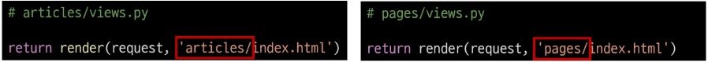
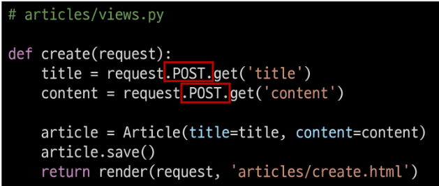

# Django

---

### ◆ 목차

1. [Namespace](##◆-namespace)

2. [Django Model](##◆-django-model)

3. [Queryset API](##◆-queryset-api)

4. [CRUD with view functions](##◆-crud-with-view-functions)

5. [Admin site](##◆-admin-site)

---

---

## ◆ Namespace

- 개체를 구분할 수 있는 범위

- Namespace의 필요성

 ①

 ②

 ③

 ④

위의 경우, 2가지 문제가 발생한다.

1. articles app index 페이지에 작성한 두번째 앱 index로 이동하는 하이퍼 링크를 클릭 시 현재 페이지로 다시 이동
   
   - url은 127.0.0.1:8000/pages/index/로 바뀌긴 함
   
   - URL namespace : ①, ④

2. pages app의 index url `(http://127.0.0.1:8000/pages/index/)`로 직접 이동해도 articles app의 index 페이지가 출력됨
   
   - Template namespace : ②, ③

---

# ◆ URL namespace

## | 개요

- URL namespace를 사용하면 서로 다른 앱에서 동일한 URL 이름을 사용하는 경우에도 이름이 지정된 URL을 고유하게 사용할 수 있음

- **app_name** attribute를 작성해 URL namespace를 설정  **(①)**


- URL tag의 변화 **(④)**
  
  
  
  - 방문할 URL이 속한 앱의 이름을 앞에 적어준다.
  
  - app_name을 지정한 후에는 url 태그에서 반드시 app_name:url_name 형태로만 사용해야 한다. << 그렇지 않으면 NoReverceMatch 에러 발생
  
  - **URL 참조는 ':' 연산자를 사용해서 지정**
    
    - 예) **app_name**이 articles이고 **URL name**이 index인 주소 참조는 articles:index가 된다.

---

# ◆ Template namespace

## | 개요

- Django는 기본적으로 `app_name/templates/` 경로에 있는 templates 파일들만 찾을 수 있으며, settings.py의 INSTALLED_APPS에 작성한 app 순서대로 template을 검색 후 렌더링 함.
  
  - settings.py 안의 Templates의 `'APP_DIRS' : True,` 속성이 해당 경로를 활성화함

## | 디렉토리 생성을 통해 물리적인 이름공간 구분

- - Django templates의 기본 경로에 app과 같은 이름의 폴더를 생성해 폴더 구조를  
    `app_name/templates/app_name/` 형태로 변경
  
  - Django templates의 기본 경로 자체를 변경할 수는 없기 때문에 물리적으로 이름 공간을 만드는 것
  
  
  
  - 폴더 구조 변경 후 변경된 경로로 해당하는 모든 부분 수정 **(②)**



 \_                                                                       

---

## ◆ Django Model

- Model(이하 모델)의 핵심 개념과 ORM을 통한 데이터베이스 조작 이해

- Django는 웹 애플리케이션의 데이터를 구조화하고 조작하기 위한 추상적인 계층(모델)을 제공함

#### ◈ Database

- 체계화된 데이터의 모임

- 검색 및 구조화 같은 작업을 보다 쉽게 하기 위해 조직화된 데이터를 수집하는 저장 시스템

- 데이터베이스 기본 구조
  
  1. 스키마(Schema)
     
     - 데이터베이스에서 자료의 구조, 표현방법, 관계 등을 정의한 구조
     
     - | column | datatype |
       |:------:|:--------:|
       | id     | INT      |
       | name   | TEXT     |
       | age    | INT      |
       | email  | TEXT     |
  
  2. 테이블(Table)
     
     - 필드와 레코드를 사용해 조직된 데이터 요소들의 집합 =  관계(Relation)
       
       1. 필드(field) : 속성, 열(column)
          
          - 각 필드에는 고유한 데이터 형식이 지정됨
       
       2. 레코드(record) : 튜플, 행(row)
          
          - 테이블의 데이터는 레코드에 저장됨
     
     - PK(Primary Key/기본 키)
       
       - 각 레코드의 고유한 값(식별자로 사용)
       
       - 기술적으로 `다른 항목과 절대로 중복되어 나타날 수 없는 단일 값(unique)`을 가짐
       
       - 데이터베이스 관리 및 테이블 간 관계 설정 시 주요하게 활용됨
  
  3. 쿼리(Query)
     
     - 데이터를 조회하기 위한 명령어를 일컬음
     
     - 조건에 맞는 데이터를 추출하거나 조작하는 명령어(주로 테이블형 자료구조)
     
     - Query를 날린다 > 데이터베이스를 조작한다.

---

#### ◈ Model

**`웹 애플리케이션의 데이터를 구조화하고 조작하기 위한 도구`**

- Django는 Model을 통해 데이터에 접속하고 관리(단일한 데이터에 대한 정보를 가짐)

- 사용자가 저장하는 데이터들의 필수적인 필드들과 동작들을 포함

- 저장된 데이터베이스의 구조(layout)

- 일반적으로 각각의 모델은 하나의 데이터베이스 테이블에 매핑(mapping)
  
  - 모델 클래스 1개 == 데이터베이스 테이블 1개
  
  - 매핑 = 하나의 값을 다른 값으로 대응시키는 것

- Models.py 작성
  
  - 모델 클래스를 작성하는 것은 데이터베이스 `테이블의 스키마를 정의`하는 것
  
  - **모델 클래스 == 테이블 스키마**
  
  
  
  - 'DB 필드의 이름' = '클래스 변수 값(DB 필드의 데이터 타입)'
  
  - **id 컬럼은 테이블 생성 시 Django가 자동으로 생성**

- 각 모델은 django.models.Model 클래스의 서브 클래스로 표현됨
  
  - 즉, 각 모델은 django.db.models 모듈의 Model 클래스를 상속받아 구성됨
  
  - **`클래스 상속 기반 형태의 Django 프레임워크 개발`**
    
    - 프레임워크에서는 잘 만들어진 도구를 가져다가 잘 쓰는 것
  
  - models 모듈을 통해 어떠한 DB 필드(컬럼)을 정의할 것인지 정의
    
    - 클래스 변수 title과 content은 DB 필드를 나타냄

- 예시 모델 필드 일람
  
  - CharField(max_length=None, \*\*options)
    
    - 길이의 제한이 있는 문자열을 넣을 때 사용
    
    - max_length : 필드의 최대 길이(필수 인자)
      
      - 데이터베이스와 Django의 유효성 검사에 활용됨
  
  - TextField(\*\*options)
    
    - 글자의 수가 많을 때 사용
    - max_length 옵션 작성 시 사용자 입력 단계에서는 반영되지만, 모델과 데이터베이스 단계에는 적용되지 않음(CharField를 사용해야 함)
      - 실제로 저장될 때 길이에 대한 유효성을 검증하지 않음

---

# ◆ Migrations

- 모델에 대한 청사진을 만들고 이를 통해 테이블을 생성하는 일련의 과정

- Django가 모델에 생긴 변화(필드 추가, 모델 삭제 등)를 DB에 반영하는 방법

- :cherry_blossom:**주요 명령어**:cherry_blossom:
  
  1. python manage.py **makemigrations**
     
     - 모델을 작성, 혹은 변경한 것에 기반한 새로운 설계도를 생성할 때 사용
     
     - migrations/000*\_initial.py의 형태
  
  2. python manage.py **migrate**
     
     - makemigrations로 생성한 설계도를 실제 db.sqlite3 DB에 반영
     
     - **`모델`** 에서의 변경사항들과 **`DB`** 의 스키마의 **`동기화`**

- 기타 명령어
  
  1. python manage.py **showmigrations**
     
     - migrations 파일들이 migrate 되었는지 여부 확인 : ([X] = 완료됨)
  
  2. python manage.py **sqlmigrate** articles 0001
     
     - 0001 migrations 파일이 SQL 문으로 어떻게 해석되는지 미리 확인

- 설계도를 해석하여 DB의 동기화를 해주는 것이 ORM

\_

#### ◈ ORM(Object-Relational-Mapping)

- 객체 지향 프로그래밍 언어를 사용하여 호환되지 않는 유형의 시스템 간에 (Django <-> SQL) 데이터를 변환하는 프로그래밍 기술

- 내장 Django ORM을 사용

- 장점
  
  - SQL을 잘 알지 못해도 객체지향 언어로 DB 조작이 가능
  
  - 객체 지향적 접근으로 인한 높은 생산성

- 단점
  
  - ORM만으로 완전한 서비스를 구현하기 어려운 경우가 있음

- `생산성`이 탁월하여 사용함

\_

#### ◈ 추가 필드 정의 과정

1. models.py에 **컬럼 추가(변경)** 한 뒤 **python manage.py makemigrations** 실행

2. Django가 추가 컬럼에 기본값을 어떻게 설정할지 물어봄  
   \1) 다음 화면으로 넘어가서 새 컬럼의 기본 값 직접 입력  
   \2) 현재 과정에서 나가고 모델 필드에 default 속성을 직접 작성  
   **보통, '1'을 입력 후 Enter**

3. 기본적으로 파이썬의 timezone 모듈의 now 메서드 반환값을 기본 값으로 사용할 수 있음 >> **Enter** 를 누르든지, **timezone.now**를 입력해라

4. 새로운 migration 파일 생성됨

5. **python manage.py migrate** 명령어로 DB와 동기화 진행

```
1. models.py에서 변경사항이 발생하면
2. migrations 파일 생성(설계도 생성) : makemigrations
3. DB 반영 (모델과 DB의 동기화) : migrate
```

\_

##### ▣ DateTimeField()

- python의 datetime.datetime 인스턴스로 표시되는 날짜 및 시간을 값으로 사용하는 필드

- DateField를 상속하는 클래스

- 선택 인자
  
  1. auto_now_add
     
     - 최초 생성 일자(Useful for creation of timestamps)
     
     - Django ORM이 최초 insert(테이블에 데이터 입력)시에만 현재 날짜와 시간으로 갱신(테이블에 어떤 값을 최초로 넣을 때)
  
  2- auto_now
  
  - 최초 수정 일자(Useful for "last-modified" timestamps)
  
  - Django ORM이 save를 할 때마다 현재 날짜와 시간으로 갱신

\_

---

## ◆ Queryset API

:star: **QuerySet과 상호작용하기 위해 사용하는 도구(메서드, 연산자 등)** :star:

- 실습 편의를 위한 추가 라이브러리 설치 및 설정
  
  - `pip install ipython` : 좀 더 이쁜 인터프리터(대화형 shell) 설치
  
  - `pip install django-extensions` : 장고 확장 프로그램 모음.   
    **설치 후 settings.py의 INSTALLED_APPS에 'django_extensions' 추가**  
    shell_plus, graph model 등 다양한 확장 기능 제공  
    
    `python manage.py shell_plus`로 실행

## | [참고] Shell

- 운영체제 상에서 다양한 기능과 서비스를 구현하는 인터페이스를 제공하는 프로그램

- Shell(껍데기)은 사용자와 운영 체제의 내부 사이의 인터페이스를 감싸는 층이기 때문에 그러한 이름이 붙음

- "사용자 ↔ 셸 ↔ 운영체제"

- Python Shell은 파이썬 코드를 실행해주는 인터프리터, 대화형 Shell

---

# ◆ QuerySet API

## | Database API

- Django가 기본적으로 ORM을 제공함에 따른 것으로 DB를 편하게 조작할 수 있도록 도움

- Model을 만들면 Django는 객체들을 만들고 읽고 수정하고 지울 수 있는 DB API를 자동으로 만듦

## | Database API 구문 및 구조

**`Article`.`Objects`.`all`** 이란 구문은 **모델 클래스.매니저.쿼리셋 API** 구조이다.

- Objects (manager)
  
  - Django 모델이 데이터베이스 쿼리 작업을 가능하게 하는 인터페이스
  
  - Django는 기본적으로 모든 Django 모델 클래스에 대해 objects라는 Manager 객체를 자동으로 추가함
  
  - 이 objects(Manager)를 통해 특정 데이터를 조작(메서드)할 수 있음
  
  - `DB를 Python class로 조작할 수 있도록 여러 메서드를 제공하는 Manager`

- Query
  
  - 데이터베이스에 특정한 데이터를 보여달라는 요청
  
  - "쿼리문을 작성한다"
    
    - = 원하는 데이터를 얻기 위해 데이터베이스에 요청을 보낼 코드를 작성한다.
  
  - 이 때, 파이썬으로 작성한 코드가 ORM에 의해 SQL로 변환되어 데이터베이스에 전달되며, 데이터베이스의 응답 데이터를 ORM이 `QuerySet`이라는 자료 형태로 변환하여 우리에게 전달

- QuerySet
  
  - 데이터베이스에게서 전달받은 객체 목록(데이터 모음)
    
    - 순회가 가능한 데이터로써 1개 이상의 데이터를 불러와 사용할 수 있음
  
  - Django ORM을 통해 만들어진 자료형이며, 필터를 걸거나 정렬 등을 수행 가능
  
  - "objects" manager를 사용하여 복수의 데이터를 가져오는 queryset Method를 사용할 때 반환되는 객체
  
  - 단, 데이터베이스가 단일한 객체를 반환할 때는 QuerySet이 아닌 모델(Class)의 인스턴스로 반환됨

---

# ◆ QuerySet API CRUD

Create(생성) / Read(조회) / Update(수정) / Delete(삭제)

= 대부분의 컴퓨터 소프트웨어가 가지는 기본적인 데이터 처리기능 4가지

- #### **Create**
  
  1. 첫번째 방법
     
     1. `article = Article()` 
        
        - 클래스를 통한 인스턴스 생성
     
     2. `article.인스턴스 변수 = 값`  
        
        - 클래스 변수명과 같은 이름의 인스턴스 변수를 생성 후 값 할당
     
     3. `article.save()` 
        
        - 인스턴스로 save 메서드 호출(DB에 즉시 값 적용)
  
  2. 두번째 방법 : 인스턴스 생성 시 초기값을 함께 작성하여 생성
     
     - `article = Article(title = 'second', content = 'django!')`
     
     - `article.save()`
     
     - **1번보단 짧고, 3번과는 달리 저장 전 검증이 가능하므로 추천됨**
  
  3. 세번째 방법 : QuertSet API - create() 메서드 활용
     
     - `Article.objects.create(title='third', content='django!')`
     
     - 위 2가지 방식과는 다르게 바로 생성된 데이터가 반환됨
  - **`.save()`**
    
    - 객체를 데이터베이스에 저장
    
    - 데이터 생성 시 save를 호출하기 전에는 객체의 id 값은 None
      
      - id 값은 Django가 아니라 데이터베이스에서 계산되기 때문
    
    - 단순히 모델 클래스를 통해 인스턴스를 생성하는 것은 DB에 영향을 주기 때문에 반드시 save를 호출해야 테이블에 레코드가 생성됨
  
  - :star2:vscode 확장 프로그램 **SQLite**로 직접 테이블 데이터 확인 :star2:
    
    - vscode에 SQLite 설치
    
    - db 우클릭하여 Open Database 선택
    
    - 좌측 하단 SQLITE EXPLORE 확인
    
    - 테이블 선택 후 show table 버튼 클릭 (▶) 

- #### **Read**
  
  - QuerySet API method를 사용해 데이터를 다양하게 조회하기
    
    - Quertset을 반환하는 메서드와 그렇지 않은 메서드가 있음
  
  - **`all()`**
    
    - 클래스명.objects.all() : 전체 데이터를 조회하여 반환
  
  - **`get()`**
    
    - 클래스명.objects.get(pk와 같은 고유한 인스턴스 변수 = 값)
      
      - 단일 데이터 조회하여 반환
    
    - 객체를 찾을 수 없으면 DoesNotExist 예외 발생,   
      둘 이상의 객체를 찾으면 MultipleObjectsReturned 예외 발생
    
    - 따라서 pk와 같은 고유성(uniqueness)를 보장하는 조회에서 사용해야 함
  
  - **`filter()`**
    
    - 클래스명.objects.filter(조회매개 인스턴스변수 = 값 )
      
      - 지정된 조회 매개 변수와 일치하는 객체를 포함하는 새 QuerySet을 반환
      
      - 조회된 객체가 없거나 1개여도 QuerySet을 반환
  
  - **Filed lookups**
    
    - 특정 레코드에 대한 조건을 설정하는 방법
    
    - filter(), exclude(), get()에 대한 키워드
    
    ```django
    # content 컬럼에 'dj'가 포함된 모든 데이터 조회
    Article.objects.filter(content__contains='dj')
    ```

- #### **Update**
  
  - 수정하고자 하는 인스턴스 객체를 조회 후 반환 값을 저장
  
  - 인스턴스 객체의 인스턴스 변수 값을 새로운 값으로 할당
  
  - save() 인스턴스 메서드 호출


- #### **Delete**
  
  - 삭제하고자 하는 인스턴스 객체를 조회 후 반환 값을저장
  
  - delete() 인스턴스 메서드 호출


### ※ 참고 : \_\_str__()

- 오브젝트를 정의한 models.py에 표준 파이썬 클래스의 메서드인 str()을 정의하여,  
  각각의 object가 사람이 읽을 수 있는 문자열을 반환하도록 할 수 있음

```python
def __str__(self):
    return self.title
```

- 정의 후 반드시 shell을 재시작해야 반영이 된다.

---

## ◆ CRUD with view funcions

#### 사전 준비

- bootstrap CDN 및 템플릿 추가 경로 작성


- URL 분리 및 연결


- index 페이지(조회 담당) 작성


- ### READ 1(index page)
  
  - 전체 게시글 조회 / 출력


- ### Create
  
  - **사용자의 입력을 받을 페이지를 렌더링하는 함수 1개(=new)**
  
  
  
  
  
  
  
  ↓ 메인페이지에서 new 페이지로 이동할 수 있도록 하이퍼 링크 작성
  
  

- **사용자가 입력한 데이터를 전송받아 DB에 저장하는 함수 1개(=create)**
  
  
  
  
  
  - 2번째 생성 방식을 사용하는 이유 : 
    
    - create 메서드가 더 간단하지만 추후 데이터가 저장되기 전에 유효성 검사 과정을  할 수 없다는 단점이 있음
    
    - 유효성 검사가 진행된 후에 save 메서드가 호출되는 구조를 택하기 위함
  
  - 게시글 작성 후 확인하기 위해 create.html 페이지를 생성하고, 위에 생성해둔 new.html을 수정한다.
    
    
    
    
  
  - 이 경우, 2가지 문제점이 발생한다.
    
    1. 게시글 작성 후 index 페이지가 출력되지만 게시글은 조회되지 않는다.
       
       - create 함수에서 index.html 문서를 렌더링할 때 context 데이터와 함께 렌더링 하지 않았기 때문
       
       - index 페이지 url로 다시 요청을 보내면 정상적으로 출력됨
    
    2- 게시글 작성 후 URL은 여전히 create에 머물러 있음
    
    - index view 함수를 통해 렌더링 된 것이 아니기 때문
    
    - index view 함수의 반환 값이 아닌 단순히 index 페이지만 render 되었을 뿐
      
      **이를 해결하기 위해 `redirect`를 사용한다**
  
  
  
  - Redirect : 인자에 작성된 곳으로 요청을 보냄  
    `return redirect('/articles/')` : 절대 or 상대 URL  
    `return redirect('articles:index')` : view 이름(URL 패턴 이름)
  
  - 이 경우, index.html로 바로 직행하므로, 기존의 create.html은 삭제해도 된다.
  
  - redirect 동작 원리
    
    ```
    1. 클라이언트가 create URL로 요청을 보냄
    2. create view 함수의 redirect 함수가 302 status code를 응답
    3. 응답 받은 브라우저는 redirect 인자에 담긴 주소(index)로 
       사용자를 이동시키기 위해 index url로 Django에 재요청
    4. index page를 정상적으로 응답받음(200 status code)
    ```

- HTTP response status code
  
  - 클라이언트에게 특정 HTTP 요청이 성공적으로 완료되었는지 여부를 전달
    
    1. Informational responses (1xx)
    
    2. Successful responses (2xx)
    
    3. Redirection messages (3xx)
    
    4. Client error responses (4xx)
    
    5. Server error responses (5xx)
  
  - 302 Found : 브라우저가 사용자를 해당 URL 페이지로 이동시켰다는 상태 코드(HTTP response status code)
  
  - 403 Forbidden
    
    - 서버에 요청이 전달되었지만, 권한 때문에 거절되었다는 것을 의미
    
    - 게시글을 작성할 권한이 없다.
    
    - 모델(DB)을 조작하는데에는 최소한의 신원확인이 필요

- HTTP method GET과 POST 재검토
  
  - **`GET`**
    
    - 쿼리 스트링  파라미터로 데이터를 보내기 때문에 url을 통해 데이터를 보냄
    
    - 특정 리소스를 가져오도록 요청할 때 사용(데이터를 가져올 때)
    
    - DB에 변화를 주지 않음.  CRUD에서 R 역할을 담당(검색)
    
    - 특정 페이지를 조회하는 a tag도 GET 사용
  
  - **`POST`**
    
    - URL이 아니라 데이터를 HTTP body에 담아 전송함
    
    - 서버로 데이터를 전송할 때 사용
    
    - GET의 쿼리 스트링 파라미터와 다르게 URL로 보내지지 않음
    
    - DB에 변경사항을 만듦.  CRUD에서 C/U/D 역할을 담당
  
  
  
  

- 위에 작성한 new.html과 views.py를 마저 수정해준다.
  
  ### ▣ CSRF(Cross-site-Request-Forgery)

- **"사이트 간 요청 위조"**

- 사용자가 자신의 의지와 무관하게 공격자가 의도한 행동을 하여 특정 웹페이지를 보안에 취약하게 하거나 수정, 삭제 등의 작업을 하게 만드는 공격 방식

- 이를 막기 위한 것이 바로 **CSRF Token**
  
  - 사용자의 데이터에 임의의 난수 값(token)을 부여해 매 요청마다 해당 난수 값을 포함시켜 전송 시키도록 함
  
  - 이후 서버에서 요청을 받을 때마다 전달된 token 값이 유효한지 검증
  
  - 일반적으로 데이터 변경이 가능한 POST, PATCH, DELETE 메소드에서 사용
  
  - Django는 DTL에서 csrf_token 템플릿 태그``를 제공
    
    - 해당 태그가 없으면 Django 서버는 요청에 403 forbidden으로 응답
    
    - 내부가 아니라 외부 URL로 향하는 POST form에 쓰면 csrf 토큰이 유출될 위험이 있으므로 주의
    
    
    
    - 위에 수정한 new.html에 csrf_토큰 추가

---

- ### READ 2(detail page)
  
  - 개별 게시글 상세 페이지 제작
  
  - 모든 게시글마다 뷰 함수와 템플릿 파일을 만들 수는 없으므로,  
    글의 번호(pk)를 활용해서 하나의 뷰 함수와 템플릿 파일로 대응
  
  - URL로 특정 게시글을 조회할 수 있는 번호를 받음
    
    
  
  - Article.objects.get(pk=pk)에서 오른쪽 pk는 variable routing을 통해 받은 pk, 왼쪽 pk는 DB에 저장된 레코드의 id 컬럼
    
    
  
  - 템플릿 - 메인 페이지와 개별 페이지
    
    
    
    
  
  - views.py의 create 함수의 리다이렉트 대상 인자의 주소를 pk로 변경
    
    

- ### DELETE
  
  - 모든 글을 삭제하는 것이 아니라 삭제하고자 하는 특정 글을 조회 후 삭제해야 함
  
  - delete 함수
    
    
  
  - 개별(detail) 페이지에 넣을 delete 버튼 : DB에 영향을 미치므로 POST
    
    

- ### UPDATE
  
  - CREATE와 마찬가지로 두 개의 views 함수가 필요
    
    - 사용자의 입력을 받을 페이지를 렌더링하는 함수(edit)
    
    - 사용자가 입력한 데이터를 전송받아 DB에 저장하는 함수(update)
  
  - **Edit - urls & views & templates**
    
    
    
    
    
    ↓ 수정하는 페이지
    
    
    
    - html 태그의 value속성을 사용해 기존에 입력되어 있던 데이터를 출력(기본값)
    
    - textarea 태그는 value 속성이 없으므로 태그 내부 값으로 작성
    
    ↓ 개별(detail) 페이지
    
    
    
    - 개별 페이지에서 Edit 페이지로 이동하기 위한 하이퍼 링크 작성
  
  - **update**
    
    
    
    
    
    
    
    - 수정 뒤 업데이트 페이지로 이동하여 views.update 함수를 동작하도록 수정

---

## ◆ Admin site

- Django의 가장 강력한 기능 중 하나인 automatic admin interface

- 관리자 페이지
  
  - 사용자가 아닌 서버의 관리자가 활용하기 위한 페이지
  
  - 모델 클래스를 admin.py에 등록하고 관리
  
  - 레코드 생성 여부 확인에 매우 유용하며, 직접 레코드를 삽입할 수 있음

- admin 계정 생성
  
  - `python manage.py createsuperuser`
  
  - username과 password를 입력해 관리자 계정 생성
    
    - email은 선택사항(무시 가능)
    
    - 비밀번호는 안보이는게 정상이니 계속 적으면 됨

- http://127.0.0.1:8000/admin/로 접속 후 로그인
  
  - 계정만 만든 경우, Django 관리자 화면에 모델 클래스는 보이지 않음

- admin.py에 모델 클래스 등록
  
  

---

---

DB 삭제
서버 끄고  
db.sqlite3 삭제  
migrations 폴더에서 000*들 지워준다.   

DB 삭제하면  
python manage.py makemigration  
python manage.py migrate  

python manage.py createsuperuser  
아이디  
비번(안보이는게 정상)  
bypass : y하고 넘겨도 무방  
