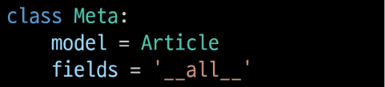

# Django 3일차

---

- Django Form

- Django ModelForm

- Handling HTTP requests

- View decorators

---

# ◆ Django Form

## | 개요

- 지금까지 우리는 HTML form, input 태그를 통해서 사용자로부터 데이터를 받았음

- Django 서버가 받는 요청 중에는 비정상적인 혹은 악의적인 요청이 있다는 것을 고려해야 한다.

- 이처럼 사용자가 입력한 데이터가 우리가 원하는 데이터 형식이 맞는지에 대한 **`유효성 검증`** 이 반드시 필요
  
  - 이러한 유효성 검증은 많은 부가적인 것들을 고려해서 구현해야 하는데, 이는 개발 생산성을 늦출뿐더러 쉽지 않은 작업

- Django Form은 이 과정에서 과중한 작업과 반복 코드를 줄여줌으로써 훨씬 쉽게 유효성 검증을 진행할 수 있도록 만들어 줌

## | Form에 대한 Django의 역할

- Form은 Django의 유효성 검사 도구 중 하나로 외부의 악의적 공격 및 데이터 손상에 대한 중요한 방어 수단

- Django는 Form과 관련한 유효성 검사를 **`단순화하고 자동화`** 할 수 있는 기능을 제공하여, 개발자가 직접 작성하는 코드보다 더 안전하고 빠르게 수행하는 코드를 작성할 수 있다.
  
  - 개발자가 필요한 핵심 부분만 집중할 수 있도록 돕는 프레임워크의 특성

## | Django는 Form에 관련된 작업의 세 부분을 처리

1. 렌더링을 위한 데이터 준비 및 재구성

2. 데이터에 대한 HTML forms 생성

3. 클라이언트로부터 받은 데이터 수신 및 처리

---

# ◆ The Django Form Class

## | 개요

- Form Class
  
  - Django form 관리 시스템의 핵심

## | Form Class 선언

- Form Class를 선언하는 것은 Model Class를 선언하는 것과 비슷하다.
  
  비슷한 이름의 필드 타입을 많이 가지고 있다.(이름만 같을 뿐 같은 필드는 아님)

- Model과 마찬가지로 상속을 통해 선언  
  
  (forms 라이브러리의 Form 클래스를 상속받음)

- 앱 폴더에 forms.py를 생성 후, ArticleForm Class 선언
  
  

- form에는 model field와 달리 TextField가 존재하지 않음

- Form 클래스는 forms.py에 굳이 작성하지 않아도 되지만, 유지보수의 관점, 관행적으로 forms.py 파일에 작성하는 것이 권장됨

## | 'new' view 함수 업데이트

## | 'new' 템플릿 업데이트

- view 함수에서 정의한 ArticleForm의 인스턴스(form) 하나로 input과 label 태그가 모두 렌더링 되는 것을 확인할 수 있다.
- as_p는 form을 \
 태그로 감싼다는 뜻

## | From rendering options

- \<label> & \<input> 쌍에 대한 3가지 출력 옵션
  
  1. as_p()
     
     - 각 필드가 단락(\
 태그)으로 감싸져서 렌더링
     
     - 주로 이걸 쓴다.
  
  2. as_ul()
     
     - 각 필드가 목록 항목(\<li> 태그)으로 감싸져서 렌더링
     
     - \<ul> 태그는 직접 작성해야 한다.
  
  3. as_table()
     
     - 각 필드가 테이블(\<tr> 태그) 행으로 감싸져서 렌더링 

## | Django의 2가지 HTML input 요소 표현

1. Form fields
   
   - 입력에 대한 유효성 검사 로직을 처리
   
   - 템플릿에서 직접 사용됨
   
   - `forms.CharField()`

2. Widgets
   
   - 웹 페이지의 HTML input 요소 렌더링을 담당
     
     - input 요소의 단순한 출력 부분을 담당
   
   - Widgets은 반드시 form fields에 할당 됨
   
   - `forms.CharField(widget=forms.Textarea)`

---

# Widgets

## | 개요

- Django의 HTML input element의 표현을 담당

- 단순히 HTML 렌더링을 처리하는 것이며, 유효성 검증과 아무런 관계가 없음
  
  - 웹페이지에서 input element의 단순 raw한 렌더링만을 처리하는 것일뿐

## | Textarea 위젯 적용하기

## | Form fields와 widget 응용하기

- 출력 결과를 확인하고 앞으로 어떻게 조합해서 사용할 수 있는지는 form field와 widgets 공식 문서를 찾아보며 사용하도록 함

---

# ◆ Django ModelForm

## | 개요

- 이미 Article Model Class에 필드에 대한 정보를 작성했는데,  
  이를 Form에 맵핑하기 위해 Form Class에 필드를 재정의해야만 했음

- 중복 작업을 피하고 쉽게 Form을 작성하기 위해, ModelForm을 사용할 수 있다.

## | ModelForm Class

- Model을 통해 Form Class를 만들 수 있는 helper class

- ModelForm은 Form과 똑같은 방식으로 View 함수에서 사용

## | ModelForm 선언

- forms 라이브러리에서 파생된 ModelForm 클래스를 상속받음

- 정의한 ModelForm 클래스 안에 Meta 클래스를 선언

- 어떤 모델을 기반으로 form을 작성할 것인지에 대한 정보를 Meta 클래스에 지정

## | ModelForm에서의 Meta Class

- ModelForm의 정보를 작성하는 곳

- ModelForm을 사용할 경우 참조할 모델이 있어야 하는데,   
  Meta class의 model 속성이 이를 구성함
  
  - 참조하는 모델에 정의된 field 정보를 Form에 적용함
    
    

- field 속성에 '\_\_all\_\_'를 사용하여 모델의 모든 필드를 포함할 수 있음

- 또는 exclude 속성을 사용하여 모델에서 포함하지 않을 필드를 지정할 수있음  
  
  ※ field와 exclude를 함께 작성해도 되나, 권장하지 않음
  
  

## | Meta Data?

- 데이터를 표현하기 위한 데이터

- 예) 사진 파일
  
  - 사진 데이터
    
    - 사진 데이터의 데이터(촬영 시각, 렌즈, 조리개 값 등)

## | 참조 값과 반환 값

- 위의 클래스에서 `model=Article` 처럼 호출하지 않고(==model을 인스턴스로 만들지 않고) 이름만 작성하는 이 방식은,
  
  ArticleForm이 해당 클래스를 필요한 시점에 사용하기 위함이다.

- 더불어 이 경우는 인스턴스가 필요한 것이 아닌, 실제 Article 모델의 참조값을 통해 해당 클래스의 필드나 속성 등을 내부적으로 참조하기 위한 이유도 있음

---

# ◆ ModelForm with view functions

- ModelForm으로 인한 view 함수의 구조 변화 알아보기

## | CREATE

- 유효성 검사를 통과하면
  
  - 데이터 저장 후
  
  - 상세 페이지로 리다이렉트

- 통과하지 못하면
  
  - 작성 페이지로 리다이렉트

## | is_valid() 메서드

- 유효성 검사를 실행하고, 데이터가 유효한지 여부를 boolean으로 반환

- 데이터 유효성 검사를 보장하기 위한 많은 테스트에 Django는 is_valid()를 제공하여 개발자의 편의를 도움

- is_valid()의 반환값이 False인 경우, form 인스턴스의 error 속성에 값이 작성되는데, 유효성 검증을 실패한 원인이 딕셔너리 형태로 저장됨
  
  - 예시 : `print(f'에러: {form.errors}')`

- 위의 코드를 수정하여 유효성 검증을 실패했을 때, 사용자에게 실패 결과 메시지를 출력해주도록 할 수 있음

## | save() 메서드

- form 인스턴스에 바인딩된 데이터를 통해 데이터베이스 객체를 만들고 저장

- ModelForm의 하위 클래스는 키워드 인자 instance 여부를 통해 생성할지, 수정할지를 결정함
  
  - 제공되지 않은 경우 save()는 지정된 모델의 새 인스턴스를 만듦(CREATE)
  
  - 제공되면 save()는 해당 인스턴스를 수정(UPDATE)
    
    

## | UPDATE

- ModelForm의 인자 instance는 수정 대상이 되는 객체(기존 객체)를 지정
1. request.POST
   
   - 사용자가 form을 통해 전송한 데이터(새로운 데이터)

2. instance
   
   - 수정이 되는 대상
- edit - view 수정
  
  

- edit - template 수정
  
  

- update - view 수정
  
  

## | Form과 ModelForm

- ModelForm과 Form은 상위호환이 아닌 상호호환 관계 (**역할이 다름**)

- **Form**
  
  - 사용자로부터 받는 데이터가 DB와 연관되어 있지 않는 경우에 사용
  
  - DB에 영향을 미치지 않고 단순 데이터만 사용되는 경우
    
    (로그인 : 사용자의 데이터를 받아 인증 과정에서만 사용. DB에 저장 안 함)

- **ModelForm**
  
  - 사용자로부터 받는 데이터가 DB와 연관되어 있는 경우에 사용(회원가입 등)
  
  - 데이터의 유효성 검사가 끝나면 데이터를 각각 어떤 레코드에 맵핑해야 할지 이미 알고 있기 때문에 곧바로 save() 호출이 가능

---

# ◆ Widgets 활용하기

## | 위젯을 작성하는 2가지 방법

- 오른쪽 작성 방식을 권장함

## | Widgets 활용하기

- widget의 attrs의 maxlength는 입력시 제한일 뿐.  DB와는 연관이 없다.

---

# ◆ Handling HTTP requests

## | 개요

- HTTP requests 처리에 따른 view 함수 구조 변화

- new-create, edit-update의 view 함수 역할을 잘 살펴보면 하나의 공통점과 하나의 차이점이 있음

- 공통점
  
  - new-create는 모두 CREATE 로직을 구현하기 위한 공통 목적
  
  - edit-update는 모두 UPDATE 로직을 구현하기 위한 공통 목적

- 차이점
  
  - new와 edit는 GET 요청에 대한 처리만을
    
    create와 update는 POST 요청에 대한 처리만을 진행

- 이 공통점과 차이점을 기반으로, 하나의 view 함수에서 method에 따라 로직이 분리되도록 변경 가능

## | Create

- new와 create view 함수를 합침

- 각각의 역할은 request.method 값을 기준으로 나뉨
  
  

- 불필요해진 articles/views.py의 new 함수와 
  
  articles/urls.py의 new/ url path는 삭제

- new.html → create.html 이름 변경 및 action 속성 값 수정
  
  

- new.html → create.html 이름 변경으로 인한 articles/views.py의 템플릿 경로 수정
  
  
  
  - if form.is_valid(): 에서 false가 나왔을 때, 에러 정보가 담긴 form 인스턴스를 context에 넘길 수 있는 구조

- index 페이지의 new 관련 링크 수정
  
  

## | Update

- edit과 update view 함수를 합침
  
  

- new와 마찬가지로 불필요해진 articles/views.py의 edit 함수와  
  articles/urls.py의 edit에 해당하는 url path를 삭제

- edit.html → update.html 이름 변경으로 인한 관련 정보 수정
  
  

- edit.html → update.html 이름 변경으로 인한 관련 정보 수정
  
  

- POST 요청에 대해서만 삭제가 가능하도록 수정
  
  

---

# ◆ View decorators

## | 데코레이터(Decorator)

- 기존에 작성된 함수에 기능을 추가하고 싶을 때, 해당 함수를 수정하지 않고 기능을 추가해주는 함수

- Django는 다양한 HTTP 기능을 지원하기 위해 view 함수에 적용할 수 있는 여러 데코레이터를 제공

- 데코레이터 동작 예시
  
  

- ㅇㅇ

---

# ◆ Allowed HTTP methods

## | 개요

- django.views.decorators.http의 데코레이터를 사용하여 요청 메서드를 기반으로 접근을 제한할 수 있음

- 일치하지 않는 메서드 요청이라면 405 Method Not Allowed를 반환
  
  - (요청 방법이 서버에게 전달되었으나 사용 불가능한 상태)

- 메서드 목록
  
  1. require_http_methods()
  
  2. require_POST()
  
  3. require_safe()

## | require_http_methods()

- view 함수가 특정한 method만 허용하도록 하는 데코레이터
  
  

## | require_POST()

- view 함수가 POST 요청 method만 허용하도록 하는 데코레이터
  
  

## | require_safe()

- require_GET이 있지만 Django에서는 require_safe를 사용하는 것을 권장
  
  
