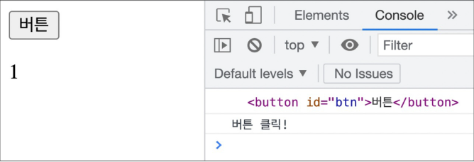
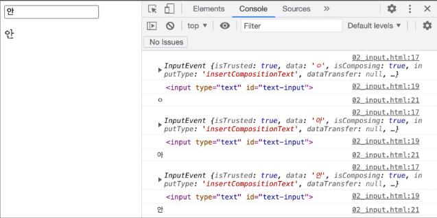
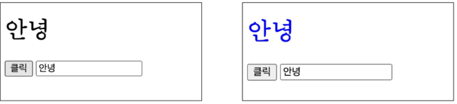
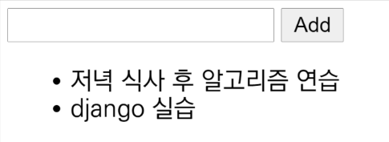
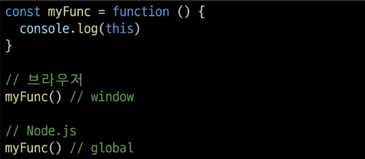

# JavaScript

---

## INDEX

- DOM

- EVENT

- this

---

# ◆ DOM

### | 개요

- "브라우저에서의 JavaScript"
  
  - 웹 페이지에서 복잡한 기능을 구현하는 스크립트 언어
  
  - 가만히 정적인 정보만 보여주는 것이 아닌 주기적으로 갱신되거나, 사용자와 상호 작용이 가능하거나, 애니메이션이 적용된 그래픽 등에 관여
  
  - [참고] 스크립트 언어(Script Language)
    
    - 응용 소프트웨어를 제어하는 컴퓨터 프로그래밍 언어

### | Browser APIs

- 웹 브라우저에 내장된 API로, 현재 컴퓨터 환경에 관한 데이터를 제공하거나 여러가지 유용하고 복잡한 일을 수행할 수 있게 함

- 종류
  
  - **DOM**
  
  - ~~Geolocation API~~
  
  - ~~WebGL 등~~

## | DOM

- "문서 객체 모델 (Document Object Model)"

- 문서의 구조화된 표현을 제공하며 프로그래밍 언어가 DOM 구조에 접근할 수 있는 방법을 제공
  
  - 문서 구조, 스타일, 내용 등을 변경할 수 있게 도움
  
  - HTML 콘텐츠를 추가, 제거, 변경하고, 동적으로 페이지에 스타일을 추가하는 등
    HTML/CSS를 조작할 수 있음
  
  - 문서가 구조화되어 있으며 각 요소는 객체(object)로 취급
  
  - 단순한 속성 접근, 메서드 활용 뿐만 아니라 프로그래밍 언어적 특성을 활용한 조작 가능

- DOM은 문서를 논리 트리로 표현

- DOM 메서드를 사용하면 프로그래밍적으로 트리에 접근할 수 있고 이를 통해 문서의 구조, 스타일, 컨텐츠를 변경할 수 있음
  
  

- 웹 페이지는 일종의 문서(document)

- 이 문서는 웹 브라우저를 통해 그 내용이 해석되어 웹 브라우저 화면에 나타나거나 HTML 코드 자체로 나타나기도 함

- DOM은 동일한 문서를 표현하고, 저장하고, 조작하는 방법을 제공

- DOM은 웹 페이지의 객체 지향 표현이며, JavaScript와 같은 스크립트 언어를 이용해 DOM을 수정할 수 있음

## | DOM에 접근하기

- DOM을 사용하기 위해 특별히 해야 할 일은 없음

- 모든 웹 브라우저는 스크립트 언어가 접근할 수 있는 웹페이지를 만들기 위해 DOM을 항상 사용함

- "DOM의 주요 객체"들을 활용하여 문서를 조작하거나 특정 요소들을 얻을 수 있음

## | DOM의 주요 객체

- **`window`**

- **`document`**

- navigator, location, history, screen 등

## | **`window`** object

- DOM을 표현하는 창

- 가장 최상위 객체(작성 시 생략 가능)

- 탭 기능이 있는 브라우저에서는 각각의 탭을 각각의 window 객체로 나타냄
  
  

## | window의 메서드 예시

- 새 탭 열기
  
  

- 인쇄 대화 상자 표시
  
  

- 경고 대화 상자 표시
  
  

## | **`document`** object

- 브라우저가 불러운 웹 페이지

- 페이지 컨텐츠의 진입점 역할을 하며, \<body> 등과 같은 수많은 다른 요소들을 포함하고 있음
  
  _20221024_assets/b3f79ecdd4479a729af959b5b1d8fb83eff8ae60.png)

## | document의 속성 예시

- 현재 문서의 제목(HTML의 \<title> 값)
  
  _20221024_assets/c9cf20ec2d7255c00f131d87b554eb9a34f92af8.png)

- 제목 수정하기
  
  _20221024_assets/bd498ba3ebfb5dc008e2522e08e5420f554c001b.png)

## | [참고] document는 window의 속성이다.

- `window.document` 입력하면, `▶ #document`가 출력됨

## | [참고] 파싱(Parsing)

- 구문 분석, 해석

- 브라우저가 문자열을 해석하여 DOM Tree로 만드는 과정

---

---

# ◆ DOM 조작

## | 개요

- Document가 제공하는 기능을 사용해 웹 페이지 문서 조작하기

- DOM 조작 순서
  
  1. 선택(Select)
  
  2. 조작(Manipulation)
     
     - 생성, 추가, 삭제 등

## | 선택 관련 메서드

- document.`querySelector`(selector)
  
  - 제공한 선택자와 일치하는 element 한 개 선택
  
  - 제공한 CSS selector를 만족하는 첫번째 element 객체를 반환(없다면 null 반환)

- documnet.`querySelectorAll`(selector)
  
  - 제공한 선택자와 일치하는 여러 element를 선택
  
  - 매칭할 하나 이상의 셀렉터를 포함하는 유효한 CSS selector를 인자(문자열)로 받음
  
  - 제공한 CSS selector를 만족하는 NodeList를 반환

## | 선택 관련 메서드 실습

- 01_select.html에서 진행(브라우저)

```html
<!DOCTYPE html>
<html lang="en">
<head>
  <meta charset="UTF-8">
  <meta http-equiv="X-UA-Compatible" content="IE=edge">
  <meta name="viewport" content="width=device-width, initial-scale=1.0">
  <title>Document</title>
</head>
<body>
  <h1 id="title">DOM 조작</h1>
  <p class="text">querySelector</p>
  <p class="text">querySelectorAll</p>
  <ul>
    <li>Javascript</li>
    <li>Python</li>
  </ul>

  <script>

  </script>
</body>
</html>
```

_20221024_assets/f2a1505ce9dd670a46d92e0f0ffd78d2e3e6d2ad.png)

- 01_select.html에서 진행(vscode)
  
  _20221024_assets/94ff77aa5630bfd7e0f892257ded81a015cc5466.png)

## | [참고] NodeList

- index로만 각 항목에 접근 가능

- 배열의 forEach 메서드 및 다양한 배열 메서드 사용 가능

- querySelectorAll()에 의해 반환되는 NodeList는 DOM의 변경 사항을 실시간으로 반영하지 않음

---

## | 조작 관련 메서드(생성)

- document`.createElement`(tagName)
  
  - 작성한 tagName의 HTML 요소를 생성하여 반환

## | 조작 관련 메서드(입력)

- Node`.innerText`
  
  - Node 객체와 그 자손의 텍스트 컨텐츠(DOMString)를 표현
    
    - 해당 요소 내부의 raw text
  
  - 사람이 읽을 수 있는 요소만 남김
  
  - 즉, 줄 바꿈을 인식하고 숨겨진 내용을 무시하는 등 최종적으로 스타일링이 적용된 모습으로 표현

## | 조작 관련 메서드(추가)

- Node`.appendChild()`
  
  - 한 Node를 특정 부모 Node의 자식 NodeList 중 마지막 자식으로 삽입
  
  - 한번에 오직 하나의 Node만 추가할 수 있음
  
  - 추가된 Node 객체를 반환
  
  - 만약 주어진  Node가 이미 문서에 존재하는 다른 Node를 참조한다면 현재 위치에서 새로운 위치로 이동

## | 조작 관련 메서드(삭제)

- Node`.removeChild()`
  
  - DOM에서 자식 Node를 제거
  
  - 제거된 Node를 반환

---

## | 조작 관련 메서드 실습

- 02_create_append.html에서 진행(브라우저)

```html
<!DOCTYPE html>
<html lang="en">
<head>
  <meta charset="UTF-8">
  <meta http-equiv="X-UA-Compatible" content="IE=edge">
  <meta name="viewport" content="width=device-width, initial-scale=1.0">
  <title>Document</title>
</head>
<body>
  <div></div>

  <script>

  </script>
</body>
</html>
```

_20221024_assets/92319daba6022450178a9640d0431820dc40e927.png)

- 02_create_append.html에서 진행(vscode) / 출력 확인 후 삭제
  
  _20221024_assets/8aa3dfdfafc302f9b54cfcf70f93e3d508f835b0.png)

---

## | 조작 관련 메서드(속성 조회 및 설정)

- Element`.getAttribute`(attributeName)
  
  - 해당 요소의 지정된 값(문자열)을 반환
  
  - 인자(attributeName)는 값을 얻고자 하는 속성의 이름

- Element`.setAttribute`(name, value)
  
  - 지정된 요소의 값을 설정
  
  - 속성이 이미 존재하면 값을 갱신, 존재하지 않으면 지정된 이름과 값으로 새 속성을 추가

---

## | 조작 관련 메서드 실습

- 03_select.html에서 진행(브라우저)

```html
<!DOCTYPE html>
<html lang="en">
<head>
  <meta charset="UTF-8">
  <meta http-equiv="X-UA-Compatible" content="IE=edge">
  <meta name="viewport" content="width=device-width, initial-scale=1.0">
  <title>Document</title>
  <style>
    .red { 
      color: red;
    }
    .blue {
      color: blue;
    }
  </style>
</head>
<body>
  <h1 class="red">안녕하세요</h1>
  <div></div>

  <script>

  </script>
</body>
</html>
```

_20221024_assets/cd5172a687cb3ac647280944830c965b06b4c0b7.png)

- 03_attribute.html에서 진행(vscode)
  
  _20221024_assets/2bd41e3bc4d3f287383aabcafa0952f5da61b351.png)

---

## | DOM 조작 정리

1. 선택한다.
   
   - querySelector()
   
   - querySelectorAll()

2. 조작한다.
   
   - innerText
   
   - setAttribute()
   
   - getAttribute()
   
   - createElement()
   
   - appendChild()
   
   - ...

---

---

# ◆ Event

## | 개요

- `Event`란 프로그래밍하고 있는 시스템에서 일어나는 사건(action) 혹은 발생(occurrence)인데, 우리가 원한다면 그것들에 어떠한 방식으로 응답할 수 있도록 시스템이 말해주는 것
  
  - 예를 들어 사용자가 웹 페이지의 버튼을 클릭한다면 클릭에 대해 이벤트가 발생하고,  우리는 이벤트를 통해 클릭이라는 사건에 대한 결과를 받거나 조작할 수 있음

- 클릭 말고도 웹에서는 각양각색의 Event가 존재
  
  - 키보드 키 입력, 브라우저 닫기, 데이터 제출, 텍스트 복사 등

---

## ◆ Event Intro

### | `Event` object

- 네트워크 활동이나 사용자와의 상호작용 같은 사건의 발생을 알리기 위한 객체

- Event 발생
  
  - 마우스를 클릭하거나 키보드를 누르는 등 사용자 행동으로 발생할 수 있고
  
  - 특정 메서드를 호출하여 프로그래밍적으로도 만들어 낼 수 있음

- DOM 요소는 Event를 받고(**"수신"**)

- 받은 Event를 **"처리"** 할 수 있음
  
  - Event 처리는 주로 **`addEventListener()`** 라는 Event 처리기(Event handler)를 사용해 다양한 html 요소에 **"부착"** 하게 됨

---

## | Event handler - `addEventListener()`

### ⓐ대상에 ⓑ특정 Event가 발생하면, ⓒ할 일을 등록하자

- ⓐEventTarget.addEventListener(ⓑtype, ⓒListener)

- EventTarget.addEventListener(type, listener[, options])
  
  - 지정한 Event가 대상에 전달될 때마다 호출할 함수를 설정
  
  - Event를 지원하는 모든 객체(Element, Document, Window 등)를 대상(EventTarget)으로 지정 가능
  
  - `type`
    
    - 반응할 Event 유형을 나타내는 대소문자 구분 문자열
    
    - 대표 이벤트
      
      - input, click, submit...
      
      - https://developer.mozilla.org/en-US/docs/Web/Events
  
  - `listener`
    
    - 지정된 타입의 Event를 수신할 객체
    
    - JavaScript function 객체(콜백 함수)여야 함
    
    - 콜백 함수는 발생한 Event의 데이터를 가진 Event 기반 객체를 유일한 매개변수로 받음

---

---

# ◆ Event 실습

## | 01_button.html

- 버튼을 클릭하면 특정 변수 값 변경하기
  
  _20221024_assets/6c5353cce90ed105fb327ea28d38e98074bf3b31.png)

- 실행 결과
  
  

## | 02_input.html

- input에 입력하면 입력 값을 실시간으로 출력하기
  
  _20221024_assets/6501b3a992dd9177a56df34e4b399f622ff5b44c.png)

- 실행 결과
  
  

---

## | 03_button_input.html

- input에 입력하면 입력 값을 실시간으로 출력하고 버튼을 클릭하면 출력된 값의 클래스를 토글하기
  
  _20221024_assets/df689537f0b8644075300c0356237e4bee0303b4.png)

- 실행 결과
  
  

---

## | addEventListener 정리

- "\~하면 \~한다"
  
  - 클릭하면, 경고창을 띄운다.
  
  - 특정 Event가 발생하면, 할 일(콜백 함수)을 등록한다. 등

---

---

# ◆ Event 취소

## | event`.preventDefault()`

- 현재 Event의 기본 동작을 중단

- HTML 요소의 기본 동작을 작동하지 않게 막음

- HTML 요소의 기본 동작 예시
  
  - a 태그 : 클릭 시 특정 주소로 이동
  
  - form 태그 : form 데이터 전송

### ◆ Event 취소 실습

### | 04_prevent.html

- 웹 페이지 내용을 복사하지 못하도록 하기
  
  _20221024_assets/960ab39c97e71b24a7b7e01f8390296199b8f4a6.png)

- 실행 결과
  
  _20221024_assets/0cac3ff6eb4096b6edb063687019e69e6ec82e75.png)

---

---

# ◆ Event 종합 실습

## | 종합 실습 1

- 05_lotto.html
  
  - 버튼을 클릭하면 랜덤 로또 번호 6개를 출력하기
    
    _20221024_assets/5298b46a7e820dc5d41df6df417907ed1c02296a.png)
    
    _20221024_assets/8c62e5a2bb03d563edaef1e5440e9436a9f7a727.png)
    
    _20221024_assets/d457b6ef6cdd16af9d611e9ff679302ba80128b7.png)

## | [참고] lodash

- 모듈성, 성능 및 추가 기능을 제공하는 JavaScript 유틸리티 라이브러리

- array. object 등 자료구조를 다룰 때 사용하는 유용하고 간편한 유틸리티 함수들을 제공

- 함수 예시
  
  - reverse, sortBy, sampleSize, range, random...
  
  - https://lodash.com/

### | 종합 실습 2

- 06_todo.html
  
  - CREATE, READ 기능을 충족하는 todo app 만들기
    
    
    
    _20221024_assets/49dc83fb9361351c5d658a23b255e782dc429dd6.png)
    
    _20221024_assets/3b8cecabd36053c964288bf7cb7a9b16fa04e7cb.png)

---

# ◆ this

## | this

- 어떠한 object를 가리키는 키워드
  
  - java에서의 this와 python에서의 self는 인스턴스 자기 자신을 가리킴

- JavaScript의 함수는 호출될 때, this를 암묵적으로 전달 받음

- JavaScript에서의 this는 일반적인 프로그래밍 언어에서의 this와 조금 다르게 동작

- JavaScript는 해당 `함수 호출 방식`에 따라 this에 바인딩 되는 객체가 달라딤

- 즉, 함수를 선언할 때 this에 객체가 결정되는 것이 아니고, 함수를 호출할 때, `함수가 어떻게 호출되었는지에 따라 동적으로 결정`됨 

## | this INDEX

1. 전역 문맥에서의 this

2. 함수 문맥에서의 this
   
   - 단순 호출
   
   - Method(객체의 메서드로서)
   
   - Nested

## | 전역 문맥에서의 this

- 브라우저의 전역 객체인 window를 가리킴
  
  - 전역 객체는 모든 객체의 유일한 최상위 객체를 의미
    
    

## | 함수 문맥에서의 this

- 함수의 this 키워드는 다른 언어와 조금 다르게 동작
  
  - this의 값은 **함수를 호출한 방법에 의해 결정**됨
  
  - 함수 내부에서 this의 값은 함수를 호출한 방법에 의해 좌우됨
1. 단순 호출
   
   - 전역 객체를가리킴
   
   - 전역은 브라우저에서는 window, Node.js에서는 global을 의미함
     
     

2. Method (Function in Object, 객체의 메서드로서)
   
   - 메서드로 선언하고 호출한다면, 객체의 메서드이므로 해당 객체가 바인딩
     
     _20221024_assets/e1e2818c5b1b0fddfe9fe75d4a42490c87491a72.png)

3. Nested (Function 키워드)
   
   - forEach의 콜백 함수에서의 this가 메서드의 객체를 가리키지 못하고 전역 객체 window를 가리킴
   
   - 단순 호출 방식으로 사용되었기 때문
   
   - 이를 해결하기 위해 등장한 함수 표현식이 바로 "화살표 함수"
     
     _20221024_assets/0eab9138ad31d06632e799aa2f87408559785e8f.png)

4. Nested (화살표 함수)
   
   - 이전에 일반 function 키워드와 달리 메서드의 객체를 잘 가리킴
   
   - 화살표 함수에서 this는 자신을 감싼 정적 범위
   
   - 자동으로 한 단계 상위의 scope의 context를 바인딩
     
     _20221024_assets/cd27f1245935ac224a23e66b2ab890a25a49dd02.png)

---

## | 화살표 함수

- 화살표 함수는 호출의 위치와 상관없이 상위 스코프를 가리킴(Lexical scope this)

- **Lexical scope**
  
  - 함수를 어디서 호출하는지가 아니라 `어디에 선언`하였는지에 따라 결정
  
  - Static scope라고도하며, 대부분의 프로그래밍 언어에서 따르는 방식

- 따라서 함수 내의 함수 상황에서 화살표 함수를 쓰는 것을 권장

## | this와 addEventListener

- 하지만...
  
  addEventListener에서의 콜백 함수는 특별하게 function 키워드의 경우
  
  addEventListener를 호출한 대상(event.target)을 뜻함

- 반면 화살표 함수의 경우, 상위 스코프를 지칭하기 때문에 window 객체가 바인딩 됨

- 결론
  
  - "addEventListener의 콜백 함수는 function 키워드를 사용하기"

_20221024_assets/400a314109fa346520240177fdf781b4c9f5c12c.png)

---

this가 호출되는 순간에 결정되는 것의 장점과 단점

- 장점 : 함수(메서드)를 하나만 만들어서 여러 객체에서 재사용할 수 있다.

- 단점 : 유연함이 실수로 이어질 수 있음
