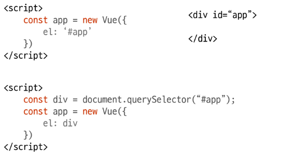
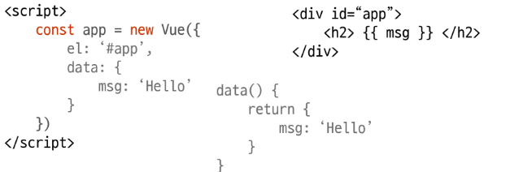

# Vue.js

---

## ◆ Vue 개요, Directive

- Vue 소개

- Vue Instance

- Vue Template Syntax

- Vue Instance Option 심화

- Vue LifeCycle

- ES6

---

## ◆ Vue 소개

- [x] 프론트 엔드 프레임워크 3대장
  
  - 리액트 : https://reactjs.org/
  
  - 앵귤러 : https://angular.io/
  
  - 뷰js : https://vuejs.org/ 

### ◎ Vue.js

- 사용자 인터페이스를 만들기 위한 progressive framework이다.

- 현대적 도구 및 지원하는 라이브러리와 함께 사용하면 정교한 SPA(Single Page Application)을 완벽하게 지원한다.

- Evan You에 의해서 만들어짐

- Vue 탄생은 Google에서 Angular로 개발하다가 가벼운 걸 만들어보고 싶다는 생각으로 시작한 개인 프로젝트

### ◎ Vue.js 특징

- Approachable (접근성)

- Versatile (유연성)

- Perfomant (고성능)

---

### ◎ MVVM Patternn

- 

- 애플리케이션 로직을 UI로부터 분리하기 위해 설계한 디자인 패턴
  
  _assets/7c552a64913d1ac773a2db377e6926b62b0e36f2.png)

- Model : 순수 자바스크립트 객체(데이터를 담기 위해 사용)

- View : 웹페이지의 DOM(HTML)

- ViewModel : Vue 역할, View와 Model 사이에서 Data와 DOM에 관련한 일 처리

### ◎ Front End Framework Trend

- https://redmonk.com/

- https://2021.stateofjs.com/ko-KR/

- https://gitstar-ranking.com/

---

### ◎ 설치 방법

- Direct \`

- NPM

- CLI
  
  - https://v2.vuejs.org/v2/guide/installation.html

### ◎ 크롬 확장 프로그램 : Vue.js devtools 설치

- 설치 후 확장 프로그램 세부 설정에서 URL 접근 허용 활성화

---

---

# ◆ Vue Instance

### ◎ Vue Instance 생성

- 모든 Vue 앱은 Vue 함수로 새 Vue 인스턴스를 만드는 것부터 시작
  
  _assets/1621e33d3bd13e1e07400e7efbd2718c096ab452.png)

- Vue 인스턴스를 생성할 때는 Options 객체를 전달해야 함

- 사용 가능한 전체 옵션은 https://kr.vuejs.org/v2/api/#propsData 에서 확인

### ◎ Vue Instance - Options : el

- Vue 인스턴스에 마운트(연결)할 기존 DOM 엘리먼트 지정

- CSS selector or HTML Element 작성

- new를 이용한 인스턴스 생성 때만 사용한다.
  
  

### ◎ Vue Instance - Options : data

- Vue 인스턴스의 데이터 객체

- 객체 또는 함수의 형태로 작성 가능

- 컴포넌트를 정의할 때 data는 데이터를 반환하는 함수로 선언해야 함.
  
  (일반 객체 사용 시 생성된 모든 인스턴스에서 동일 객체 참조 공유, 함수로 생성 시 새 복사본을 반환)

- 화살표 함수 사용 X
  
  화살표 함수가 부모 컨텍스트를 바인딩하기 때문에 'this'는 예상과 달리 Vue 인스턴스가 아님
  
  

- Vue 인스턴스에 추가할 메소드

- VM 인스턴스를 통해 직접 접근 or Directive 표현식에서 사용 가능

- 모든 메소드는 자동으로 this 컨텍스트를 Vue 인스턴스에 바인딩.

- 화살표 함수를 메소드 정의하는데 사용하면 안 됨.
  
  _assets/1cc20372fc382a7a19b77bd4f1c66bbce63d4171.png)

### ◎ Vue Instance - Options : template

- Vue 인스턴스의 마크업으로 사용할 문자열 템플릿

- template는 마운트(연결)된 엘리먼트를 대체함

- Vue 옵션에 render 함수가 있으면 템플릿 속성은 무시

---

---

# ◆ Vue Template Syntax

### ◎ Template Syntax

- Vue.js는 렌더링 된 DOM을 기본 Vue 인스턴스의 데이터에 선언적으로 바인딩 할 수 있는 HTML 기반 템플릿 구문 사용

- 보간법(Interpolation)

- 디렉티브(Directive)

### ◎ 보간법(Interpolation) - 문자열(Text)

- 데이터 바인딩의 가장 기본 형태 "Mustache" 구문(이중 중괄호)을 사용한 텍스트 보간

- \메시지 : {{msg}} \

- Mustache 태그는 데이터 객체의 msg 속성 값으로 대체
  
  (해당 값이 변경되면 갱신) 

- v-once 디렉티브를 사용하여 데이터 변경 시 업데이트 되지 않는 일회성 보간을 수행

- \ 다시는 변경하지 않습니다: {{msg}} \

### ◎ 보간법(Interpolation) - Raw HTML (원시 HTML)

- 이중 중괄호는 HTML이 아닌 일반 텍스트로 해석
  
  실제 HTML을 출력하기 위해서는 v-html 디렉티브 사용

- \
Using mustaches: {{rawHtml}}\

  
  \
Using v-html directive: \\

  
  _assets/660929c11f6aa31eeeb53b7bfeb842a10158e985.png)

- 웹사이트에서 임의의 HTML을 동적으로 렌더링하려면 XSS 취약점으로 쉽게 이어질 수 있으므로 매우 위험할 수도 있음. 신뢰할 수 있는 콘텐츠에서만 HTML 보간을 사용할 것

### ◎ 보간법(Interpolation) -

- Vue.js는 모든 데이터 바인딩 내에서 JavaScript 표현식의 모든 기능을 지원
  
  _assets/0188a1ef03149397ec3b91e8b20450cabe92ab7c.png)

- 한가지 제한 사항은 각 바인딩에 하나의 단일 표현식만 포함될 수 있으므로 아래처럼 작성하지 말것
  
  _assets/1b0bbce17a97dc31f17fb1f3c381611dd079ec41.png)

### ◎ Directive (디렉티브)

- v- 접두사가 있는 특수 속성

- 속성 값은 단일 JavaScript 표현식이 됨. (v-for 예외)

- 역할은 표현식의 값이 변경될 때 사이드 이펙트를 반응적으로 DOM에 적용
  
  _assets/85cf06e3e043fdfb652686beddaa7a3cbc7613ea.png)

### ◎ Directive (디렉티브) : v-text

- 엘리먼트의 textContent를 업데이트

- 일부를 갱신해야 한다면 {{}}를 사용해야 함.
  
  _assets/8806849ed701c67861d35de3011cc414c3851675.png)

### ◎ Directive (디렉티브) : v-bind

- HTML 요소의 속성에 Vue 상태 데이터를 값으로 할당

- Object 형태로 사용하면 Value가 true인 key가 class 바인딩 값으로 할당

- 약어 제공 : 
  
  v-bind : herf == :href
  
  _assets/36facea79e257173dc58dea3eb210a02cfe46f2f.png)

### ◎ Directive (디렉티브) : v-model

- HTML form 요소의 input 엘리먼트 또는 컴포넌트에 양방향 바인딩 처리

- 수식어
  
  - .lazy : input 대신 change 이벤트 이후에 동기화
  
  - .number : 문자열을 숫자로 변경
  
  - .trim : 입력에 대한 trim 진행

- form 엘리먼트 초기 'value'와 'checked', 'selected' 속성을 무시함

### ◎ Directive (디렉티브) : v-show

- 조건에 따라 엘리먼트를 화면에 표시

- 항상 렌더링되고 DOM에 남아있음

- 단순히 엘리먼트에 display CSS 속성을 토글하는 것

- 조건이 바뀌면 트랜지션 호출
  
  _assets/fd408b4ed6e92f0d12b7f0fc26028e8f5664fbb8.png)

### ◎ Directive (디렉티브) : v-if, v-else-if, v-else

- 표현식 값의 참, 거짓을 기반으로 엘리먼트를 조건부 렌더링 함

- 엘리먼트 및 포함된 디렉티브/컴포넌트는 토글하는 삭제되고 다시 작성됨.

- \<template> 엘리먼트를 이용하여 v-if 사용가능, 최종 결과에는 \<template>엘리먼트는 포함 X

- `무료`

- `7000원`

- `10000원`

- `3000원`

### ◎ Directive (디렉티브) : v-for

- 원본 데이터를 기반으로 엘리먼트 또는 템플릿 블록을 여러번 렌더링

- 디렉티브의 값은 반복되는 현재 엘리먼트에 대한 별칭을 제공하기 위해
  
  **allias in expression**을 사용
  
  _assets/14a9de4877278d5aff0aa5ed4c11bc5abb519212.png)

- 
  
  _assets/5be307c1d43d2a17044635ad22a35b43a9d929ac.png)

- v-for의 기본 동작은 엘리먼트를 이동하지 않고 그 자리에서 패치 시도, 강제로 엘리먼트의 순서를 바꾸려면 특수 속성 key 설정

### ◎ Directive (디렉티브) : v-for

- v-for의 기본 동작은 엘리먼트를 이동하지 않고 그 자리에서 패치 시도,   
  강제로 엘리먼트의 순서를 바꾸려면 특수 속성 key 설정
  
  _assets/d632fe64d21598af0eae7173cfcc3af3c7a01332.png)

- v-if와 함께 사용하는 경우, v-for는 v-if보다 높은 우선 순위를 갖는다.
  
  따라서 되도록이면 같이 작성하는 것은 피하자

### ◎ Directive (디렉티브) : v-on

- 엘리먼트에 이벤트 리스너를 연결

- 이벤트 유형은 전달인자로 표시

- 약어 제공 @
  
  `v-on:click===@click`
  
  _assets/02399cbd8e9552954878d1be77e29898562381b7.png)

### ◎ Directive (디렉티브) : v-cloak

- Vue Instance가 준비될 때까지 Mustache 바인딩을 숨기는데 사용

- [v-clock] {display: none}과 같은 CSS 규칙과 함께 사용

- Vue Instatnce가 준비되면 v-cloak는 제거됨

---

---

# ◆ Vue Instance Option

### ◎ Vue Method

- Vue Instance는 생성 관련된 데이터(data) 및 메서드의 정의 가능ㅇ

- method 안에 data를 this.데이터 이름으로 접근 

_assets/08d628680dafc4714f2768ecb54757794114a9e3.png)

### ◎ Vue Filters

- Vue는 텍스트 형식화를 적용할 수 있는 필터를 지원함

- filter를 이용하여 표현식에 새로운 결과 형식을 적용

- {{Mustache}} 구문(이중 중괄호) 또는 v-bind 속성에서 사용이 가능

- 자바스크립트 표현식 마지막에 "|" 심볼과 함께 추가되어야 함

- 필터는 체이닝이 가능
  
  _assets/310755e5b7b0238836e72df8d49fb1097bca2e23.png)

- 전역 필터
  
  _assets/ce9bfe5857c6a125a251d956c56f215a083c9286.png)

- 지역 필터
  
  _assets/47aa64e95a9ee2663804e03ca91f9117a99ef9f6.png)

### ◎ Vue computed

- 특정 데이터의 변경 사항을 실시간으로 처리할 수 있음

- 

- Setter와 Getter를 직접 지정할 수 있음

- 작성은 method 형태로 정의하지만 Vue에서 프록시 처리하여 property처럼 사용.

- 화살표 함수를 사용하면 안 됨
  
  _assets/4edeb99ebb2a723f927526b0c3e0564534bd39b3.png)
  
  _assets/dfd316c638ddb7caf5de98b068496c86226ad9fc.png)

### ◎ Vue computed & methods

- computed 속성 대신 methods에 함수 정의하여 사용 가능. (최종 결과는 같음)

- computed 속성은 종속 대상을 계
  
  즉, 종속된 대상이 변경되지 않는 한 computed에 작성된 함수를 여러 번 호출해도 계산을 다시 하지 않고, 계산되어 있는 결과를 반환

- method를 호출하면 렌더링을 다시 할 때마다 항상 함수를 실행

### ◎ Vue watch

- Vue Instance의 특정 property가 변경될 때 실행할 callback 함수 설정

- 데이터를 감시

- 화살표 함수 사용 X
  
  _assets/780fddd83c04bca56ba930749f2e3e72bc5934bd.png)

### ◎ Vue computed & watch

- computed
  
  - 특정 데이터를 직접적으로 사용/가공하여 다른 값으로 만들 때 사용
  
  - 계산해야 하는 목표 데이터를 정의하는 방식으로 SW 공학에서 이야기하는 '선언형 프로그래밍' 방식

- watch
  
  - 특정 데이터의 변화 상황에 맞추어 다른 data 등이 바뀌어야 할 때 주로 사용
  
  - 감시할 데이터를 지정하고 "그 데이터가 바뀌면 이런 함수를 실행하라"라는 방식으로 SW 공학에서 이야기하는 '명령형 프로그래밍' 방식

---

---

# ◆ Vue Life Cycle

### ◎ Instance Life Cycle Hooks

- 각 Vue 인스턴스는 생성될 때 일련의 초기화 단계를 걸친다.
  
  - 데이터 관찰 설정이 필요한 경우
  
  - 템플릿을 컴파일하는 경우
  
  - 인스턴스를 DOM에 마운트하는 경우
  
  - 데이터가 변경되어 DOM을 업데이트하는 경우 등

- 그 과정에서 사용자 정의 로직을 실행할 수 있는 Life Cycle Hooks도 호출

- 크게 4개의 파트(생성, 부착, 갱신, 소멸)로 나뉜다.

- 모든 Life Cycle Hooks은 자동으로 this 컨텍스트를 인스턴스에 바인딩하므로 데이터, 계산된 속성 및 메소드에 접근할 수 있다. (화살표 함수를 사용해 라이프 사이클 메소드를 정의하면 X)

| Life Cycle Hooks | 설명                                                                                                      |
|:----------------:|:-------------------------------------------------------------------------------------------------------:|
| beforeCreate     | 인스턴스가 방금 초기화된 후 데이터 관찰 및 이벤트 / 감시자 설정 전에 동기적으로 호출                                                       |
| created          | 인스턴스가 작성된 후 동기적으로 호출. 데이터 처리, 계산된 속성, 메서드, 감시/이벤트 콜백 등과 같은 옵션 처리 완료 마운트가 시작되지 않았으므로 DOM 요소 접근 X |
| beforeMount      | 마운트가 시작되기 전에 호출                                                                                         |
| mounted          | 지정된 엘리먼트에 Vue  인스턴스 데이터가 마운트 된 후에 호출                                                                    |
| beforeUpdated    | 데이터 변경될 때 virtual DOM이 렌더링, 패치되기 전에 호출                                                                  |
| updated          | Vue에서 관리되는 데이터가 변경되어 DOM이 업데이트 된 상태                                                                     |
| beforeDestroy    | Vue 인스턴스가 제거되기 전에 호출                                                                                    |
| destroyed        | Vue 인스턴스가 제거된 후에 호출                                                                                     |

---

---

# ◆ ES6 문법

### ◎ Property Shorthand

_assets/2b260dc6b1c117f91fc2bfe6a031c1cb823b5888.png)

### ◎ Concise method

_assets/931a0d468b60b4ab06d77e9315015cae00286869.png)

### ◎ Destructuring

- 객체(배열, 객체)에 입력된 값을 개별적인 변수에 할당하는 간편 방식 제공

_assets/eb3cd6e5e75f6544f920c3fe412bdc2957bec54c.png)

_assets/7743878a26b531d5558c15a07c57cbbfe0de8141.png)

_assets/dc7bb1afa85768e36a05c9008412c7aa430ed90b.png)

### ◎ Module

- 프로그램을 기능별로 여러 개의 파일로 나누는 형태

- 브라우저의 지원 여부 확인

### ◎ Module 시스템

- CommonJS(NodeJS) - 웹 브라우저 밖에서도 동작될 수 있는 모듈 규칙 설립

- AMD (Asynchronous Module Defination) - 비동기적으로 모듈을 로딩

- **ESM(ECMAScript Module, ECMA215, es6)** - 자바 스크립트 자체 모듈

### ◎ Module 정의 및 사용

- 가져오기 : import

- 
  
  _assets/9ffa382906c0299af6d5b4f247fb8aba1d860fd4.png)

- 내보내기 : export

  _assets/841332032ced32506470934e6787ba5be25fd39f.png)
