# Vue

---

## INDEX

- Vue intro

- Why Vue

- Vue instance

- Basic of Syntax

- Vue advanced

---

## ◆ Vue intro

### | 사전 준비

- VSCode **Vetur** extension 설치
  
  - 문법 하이라이팅, 자동 완성, 디버깅 기능 제공

- Chrome **Vue devtools** extension 설치 및 설정
  
  - 크롬 브라우저 개발자 도구에서 vue 디버깅 기능 제공

### |  Front-end Framework

- Front-end(FE) 개발이란?
  
  - 사용자에게 보여지는 화면 만들기

- `Web App`(SPA)을 만들 때 사용하는 도구
  
  - SPA : Single Page Application

### | Web App이란?

- 웹 브라우저에서 실행되는 어플리케이션 소프트웨어

- 개발자 도구에서 디바이스 모드를 켰을 때, 웹 페이지가 본래 모습 그대로가 아니라 `디바이스에 설치된 App`처럼 보이는 것

- 웹 페이지가 디바이스에 맞는 적절한 UX/UI로 표현되는 형태

### | SPA(Single Page Application)

- Web App과 함께 자주 등장할 용어 SPA

- 이전까지는 사용자의 요청에 적절한 페이지 별 template을 반환

- SPA는 서버에서 최초 1장의 HTML만 전달받아 모든 요청에 대응하는 방식을 의미
  
  - 어떻게 한 페이지로 모든 요청에 대응할 수 있을까?
  
  - `CSR`(Client Side Rendering) 방식으로 요청을 처리하기 때문

### | [참고] SSR(Server Side Rendering)이란?

- 기존의 요청 처리 방식은 SSR

- Server가 사용자의 요청에 적합한 HTML을 렌더링하여 제공하는 방식

- 전달 받은 새 문서를 보여주기 위해 브라우저는 새로고침을 진행
  
  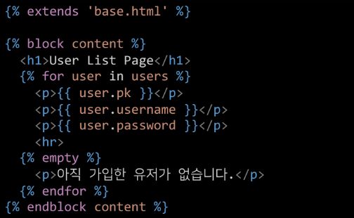

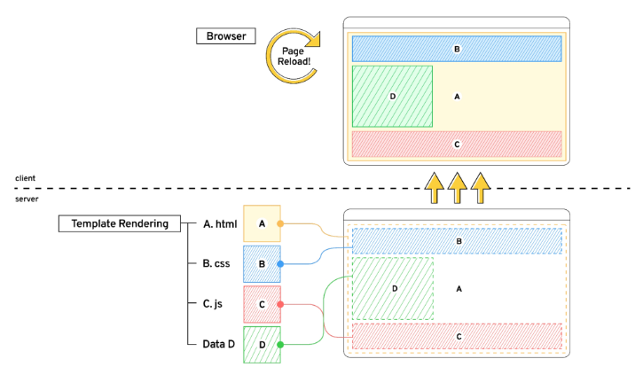

### | CSR (Client Side Rendering)이란?

- 최초 한 장의 HTML을 받아오는 것은 동일
  
  - 단, server로부터 최초로 받아오는 문서는 빈 html 문서
    
    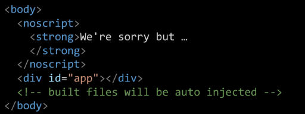

- 각 요청에 대한 대응을 JavaScript를 사용하여 필요한 부분만 다시 렌더링
  
  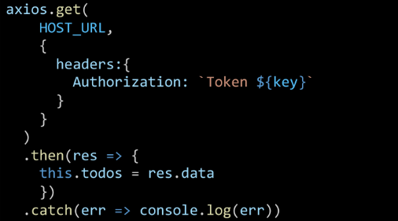
  
  1. 새로운 페이지를 서버에 `AJAX`로 요청
  
  2. 서버는 화면을 그리기 위해 필요한 데이터를 JSON 방식으로 전달
  
  3. `JSON` 데이터를 JavaScript로 처리, DOM 트리에 반영(렌더링)

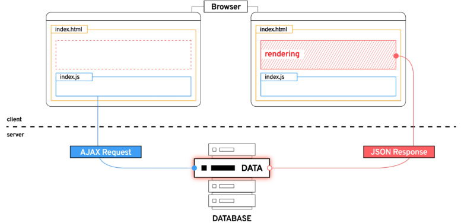

### | 왜 CSR 방식을 사용하는 걸까?

1. 모든 HTML 페이지를 서버로부터 받는 것이 아니기 때문
   
   - 클라이언트 - 서버간 통신 즉, 트래픽이 감소
   
   - 트래픽이 감소한다 = 응답 속도가 빨라진다

2. 매번 새 문서를 받아 새로고침하는 것이 아니라 필요한 부분만 고쳐나가므로, 각 요청이 끊김없이 진행
   
   - SNS에서 추천을 누를 때마다 첫 페이지로 돌아간다 = 끔찍한 App!
   
   - 요청이 자연스럽게 진행이 된다 = UX 향상

3. BE와 FE의 작업 영역을 명확히 분리할 수 있음
   
   - 각자 맡은 역할을 명확히 분리한다 = 협업이 용이해짐

### | CSR은 만능일까?

- 첫 구동 시 필요한 데이터가 많으면 많을수록  
  최초 작동 시작까지 오랜 시간이 소요

- Naver, Netflix, Disney+ 등 모바일에 설치된 Web-App을 실행하게 되면 잠깐의 로딩 시간이 필요

- **`검색 엔진 최적화`**(SEO, Search Engine Optimization)가 어려움
  
  - 서버가 제공하는 것은 텅 빈 HTML
  
  - 내용을 채우는 것은 AJAX 요청으로 얻은 JSON 데이터로 클라이언트(브라우저)가 진행

- 대체적으로 HTML에 작성된 내용을 기반으로 하는 검색 엔진에
  
  빈 HTML을 공유하는 SPA 서비스가 노출되기는 어려움

### | [참고] SEO(Search Engine Optimization)

- google, bing과 같은 검색 엔진 등에 내 서비스나 제품 등이 효율적으로 검색 엔진에 노출되도록 개선하는 과정을 일컫는 작업

- `검색` = 각 사이트가 운용하는 검색 엔진에 의해 이루어지는 작업

- `검색 엔진` = 웹 상에 존재하는 가능한 모든 정보들을 긁어 모으는 방식으로 동작
  
  - 정보의 대상은 주로 HTML에 작성된 내용
  
  - JavaScript가 실행된 이후의 결과를 확인하는 과정이 없음

- 최근에는 SPA, 즉 CSR로 구성된 서비스의 비중이 증가
  
  - SAP 서비스도 검색 대상으로 넓히기 위해 JS를 지원하는 방식으로 발전

- 단, 단순 HTML만을 분석하는 것보다 몇 배의 리소스가 필요한 작업이기에 여전히 CSR의 검색 엔진 최적화 문제가 모두 해결된 것은 아님

### | CSR vs SSR

- CSR과 SSR은 양립할 수 있음
  
  - 내 서비스에 적합한 렌더링 방식을 적절하게 활용할 수 있어야 함

- SPA 서비스에서도 SSR을 지원하는 Framework도 발전하고 있음
  
  - Vue의 Nuxt.js
  
  - React의 Next.js
  
  - Angular Universal 등

### | 여러가지 Front-end Framework

- Front-end Framework == HTML + CSS + JS를 더 편하게 작업하기 위한 툴
  
  - React, Angular, Svelt, `Vue` 등

### | 프레임워크는 필수적인가?

- 더 쉽게 개발하기 위해서 사용하는 것일뿐임

- 실제로 Github 같은 곳은 이러한 Front-end Framework를 사용하지 않음

- 하지만 대부분의 기업에서는 생산성과 협업을 위해 Framework를 사용해서 개발

---

---

# ◆ Why Vue

### | Vue를 쓰는 이유

- 타 Framework에 비해 상대적으로 진입장벽이 낮다
  
  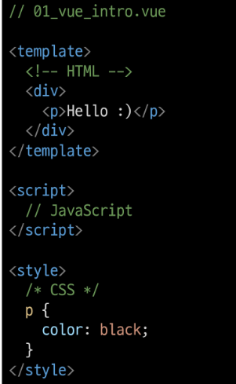
  
  - 구조가 직관적임
    
    - template : HTML
    
    - script : JavaScript
    
    - style : CSS

### | Vue CDN

- Vue로 작업을 시작하기 위하여 CDN을 가져와야 함

- Django == Python Web Framework
  
  - pip install

- Vue === JS Front-end Framework
  
  - Bootstrap에서 사용하였던 CDN 방식 제공
  
  - npm으로도 설치 가능

- Vue CDN을 위하여 `Vue2 공식 문서` 접속
  
  - https://v2.vuejs.org/
    
    1. Getting Started
    
    2. Installation
    
    3. Development Version CDN 복사
       
       ``

### | Vue로 코드 작성하기

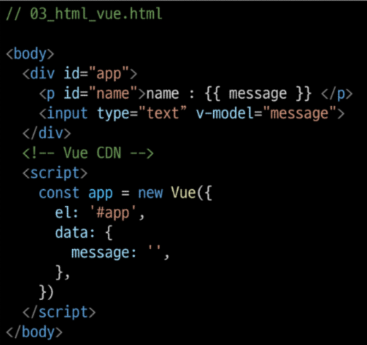

1. Vue CDN 가져오기

2. Vue instance 생성
   
   - Vue instance - 1개의 Object
   
   - 정해진 속성명을 가진 Object

3. `el, data` 설정
   
   - data에 관리할 속성 정의

4. 선언적 렌더링 `{{}}`
   
   - Vue data를 화면에 렌더링

5. input tag에 `v-model` 작성
   
   - input에 값 입력 => Vue data 반영
   
   - Vue data => Dom 반영

### | [참고] Dev Tools 확인

- Vue devtools에서 data 변경 -> DOM 반영

- 눈에 보이는 화면을 조작하는 것이 아닌 Vue가 가진 data를 조작

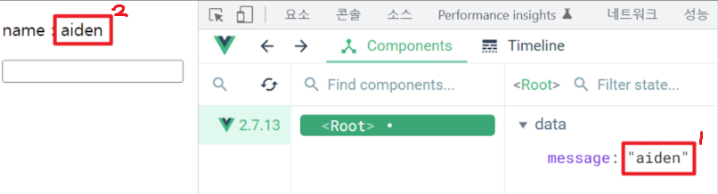

---

---

# ◆ Vue2 vs Vue3

### | Vue3

- 2022년 02월부터 Vue 프레임워크의 기본 버전이 3버전으로 전환

- 대체적인 설정들이 Vue3을 기본으로 적용되어 있음
  
  - ex) 공식 문서, CDN, npm 등

### | Vue2

- 여전히 vue2가 많이 사용됨 (legacy code)

- 사용된 기간이 긴 만큼 상대적으로 많은 문서의 양, 참고자료, 질문/답변

- 안정적인 측면에서는 아직 vue2가 우세한 편

---

---

# ◆ Vue instance

### | MVVM Pattern

- 소프트웨어 아키텍처 패턴의 일종

- 마크업 언어로 구현하는 그래픽 사용자 인터페이스(`view`)의 개발을
  
  Back-end(`model`)로부터 분리시켜
  
  view가 어느 특정한 모델 플랫폼에 종속되지 않도록 함

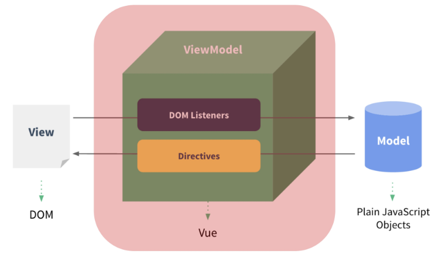

- `View` : 우리 눈에 보이는 부분 = DOM!

- `Model` : 실제 데이터 = JSON!

- `View Model` (Vue)
  
  - View를 위한 Model
  
  - View와 연결(binding)되어 Action을 주고 받음
  
  - Model이 변경되면 View Model도 변경되고 바인딩된 View도 변경됨
  
  - View에서 사용자가 데이터를 변경하면
    
    View Model의 데이터가 변경되고 바인딩된 다른 View도 변경됨

### | MVVM Pattern 정리

- View는 Model을 모르고, Model도 View를 모른다 = **독립성 증가, 적은 의존성**
  
  - DOM은 Data를 모르고, Data도 DOM을 모른다.

### | Vue instance

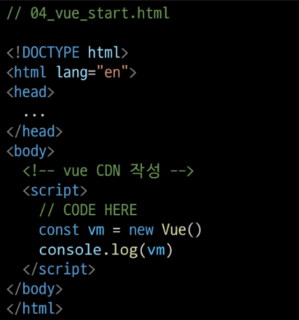

1. Vue CDN 가져오기

2. `new` 연산자를 사용한 생성자 함수 호출
   
   - vue instance 생성

3. 인스턴스 출력 및 확인

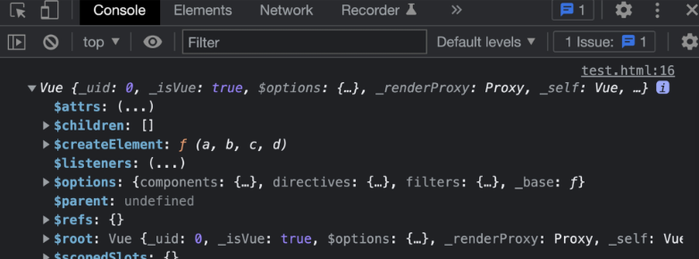

- Vue instance === 1개의 객체

- 아주 많은 속성과 메서드를 이미 가지고 있고, 이러한 기능들을 사용하는 것

---

### | [참고] 생성자 함수

- JS에서 객체를 하나 생성한다면, 하나의 객체를 선언하여 생성
  
  - 동일한 형태의 객체를 또 만든다면, 또 다른 객체를 선언하여 생성

- Vue에서는 `new` 연산자로 사용하는 **생성자 함수**로 동일한 구조의 객체를 여러 개 만들 수 있다.
  
  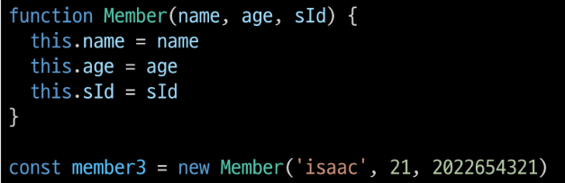

- 함수 이름은 반드시 대문자로 시작

- 생성자 함수를 사용할 때는 반드시 `new` 연산자를 사용

---

### | el(element)

- Vue instance와 DOM을 mount(연결)하는 옵션
  
  - View와 Model을 연결하는 역할 
  
  - HTML id 혹은 class와 마운트 가능

- Vue instance와 **연결되지 않은 DOM 외부는 Vue의 영향을 받지 않음**
  
  - Vue 속성 및 메서드 사용 불가

---

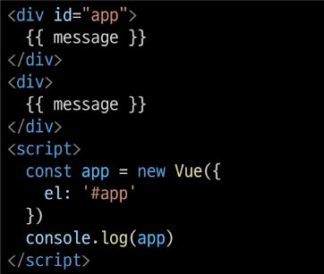

- 생성자 함수 첫번째 인자로 `Object` 작성

- el 옵션에 **`#app`** 작성 = DOM 연결
  
  - `console.log(app)`으로 개발자 도구 console 창에 `$el:div#app` 출력됨

- Vue와 연결되지 않은 div 생성
  
  - id가 app인 놈은 message 속성이 정의되지 않았다는 경고가 console 창에 뜨고,
  
  - 아랫놈은 message가 그대로 출력됨

---

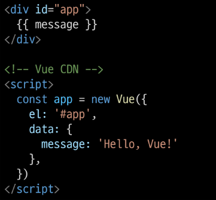

- Vue instance의 `데이터 객체` 혹은 `인스턴스 속성`

- 데이터 객체는 반드시 기본 객체 `{ } (Object)`여야 함

- 객체 내부의 아이템들은 value로, 모든 타입의 객체를 가질 수 있음

- 정의된 속성은 `interpolation {{}}`을 통해 view에 렌더링 가능함

- Vue instance에 `data` 객체 추가
  
  - data 객체에 `message` 값 추가
  
  - 추가된 객체의 각 값들은 `this.message` 형태로 접근 가능

---

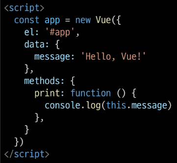

- Vue instance의 `method`들을 정의하는 곳

- `methods` 객체 정의
  
  - 객체 내 print method 정의
  
  - print method 실행 시, Vue instance의 data내 message 출력

- 콘솔창에서 app.print() 실행 > "Hello, Vue!"

----

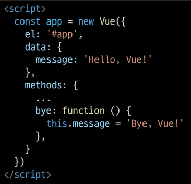

- method를 호출하여 data 변경 가능
  
  - 객체 내 bye method 정의
  
  - print method 실행 시
    
    Vue instance의 data 내 message 변경

- 콘솔창에서 app.bye() 실행
  
  - DOM에 바로 변경된 결과 반영
  
  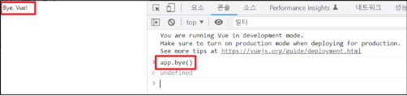
  
  - Vue의 강력한 반응성(reactivity)

---

### | [주의] methods with Arrow Function

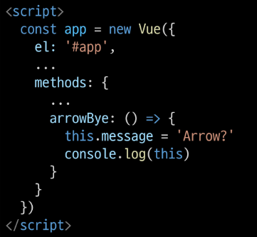

- `메서드를 정의할 때, Arrow Function을 사용하면 안 됨`

- Arrow Function의 this는 함수가 선언될 때, 상위 스코프를 가리킴

- 즉 this가 상위 객체 window를 가리킴

- 호출은 문제없이 가능하나, this로 Vue의 data를 변경하지 못함

---

---

# ◆ Basic of Syntax

### | Template Syntax

- Vue2 guide > template syntax 참고

- `렌더링 된 DOM`을 기본 Vue instance의 data에 `선언적으로 바인딩`할 수 있는 `HTML 기반 template syntax`를 사용
  
  - 렌더링 된 DOM - 브라우저에 의해 보기 좋게 그려질 HTML 코드
  
  - HTML 기반 template syntax - HTML 코드에 직접 작성할 수 있는 문법 제공
  
  - 선언적으로 바인딩 - Vue instance와 DOM을 연결  

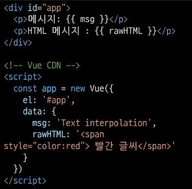

- 가장 기본적인 바인딩(연결) 방법

- 중괄호 2개로 표기

- DTL과 동일한 형태로 작성

- Template interpolation 방법은 HTML을 `일반 텍스트`로 표현

### | RAW HTML

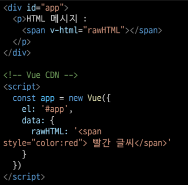

- `v-html` directive을 사용하여 data와 바인딩

- directive - HTML 기반 template syntax

- HTML의 기본 속성이 아닌 Vue가 제공하는 특수 속성의 값으로 data를 작성

### | [참고] JS 표현식

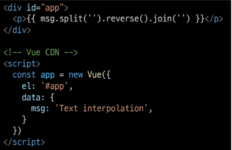

- 위와 같은 표현식 형태로 작성 가능
  
  - 결과 : noitalopretni txeT

---

---

# ◆ Directives

### | Directives 기본 구성

- v-접두사가 있는 특수 속성에는 값을 할당할 수 있음
  
  - 값에는 JS 표현식을 작성할 수 있음 

- directive의 역할은 **표현식의 값이 변경될 때 반응적**으로 DOM에 적용하는 것

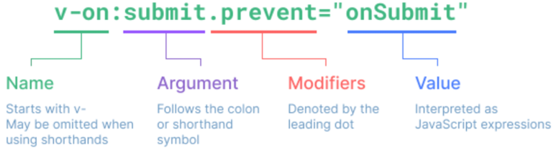

- **\`:`** 을 통해 전달 인자를 받을 수 있음

- **\`.`** 으로 표시되는 특수 접미사 - directive를 특별한 방법으로 바인딩해야 함

### | 새 Vue instance 생성

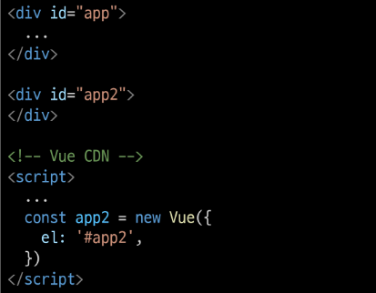

- 각각의 instance들은 연결된 DOM element에만 영향을 미침

- 연결되지 않은 DOM이 Vue의 영향을 받지 않았던 것과 동일한 상황

---

### | v-text

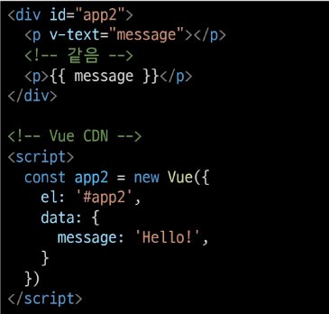

- Template Interpolation과 함께 가장 기본적인 바인딩 방법

- {{ }}와 흡사한 역할

---

### | v-html

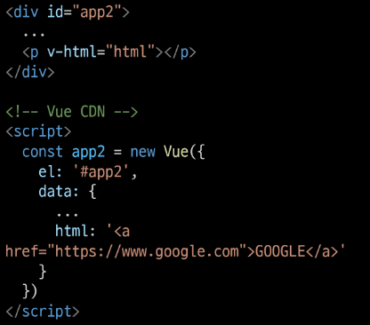

- RAW HTML을 표현할 수 있는 방법

- 단, 사용자가 입력하거나 제공하는 컨텐츠에는 **절대 사용 금지**
  
  - XSS 공격에 취약하다

    ---

### | v-show

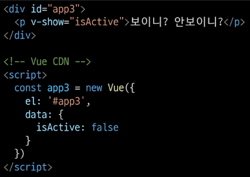

- 표현식에 작성된 값에 따라 element를 보여 줄 것인지 결정
  
  - boolean 값이 변경될 때마다 반응

- 대상 element의 display 속성을 기본 속성과 none으로 toggle

- 요소 자체는 항상 DOM에 렌더링 됨
  
  - 위 예시는 isActive 값이 false냐 true냐에 따라 보이고 안 보이고가 바뀌는 것

- 바인딩 된 isActive의 값이 false이므로 첫 방문 시 p tag는 보이지 않음
  
  - vue dev tools에서 isActive 변경 시 화면에 출력
  
  - 값을 false로 변경 시 다시 사라짐

- 화면에서만 사라졌을뿐, DOM에는 존재한다.
  
  - display 속성이 변경되었을 뿐

---

### | v-if

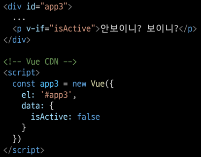

- v-show와 사용 방법은 동일

- isActive의 값이 변경될 때 반응

- 단, 값이 false인 경우, `DOM에서 사라짐`

- **v-if, v-else-if, v-else** 형태로 사용

---

### | v-show VS v-if

- **v-show** (Expensive initial load, cheap toggle)
  
  - 표현식 결과와 관계없이 렌더링 되므로
    
    초기 렌더링에 필요한 비용은 v-if보다 높을 수 있음
  
  - display 속성 변경으로 표현 여부를 판단하므로 렌더링 후 toggle 비용은 적음

- **v-if** (Cheap initial load, expensive toggle)
  
  - 표현식 결과가 false인 경우, 렌더링조차 되지 않으므로
    
    초기 렌더링 비용은 v-show보다 낮을 수 있음
  
  - 단, 표현식 값이 자주 변경되는 경우, 잦은 재 렌더링으로 비용이 증가할 수 있음

---

### | v-for

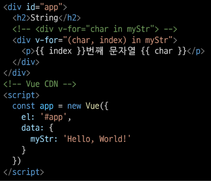

- `for ... in ... ` 형식으로 작성

- 반복한 데이터 타입에 모두 사용 가능

- index를 함께 출력하고자 한다면, `(char, index)` 형태로 사용 가능

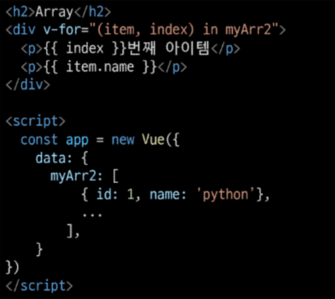

- 배열 역시 문자열과 동일하게 사용 가능

- 각 요소가 객체라면 `dot notation`으로 접근할 수 있음

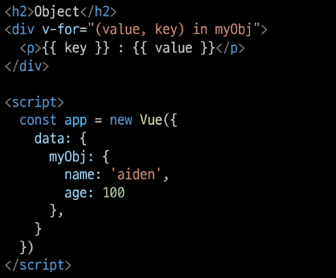

- 객체 순회 시 value가 할당되어 출력

- 2번째 변수 할당 시 key 출력 가능

---

### | [참고] 특수 속성 key

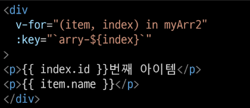

`"v-for 사용 시 반드시 key 속성을 각 요소에 작성"`

- 주로 **v-for directive** 작성 시 사용

- vue 화면 구성 시 이전과 달라진 점을 확인하는 용도로 활용
  
  - 따라서 key가 중복되어서는 안 됨

- 각 요소가 고유한 값을 가지고 있지 않다면 생략할 수 있음

---

### | v-on

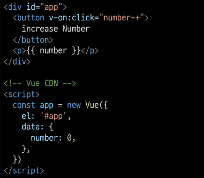

- **\`:`** 을 통해 전달받은 인자를 확인

- 값으로 JS 표현식 작성

- addEventListener의 첫 번째 인자와 동일한 값들로 구성

- 대기하고 있던 이벤트가 발생하면 할당된 표현식 실행

- method를 통한 data 조작도 가능

- method에 인자를 넘기는 방법은 일반 함수를 호출할 때와 동일한 방식

- \`:`을 통해 전달된 인자에 따라 특별한 modifiers(수식어)가 있을 수 있음
  
  - ex) v-on:keyup.enter 등

- :star: **\`@`** shortcut 제공 :star:
  
  - ex) @keyup.click

---

### | v-bind

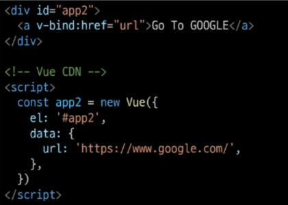

- HTML 기본 속성에 Vue data를 연결

- class의 경우, 다양한 형태로 연결 가능
  
  - `조건부 바인딩`
    
    - {'class Name' : '조건 표현식'}
    
    - 삼항 연산자도 가능
  
  - `다중 바인딩`
    
    - ['JS표현식', 'JS 표현식',...]

- Vue data의 변화에 반응하여 DOM에 반영하므로 상황에 따라 유동적 할당 가능

- :star: **\`:`** shortcut 제공:star:
  
  - ex) :class 등
  
  - v-for에서 사용하였던 :key는 v-bind의 shortcut을 활용한 것

---

### | v-model

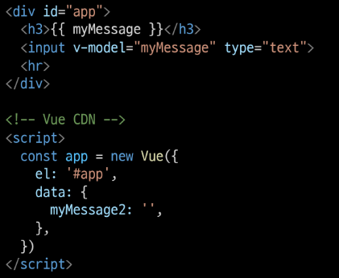

- Vue instance와 DOM의 `양방향 바인딩`

- Vue data 변경 시 v-model로 연결된 사용자 입력 element에도 적용

----

---

# ◆ Vue Advacned

### | computed

- Vue instance가 가진 options 중 하나

- computed 객체에 정의한 함수를 페이지가 최초로 렌더링 될 때 호출하여 계산
  
  - 계산 결과가 변하기 전까지 함수를 재호출하는 것이 아닌 계산된 값을 반환

### | method VS computed

- method
  
  - 호출 될 때마다 함수를 실행
  
  - 같은 결과여도 매번 새롭게 계산

- computed
  
  - 함수의 종속 대상의 변화에 따라 계산 여부가 결정됨
  
  - 종속 대상이 변하지 않으면 항상 저장(캐싱)된 값을 반환

---

### | watch

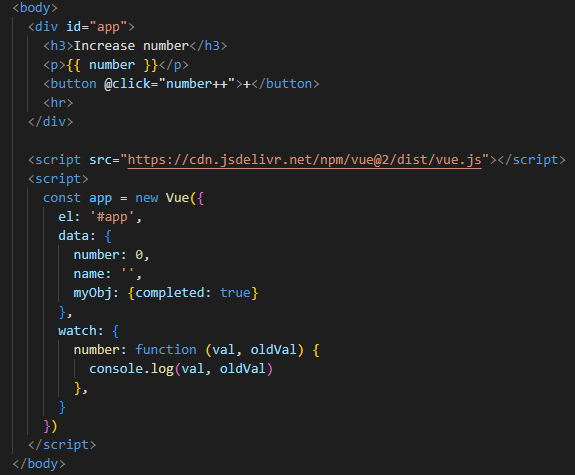

- 특정 데이터의 변화를 감지하는 기능
  
  1. watch 객체를 정의
  
  2. 감시할 대상 data를 지정
  
  3. data가 변할 시 실행할 함수를 정의

- 첫 번째 인자는 변동 전 data

- 두 번째 인자는 변동 후 data

- 실행 함수를 Vue method로 대체 가능
  
  1. 감시 대상 data의 이름으로 객체 생성
  
  2. 실행하고자 하는 method를 handler에 문자열 형태로 할당

- Array, Object의 내부 요소 변경의 감디를 위해서는 `deep` 속성 추가 필요
  
  - `deep: true`

---

### | filters

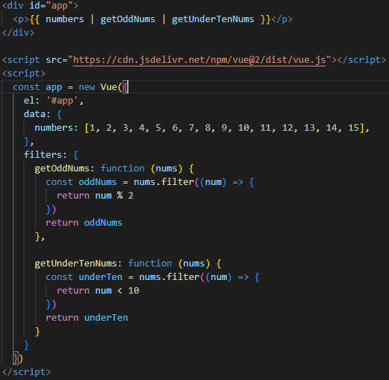

- 텍스트 형식화를 적용할 수 있는 필터

- interpolation 혹은 v-bind를 이용할 때 사용 가능

- 필터는 자바 스크립트 표현식 마지막에 **\`|`** (파이프)와 함께 추가되어야 함

- 이어서 사용(Chaining) 가능 (앞에서부터 적용)
