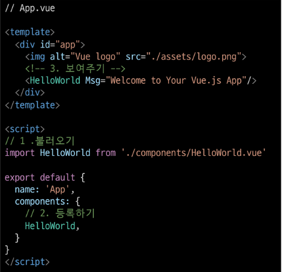
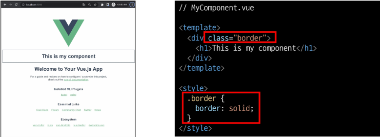
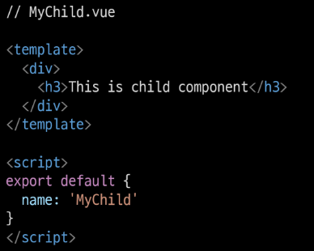

# Vue

---

1. Vue CLI

2. SFC

3. Pass Props & Emit Events

---

# ◆ Node.js

### | Node.js

- 자바스크립트는 브라우저를 조작하는 유일한 언어
  
  - 하지만 브라우저 밖에서는 구동할 수 없었음

- 자바스크립트를 구동하기 위한 런타임 환경인 Node.js로 인해 브라우저가 아닌 환경에서도 구동할 수 있게 됨
  
  - Chrome V8 엔진을 제공하여 여러 OS 환경에서 실행할 수 있는 환경을 제공
  
  - Browser만 조작 가능했으나, Server-Side-Programming 또한 가능해짐

---

### | NPM (Node Package Manage)

- 자바스크립트 패키지 관리자
  
  - Python에 pip이 있다면 Node.js에는 npm
  
  - pip과 마찬가지로 다양한 의존성 패키지를 관리

- Node.js의 기본 패키지 관리자

- Node.js 설치 시 함께 설치됨

---

# ◈ Vue CLI

### | Vue CLI

- Vue 개발을 위한 표준 도구

- 프로젝트의 구성을 도와주는 역할

- 확장 플러그인, GUI, Babel 등 다양한 tool 제공

### | :star: Vue CLI Quick Start :star:

- 설치
  
  `$ npm install -g @vue/cli`
  
  - -g는 글로벌이므로, 어디에서 git bash를 실행해도 상관 없음

- :sun_with_face:프로젝트 생성:sun_with_face:
  
  - vscode terminal에서 진행 (vue-cli는 假題임)
    
    `$ vue create vue-cli`
  
  - Vue 버전 선택 (Vue2)
  
  - `$ cd vue-cli`로 새로 생성된 프로젝트 폴더로 이동함
  
  - `$ npm run serve`로 실행 가능
    
    - http://localhost:8080/ 클릭하면 내 컴퓨터의 vue 페이지가 열림
      
      

---

# ◈ Vue CLI 프로젝트 구조

- .gitignore가 이미 생성되어 있음

- MINGW64 ~/ssafy8/Vue.js/03_vue/vue-cli (master)를 보면 알겠듯이, 
  
  git init이 이미 되어있는 상태로 만들어진다.
  
  - 이미 git이 설치되어있는 폴더 내에서 프로젝트를 생성했다면, 
    
        프로젝트의 .git을 삭제해줄 것

---

### | node_modules

- node.js 환경의 여러 의존성 모듈

- python의 venv와 비슷한 역할을 함
  
  - 따라서 .gitignore에 넣어주어야 한다.
    
    - 기본이 133MB나 된다...
  
  - vue 프로젝트를 생성하면 자동으로 추가됨
  
  - 새로 생성할 때는 프로젝트가 있는 폴더에서 `$ npm install`

### | node_modules - `Babel`

- "JavaScript Compiler"

- 자바스크립트의 ES6+ 코드를 구버전으로 번역/변환해주는 도구

- 자바스크립트의 파편화, 표준화의 영향으로 작성된 코드의 스펙트럼이 매우 다양
  
  - 최신 문법을 사용해도 브라우저의 버전 별로 동작하지 않는 상황이 발생
  
  - 버전에 따른 다른 의미의 다른 코드를 작성하는 등의 대응이 필요해졌고, 이러한 문제를 해결하기 위한 도구
  
  - 원시 코드(최신 버전)을 목적 코드(구 버전)으로 옮기는 번역기가 등장하면서 더 이상 코드가 특정 브라우저에서 동작하지 않는 상황에 대해 크게 고민하지 않을 수 있음

- Babel 동작 예시
  
  

### | node_modules - `Webpack`

- "static module bundler"

- 모듈 간의 의존성 문제를 해결하기 위한 도구

- 프로젝트에 필요한 모든 모듈을 매핑하고 내부적으로 종속성 그래프를 빌드함

### | [참고] Module

- 개발하는 애플리케이션의 크기가 커지고 복잡해지면 파일 하나에 모든 기능을 담기가 어려워짐

- 따라서 자연스럽게 파일을 여러 개로 분리하여 관리를 하게 되었고, 이때 분리된 파일 각각이 모듈. 즉 js 파일 하나가 하나의 모듈

- 모듈은 대개 기능 단위로 분리하며, 
  
  클래스 하나 혹은 특정한 목적을 가진 복수의 함수로 구성된 라이브러리 하나로 구성됨

- 여러 모듈 시스템
  
  - ESM(ECMA Script Module), AMD, CommonJS, UMD

### | Module 의존성 문제

- 모듈의 수가 많아지고 라이브러리 혹은 모듈 간의 의존성(연결성)이 깊어지면서 특정한 곳에서 발생한 문제가 어떤 모듈 간의 문제인지 파악하기 어려움
  
  - Webpack은 이 모듈간의 의존성 문제를 해결하기 위해 등장 

### | `Bundler`

- 모듈 의존성 문제를 해결해주는 작업이 Bundling

- 이러한 일을 해주는 도구가 Bundler이고, Webpack은 다양한 Bundler 중 하나

- 모듈들을 하나로 묶어주고 묶인 파일은 하나(혹은 여러 개)로 만들어짐

- Bundling된 결과물은 개별 모듈의 실행 순서에 영향을 받지 않고 동작하게 됨

- snowpack, parcel, rollup.js 등의 webpack 이외에도 다양한 모듈 번들러 존재

- `Vue CLI는 이러한 Babel, Webpack에 대한 초기 설정이 자동으로 되어 있음`

---

### | package.json

- 프로젝트의 종속성 목록과 지원되는 브라우저에 대한 구성 옵션을 포함

### | package-lock.json

- node_modules에 설치되는 모듈과 관련된 모든 의존성을 설정 및 관리

- 협업 및 배포 환경에서 정확히 동일한 종속성을 설치하도록 보장하는 표현

- 사용할 패키지의 버전을 고정

- 개발 과정 간의 의존성 패키지 충돌 방지

- python의 requirements.txt 역할

### | public/index.html

- Vue 앱의 뼈대가 되는 html 파일

- Vue 앱과 연결될 요소가 있음

### | src/

- src/assets
  
  - 정적(static) 파일을 저장하는 디렉토리

- src/components
  
  - 하위 컴포넌트들이 위치

- src/App.vue
  
  - 최상위 컴포넌트
  
  - public/index.html과 연결됨

- src/main.js
  
  - webpack이 빌드를 시작할 때 가장 먼저 불러오는 entry point
  
  - public/index.html과 src/App.vue를 연결시키는 작업이 이루어지는 곳
  
  - Vue 전역에서 활용할 모듈을 등록할 수 있는 파일

---

---

# ◆ SFC

## Component

### | Component란?

- UI를 독립적이고 재사용 가능한 조각들로 나눈 것
  
  - 즉, 기능별로 분화한 코드 조각

- CS에서는 다시 사용할 수 있는 범용성을 위해 개발된 소프트웨어 구성 요소를 의미

- 하나의 app을 구성할 때 중첩된 컴포넌트들의 tree로 구성하는 것이 보편적임
  
  - Web 시간에 배운 HTML 요소들의 중첩을 떠올려 보자!
    
    - Body tag를 root node로 하는 tree의 구조이다.
    
    - 마찬가지로, Vue에서는 src/App.vue를 root node로 하는 tree의 구조를 가짐

- 컴포넌트는 유지보수를 쉽게 만들어 줄 뿐만 아니라
  
  재사용성의 측면에서도 매우 강력한 기능을 제공

### | Django에서의 예시

- Django에서 base.html과 index.html을 분리하여 작성하였지만, 하나의 화면으로 볼 수 있었다.
  
  - 즉, 한 화면은 여러 개의 컴포넌트로 이루어질 수 있다. 

- base.html을 변경하면 이를 extends하는 모든 화면에 영향을 미침
  
  - 유지보수를 쉽게 해줌

### | Component based architecture 특징

- 관리가 용이
  
  - 유지/보수 비용 감소

- 재사용성

- 확장 가능

- 캡슐화

- 독립적

---

---

# SFC

### | component in Vue

- Vue에서 말하는 component란 **이름이 있는 재사용 가능한 Vue instance**

- Vue instance란, `new Vue()`로 만든 인스턴스

### | SFC (Single File Component

- 하나의 `.vue` 파일이 하나의 `Vue instance`이고, 하나의 `컴포넌트`이다.
  
  - 즉 Single File Component

- Vue instance에서는 HTML, CSS, JavaScript 코드를 한번에 관리
  
  - 이 Vue instance를 기능 단위로 작성하는 것이 핵심

- 컴포넌트 기반 개발의 핵심 기능

### | 정리

- HTML, CSS, 그리고 JavaScript를 .vue라는 확장자를 가진 파일 안에서 관리하며 개발

- 이 파일을 Vue instance, 또는 Vue component라고 하며, 기능 단위로 작성

- Vue CLI가 Vue를 Component based하게 사용하도록 도와줌

---

---

# Vue Component

### | Vue component

- 템플릿(HTML)
  
  - **HTML의 body 부분**
  
  - 눈으로 보여지는 요소 작성
  
  - 다른 컴포넌트를 HTML 요소처럼 추가 가능

- 스크립트(JavaScript)
  
  - **JavaScript 코드가 작성되는 곳**
  
  - 컴포넌트 정보, 데이터, 메서드 등
    
    vue 인스턴스를 구성하는 대부분이 작성됨

- 스타일(Style)
  
  - **CSS가 작성되며** 컴포넌트의 스타일을 담당

### | Vue component 구조 정리

- 컴포넌트들이 tree 구조를 이루어 하나의 페이지를 만듦

- root에 해당하는 최상단의 component가 `App.vue`

- 이 App.vue를 index.html과 연결

- 결국 index.html 파일 하나만의 rendering
  
  - 이게 바로 SPA

---

----

# ◆ Vue Component 실습

### |현재 구조

- Vue CLI를 실행하면 이미 HelloWorld.vue라는 컴포넌트가 생성되어 있고 App.vue에 등록되어 사용되고 있음
  
  - npm run serve 명령어를 진행했을 때, 나온 화면의 대부분이 HelloWorld.vue

### | MyComponent.vue 생성

1. src/components/ 안에 생성  (이름은 카멜 케이스로)

2. script에 이름 등록

3. template에 요소 추가

※ 주의) templates 안에는 반드시 하나의 요소만 추가 가능

- 비어 있어도 안 됨

- 해당 요소 안에 추가 요소를 작성해야 함

---

### | component 등록 3단계

1. 불러오기

2. 등록하기

3. 보여주기

---

### | component 등록 - 불러오기

- import {instance name} from {위치}

- instance name은 instance 생성 시 작성한 name

- `@`는 src의 shortcut

- 위치 맨 끝의 확장자 `.vue`는 생략 가능

### | component 등록 - 등록하기

- export default 안의 components 안에 생성한 component 이름 추가

### | component 등록 - 보여주기

- 닫는 태그만 있는 요소처럼 사용

- 로고와 기존 컴포넌트 사이에 위치

### | 자식 컴포넌트 작성

- 이제 MyComponent의 자식 컴포넌트를 만들어보자

- 자식 관계를 표현하기 위해 기존 MyComponent에 간단한 컴포넌트를 추가하였다.
  
  

- src/components/ 안에 MyChild.vue 생성
  
  

- MyComponent에 MyChild 등록
  
  

- Component의 재사용성 예시
  
  

---

---

# Pass Props & Emit Events

# ◆ Data in Components

### | Data in components (1/4)

- 우리는 정적 웹페이지가 아닌, 동적 웹페이지를 만들고 있음
  
  - 즉, 웹페이지에서 다뤄야 할 데이터가 등장
  
  - User data, 게시글 data, 등등...

- 한 페이지 내에서 같은 데이터를 공유해야 함
  
  - 하지만 페이지들은 component로 구분이 되어 있음

- MyComponent에 정의된 data를 MyChild에서 사용하려면 어떻게 해야 할까?

### | Data in components (2/4)

- MyChild에도 똑같은 data를 정의
  
  - MyComponent의 data와 MyChild의 데이터가 동일한 data가 맞는가?
  
  - MyComponent의 data가 변경된다면 MyChild도 같이 변경이 될까?
  
  - 아니다. 각 Component는 독립적이므로 서로 다른 data를 갖게 될 것이다.
  
  - 그렇다면 완전히 동일한 data를
    
    서로 다른 Component에서 보여주려면 어떻게 해야 할까?

### | Data in components (3/4)

- 필요한 컴포넌트들끼리 데이터를 주고받으면 될까?
  
  - 데이터의 흐름을 파악하기 힘듦
  
  - 개발속도 저하
  
  - 유지보수 난이도 증가

### | Data in components (4/4)

- 컴포넌트는 부모-자식 관계를 가지고 있으므로,
  
  부모-자식 관계만 데이터를 주고받게 하자!
  
  - 데이터의 흐름을 파악하기 용이
  
  - 유지 보수하기 쉬워짐

### | pass props & emit event

- 부모 → 자식으로서의 데이터의 흐름
  
  - pass **props**의 방식

- 자식 → 부모로의 데이터의 흐름
  
  - **emit** event의 방식

---

---

## ◆ Pass Props

### | Pass Props (1/3)

- 요소의 속성(Property)을 사용하여 데이터 전달

- props는 부모(상위) 컴포넌트의 정보를 전달하기 위한 사용자 지정 특성

- 자식(하위) 컴포넌트는 props 옵션을 사용하여
  
  수신하는 props를 명시적으로 선언해야 함 

### | Props in HelloWorld

- Vue CLI를 설치할 때 만들어주었던 App.vue의 HelloWorld 컴포넌트를 살펴보면 msg라는 property가 이미 작성되어 있음
  
  

- HelloWorld.vue에서 msg를 사용한 것을 확인할 수 있음
  
  

- App.vue에서 property로 넘긴 msg가 출력되는 것을 확인할 수 있음

- App.vue의 \<HelloWorld/> 요소에 `msg="~"`라는 property를 설정하였고,
  
  하위 컴포넌트인 HelloWorld는 자신에게 부여된 msg property를 
  
  template에서 {{ msg }}의 형태로 사용한 것

### | Pass Props (2/3)

- 이렇게 부모 → 자식으로의 data 전달 방식을 pass props라고 함

- 정적인 데이터를 전달하는 경우, static props라고 명시하기도 함

- 요소에 속성을 작성하듯이 사용 가능하여,
  
  `prop-data-name="value"`의 형태로 데이터를 전달
  
  - 이때 속성의 키 값은 kebab-case를 사용
    
    - html에서 보낼때는 케밥,  JS에서 받을 때는 카멜로 변수 설정
    
    - 예) msg-title → msgTitle

### | Pass Props (3/3)

- Props 명시
  
  

- 데이터를 받는 쪽, 즉 하위 컴포넌트에서도 props에 대해 명시적으로 작성해주어야 함

- 전달받은 props를 type과 함께 명시

- 컴포넌트를 문서화할 뿐만 아니라, 잘못된 타입이 전달하는 경우 
  
  브라우저의 자바스크립트 콘솔에서 사용자에게 경고
  
  
  
  

### | Pass Props convention

- 부모에서 넘겨주는 props
  
  - `kebab-case`
    
    - HTML 속성명은 대소문자를 구분하지 않기 때문

- 자식에서 받는 props
  
  - `camelCase`

- 부모 템플릿(html)에서 kebab-case로 넘긴 변수를 
  
  자식의 스크립트(vue)에서 자동으로 camelCase로 변환하여 인식함

### | Dynamic props

- 변수를 props로 전달할 수 있음

- v-bind directive를 사용해 데이터를 동적으로 바인딩

- 부모 컴포넌트의 데이터가 업데이트 되면
  
  자식 컴포넌트로 전달되는 데이터 또한 업데이트 됨
  
  
  
  

### | 컴포넌트의 data 함수

- 각 vue 인스턴스는 같은 data 객체를 공유하므로
  
  새로운 data 객체를 반환(return)하여 사용해야 함
  
  

- https://v2.vuejs.org/v2/guide/components.html#data-Must-Be-a-Function

### | Pass Props

- :dynamic-props = "dynamicProps"는
  
  앞의 key값 (dynamic-props)이란 이름으로
  
  뒤의 " " 안에 오는 데이터(dynamicProps)를 전달하겠다는 뜻

- 즉, :my-props="dynamicProps"로 데이터를 넘긴다면,
  
  자식 컴포넌트에서 myProps로 데이터를 받아야 함
  
  
  
  

- v-bind로 묶여있는 " " 안의 구문은 javascript의 구문으로 볼 수 있음
  
  - 따라서 dynamicProps라고 하는 변수에 대한 data를 전달할 수 있는 것

- 그렇다면 숫자를 props로 전달하기 위해서 다음 두 방법 중 어떤게 맞을까?
  
  
  
  - 위는 static props로, 문자열로서의 "1"을 전달
  
  - 아래는 dynamic props로 숫자로서의 1을 전달

### | `단반향 데이터 흐름`

- 모든 props는 부모에서 자식으로, 즉 아래로 단방향 바인딩을 형성

- 부모 속성이 업데이트되면 자식으로 흐르지만 반대방향은 불가능
  
  - 부모 컴포넌트가 업데이트될 때마다 자식 컴포넌트의 모든 prop들이 최신 값으로 새로고침됨

- 목적
  
  - 하위 컴포넌트가 실수로 상위 컴포넌트 상태를 변경하여 앱의 데이터 흐름을 이해하기 힘들게 만드는 것을 방지

- 하위 컴포넌트에서 prop을 변경하려고 시도해서는 안되며,
  
  시도할 경우 Vue는 콘솔에서 경고를 출력함

---

---

# Emit Event

### | Emit Event

- 부모 컴포넌트에서 자식 컴포넌트로 데이터를 전달할 때는 `이벤트를 발생시킴`

- 이벤트를 발생시키는게 어떻게 데이터를 전달하는 것이냐?
  
  1. 데이터를 이벤트 리스너의 **콜백 함수의 인자로 전달**
  
  2. 상위 컴포넌트는 해당 **이벤트를 통해 데이터를 받음**

---

### | \$emit

- \$emit 메서드를 통해 부모 컴포넌트에 이벤트를 발생
  
  - `$emit('event-name')` 형식으로 사용하며 부모 컴포넌트에
    
    `event-name`이라는 이벤트가 발생했다는 것을 알림
  
  - 마치 사용자가 마우스 클릭을 하면 click 이벤트가 발생하는 것처럼
    
    \$emit('event-name')가 실행되면 event-name 이벤트가 발생하는 것

- 참고) `$`
  
  - javaScript는 변수에 \_, \$ 두 개의 특수문자를 사용 가능
  
  - 이때, 기존에 사용하던 변수, 메서드들과 겹치지 않게 하기 위해서 vue는 \$emit을 이벤트 전달을 

### | Emit Event 적용

1. 자식 컴포넌트에 버튼을 만들고 클릭 이벤트를 추가

2. \$emit을 통해 부모 컴포넌트에게 child-to-parent 이벤트를 트리거

- emit된 이벤트를 상위 컴포넌트에서 청취 후 핸들러 함수 실행

----

### | Emit Event 흐름 정리

1. 자식 컴포넌트에 있는 버튼 클릭 이벤트를 청취하여
   
   연결된 핸들러 함수(childToParent) 호출

2. 호출된 함수에서 **\$emit**을 통해 상위 컴포넌트에 이벤트(child-to-parent) 발생

3. 상위 컴포넌트는 자식 컴포넌트가 발생시킨 이벤트(child-to-parent)를 청취하여 연결된 핸들러 함수(parentGetEvent) 호출

### | emit with data

- 이벤트를 발생(emit)시킬 때, 인자로 데이터를 전달 가능

- 이렇게 전달한 데이터는 이벤트와 연결된 부모 컴포넌트의 핸들러 함수의 인자로 사용 가능

---

### | emit with data 흐름 정리

1. 자식 컴포넌트에 있는 버튼 클릭 이벤트를 청취하여
   
   연결된 핸들러 함수(ChildToParent) 호출

2. 호출된 함수에서 **\$emit**을 통해 부모 컴포넌트에 이벤트(child-to-parent)를 발생
   
   - 이벤트에 데이터(child data)를 함께 전달

3. 부모 컴포넌트는 자식 컴포넌트의 이벤트(child-to-parent)를 청취하여 연결된 핸들러 함수(parentGetEvent) 호출
   
   함수의 인자로 전달된 데이터(child data)가 포함되어 있음

4. 호출된 함수에서 **console.log(\`~child data~`)** 실행

### | emit with dynamic data

- pass props와 마찬가지로 동적인 데이터도 전달 가능

- 자식 컴포넌트에서 입력받은 데이터를 부모 컴포넌트에게 전달하여 출력해보자!

### | emit with dynamic data 흐름 정리

1. 자식 컴포넌트에 있는 **keyup.enter** 이벤트를 청취하여
   
   연결된 핸들러 함수(ChildInput) 호출

2. 호출된 함수에서 **$emit**을 통해 부모 컴포넌트에 이벤트(child-input)를 발생
   
   - 이벤트에 v-model로 바인딩 된 **입력받은 데이터**를  전달

3. 상위 컴포넌트는 자식 컴포넌트의 이벤트(child-input)를 청취하여 연결된 핸들러 함수(getDynamicData) 호출
   
   함수의 인자로 전달된 데이터가 포함되어 있음

4. 호출된 함수에서 **console.log(\`~입력받은 데이터~`)** 실행

### | 정리

- 자식 컴포넌트에서 부모 컴포넌트로 이벤트를 발생시킴
  
  - 이벤트에 데이터를 담아 전달 가능

- 부모 컴포넌트에서는 자식 컴포넌트의 이벤트를 청취
  
  - 전달받은 데이터는 이벤트 핸들러 함수의 인자로 사용

### | pass props / emit event 정리

- HTML 요소에서 사용할 때는 kebab-case
  
  JavaScript에서 사용할 때는 camelCase

- props
  
  - 상위 => 하위 흐름에서 HTML 요소로 내려줌 : kebab-case
  
  - 하위에서 받을 때 JavaScript에서 받음 : camelCase

- emit
  
  - emit 이벤트를 발생시키면 HTML 요소가 이벤트를 청취함 : kebab-case
  
  - 메서드, 변수명 등은 JavaScript에서 사용함 : camelCase
