# Vue

---

# INDEX

1. Vuex

2. Lifecycle Hooks

3. Todo with Vuex

----

---

# ◆ Vuex

### | 개요

- 상태 관리(State Management)가 무엇인지 이해하기

- Vuex가 무엇인지, 왜 필요한지 이해하기

- Vuex 기본 문법 알아보기

---

## ◈ State Management

### | 상태 관리

- 상태(State)란?
  
  - `현재에 대한 정보(data)`

- Web Application에서의 상태는 어떻게 표현할 수 있나?
  
  - `현재 App이 가지고 있는 Data로 표현`할 수 있음

- 우리는 여러 개의 component를 조합해서 하나의 App을 만들고 있음

- 각 component는 독립적이기 때문에 각각의 상태(data)를 가짐

- 하지만 결국 이러한 component들이 모여서 하나의 App을 구성할 예정
  
  즉, `여러 개의 component가 같은 상태(data)를 유지할 필요가 있음`
  
  → **상태 관리(State Management)가 필요!**

### | Pass Props & Emit Event

- 지금까지 우리는 props와 event를 이용해서 상태 관리를 하고 있었다.

- 각 컴포넌트는 독립적으로 데이터를 관리

- `같은 데이터를 공유하고 있으므로,`
  
  각 컴포넌트가 동일한 상태를 유지하고 있음

- 데이터의 흐름을 직관적으로 파악 가능

- 그러나 component의 중첩이 깊어지면 데이터 전달이 쉽지 않음

- 공통의 상태를 유지해야 하는 component가 많아지면 데이터 전달 구조가 복잡해짐

### | Centralized Store

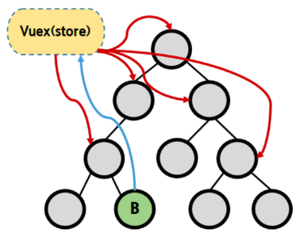

- `중앙 저장소(store)에 데이터를 모아서 상태 관리`

- 각 component는 중앙 저장소의 데이터를 사용

- component의 계층에 상관없이 중앙 저장소에 접근해서 데이터를 얻거나 변경할 수 있음

- 중앙 저장소의 데이터가 변경되면 각각의 component는 해당 데이터의 변화에 반응하여 새로 변경된 데이터를 반영함

- 규모가 크거나 컴포넌트 중첩이 깊은 프로젝트의 관리가 매우 편리

### | Vuex

- "state management pattern + Library" for vue.js 
  
  = (상태 관리 패턴 + 라이브러리)

- 중앙 저장소를 통해 상태 관리를 할 수 있도록하는 라이브러리

- 데이터가 예측 가능한 방식으로만 변경될 수 있도록하는 `규칙을 설정하며, Vue의 반응성을 효율적으로 사용하는 상태 관리 기능`을 제공

- Vue의 공식 도구로써 다양한 기능을 제공

---

---

# ◆ Vuex 시작하기

### | 프로젝트 with vuex (1/2)

- `$ vue create vuex-app` : Vue 프로젝트 생성

- `$ cd vuex-app` : 디렉토리 이동

- `$ vue add vuex` : Vue CLI를 통해 vuex plugin 적용

### | 프로젝트 with vuex (2/2)

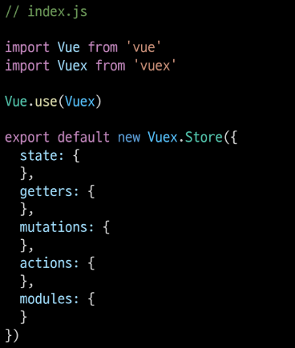

- src / store / index.js가 생성됨

- vuex의 핵심 컨셉 4가지
  
  1. state
  
  2. getters
  
  3. mutations
  
  4. actions

### | Vue와 Vuex 인스턴스 비교

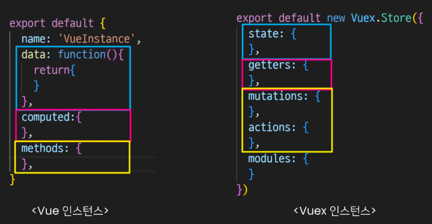

### | 1. State

- vue 인스턴스의 data에 해당

- `중앙에서 관리하는 모든 상태 정보`

- 개별 component는 state에서 데이터를  가져와서 사용
  
  - 개별 component가 관리하던 data를
    
    중앙 저장소(Vuex Store의 state)에서 관리하게 됨

- state의 데이터가 변화하면 해당 데이터를 사용(공유)하는 component도 자동으로 다시 렌더링

- `$store.state`로 state 데이터에 접근

### | 2. Mutations

- `실제로 state를 변경하는 유일한 방법`

- vue 인스턴스의 methods에 해당하지만 Mutations에서 호출되는 핸들러(handler) 함수는 반드시 `동기적`이어야 함
  
  - 비동기 로직으로 mutations를 사용해서 state를 변경하는 경우, state의 변화의 시기를 특정할 수 없기 때문

- 첫번째 인자로 `state`를 받으며,
  
  component 혹은 Actions에서 `commit()` 메서드로 호출됨

※  mutation, action에서 호출되는 함수를 handler 함수라고 함

### | 3. Actions

- mutations와 비슷하지만 `비동기` 작업을 포함할 수 있다는 차이가있음

- `state를 직접 변경하지 않고 commit() 메서드로 mutations를 호출해서 state를 변경함`

- **context** 객체를 인자로 받으며, 이 객체를 통해 store.js의 모든 요소와 메서드에 접근할 수 있음(== 즉 state를 직접 변경할 수 있지만 하지 않아야 함)

- component에서 `dispatch()` 메서드에 의해 호출됨

### | Mutations & Actions

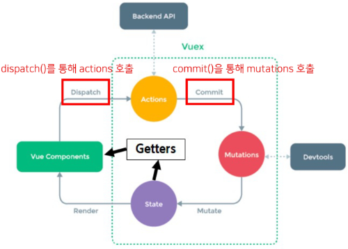

- vue component의 methods 역할이 vuex에서는 아래와 같이 분화됨

- Mutations
  
  - state를 변경

- Actions
  
  - state 변경을 제외한 나머지 로직

### | 4. Getters

- vue 인스턴스의 computed에 해당

- `state를 활용하여 계산된 값을 얻고자 할 때 사용`
  
  state의 원본 데이터를 건들지 않고 계산된 값을 얻을 수 있음

- computed와 마찬가지로 getters의 결과는 캐시(cache)되며,
  
  종속된 값이 변경된 경우에만 재계산됨

- getters에서 계산된 값은 state에 영향을 미치지 않음

- 첫번째 인자로 `state`, 두번째 인자로 `getter`를 받음

### | 모든 데이터를 Vuex에서 관리해야 하는가?

- 모든 데이터를 Vuex state에 넣어야 하는 것은 아님

- Vuex에서도 여전히 pass props, emit event를 사용하여 상태를 관리할 수 있음

- 개발 환경에 따라 적절하게 사용하는 것이 필요함

### | 정리

- state
  
  - 중앙에서 관리하는 `모든 상태 정보`

- mutations
  
  - `state를 변경`하기 위한 methods

- actions
  
  - `비동기 작업이 포함될 수 있는(외부 API와의 소통 등)` methods
  
  - state를 변경하는 것 외의 모든 로직 진행

- getters
  
  - state를 활용해 `계산한 새로운 변수 값`

- component에서 데이터를 조작하기 위한 데이터의 흐름
  
  - component => (actions) => mutations => state

- component에서 데이터를 사용하기 위한 데이터의 흐름
  
  - state => (getters) => component

---

---

# Vuex 실습

### | state

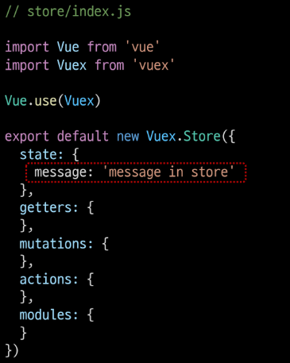

- 중앙에서 관리하는 모든 상태 정보

- `$store.state`로 접근 가능

- store의 state에 message 데이터 정의

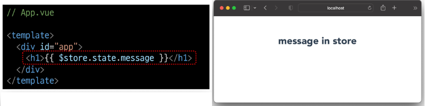

- component에서 state 사용

- **\$store.state**로 바로 접근하기 보다 `computed`에 정의 후 접근하는 것을 권장

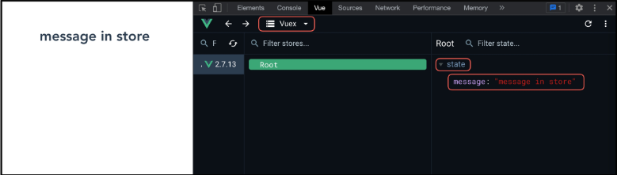

- Vue 개발자 도구에서의 Vuex

- 관리 화면을 Vuex로 변경

- 관리되고 있는 state 확인 가능

---

### | actions

- state를 변경할 수 있는 `mutations 호출`

- component에서 `dispatch()에 의해 호출됨`

- `dispatch(A, B)`
  
  - A : 호출하고자 하는 actions 함수
  
  - B : 넘겨주는 데이터 (payload)

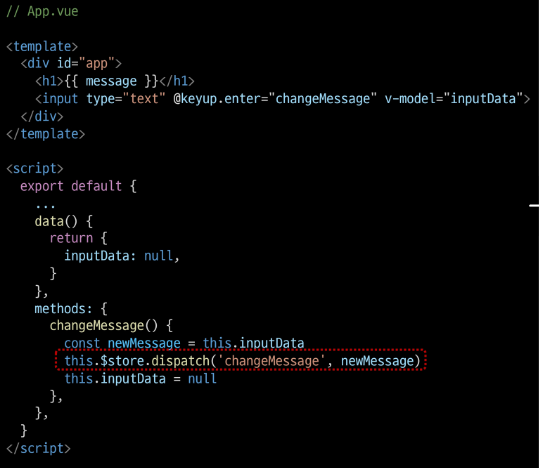

- actions에 정의된 changeMessage 함수에 데이터 전달하기

- component에서 actions는 `dispatch()`에 의해 호출됨

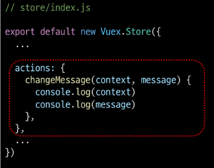

- actions의 첫 번째 인자는 `context`
  
  - context는 store의 전반적인 속성을 모두 가지고 있으므로
    
    context.state와 context.getters를 통해
    
    mutations를 호출하는 것이 모두 가능
  
  - **dispatch()** 를 사용해 다른 actions도 호출할 수 있음
  
  - **단, actions에서 state를 직접 조작하는 것은 삼가야 함**

- actions의 두 번째 인자는 `payload`
  
  - 넘겨준 데이터를 받아서 사용

---

### | mutations

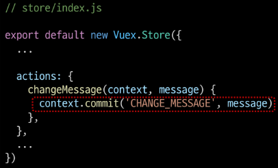

"actions에서 **commit()** 을 통해 mutations 호출하기"

- mutations는 state를 변경하는 유일한 방법

- component 또는 actions에서 `commit()에 의해 호출됨`

- **`commit(A, B)`**
  
  - A : 호출하고자 하는 mutation 함수
  
  - B : payload

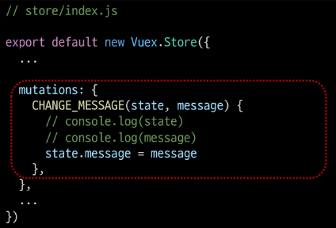

"mutations 함수 작성하기"

- mutations는 state를 변경하는 유일한 방법

- mutations 함수의
  
  - 첫 번째 인자는 **state**
  
  - 두 번째 인자는 **payload**

---

### | getters

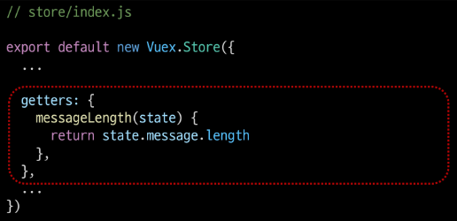

↑ "getters 사용해보기"

- `getters는 state를 활용한 새로운 변수`

- getters 함수의
  
  - 첫 번째 인자는 **state**
  
  - 두 번째 인자는 **getters**

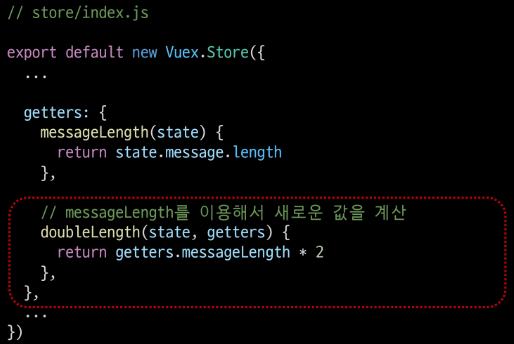

↑ "getters의 다른 함수 사용해보기"

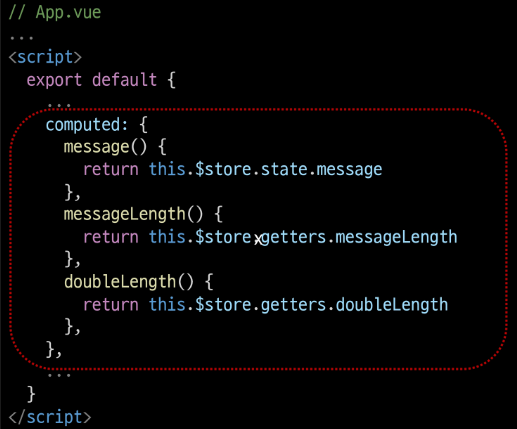

↑ "getters 출력하기"

- getters 역시 state와 마찬가지로 computed에 정의해서 사용하는 것을 권장

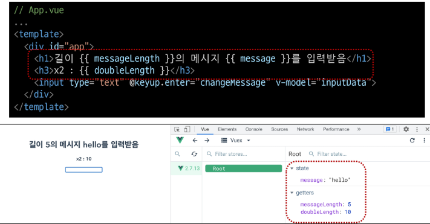

---

---

## ◆ Lifecycle Hooks

### | Lifecycle Hooks

- 각 Vue 인스턴스는 생성과 소멸의 과정 중 단계별 초기화 과정을 거침
  
  - Vue 인스턴스가 생성된 경우, 인스턴스를 DOM에 마운트하는 경우,
    
    데이터가 변경되어 DOM를 업데이트하는 경우 등

- 각 단계가 트리거가 되어 특정 로직을 실행할 수 있음

- 이를 Lifecycle Hooks라고 함

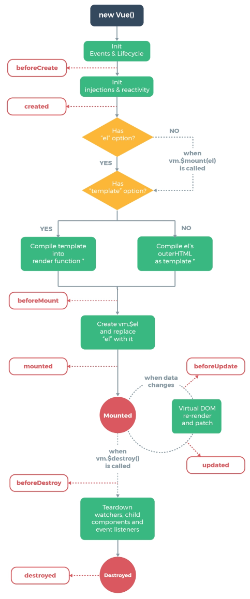

### | created

- Vue instance가 생성된 후 호출됨

- data, computed 등의 설정이 완료된 상태

- 서버에서 받은 데이터를 vue instance의 data에 할당하는 로직을 구현하기 적합

- 단, mount되지 않아 요소에 접근할 수 없음

- 버튼을 누르면 사진을 보여주는 함수가 있을 경우,
  
  버튼을 누르지 않아도 첫 실행 시 기본 사진이 출력되도록 하고 싶다면
  
  => created 함수에 해당 함수를 추가
  
  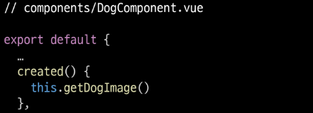

### | mounted

- Vue instance가 요소에 mount된 후 호출됨

- mount된 요소를 조작할 수 있음
  
  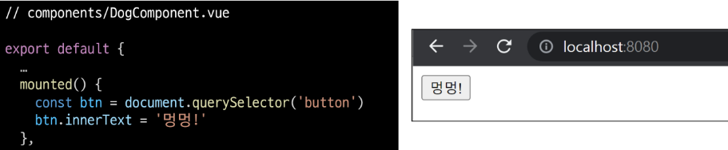

- created의 경우.
  
  mount되기 전이기 때문에, DOM에 접근할 수 없으므로 동작하지 않음

- mounted는 주석 처리
  
  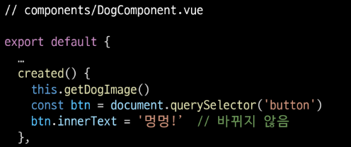

### | updated

- 데이터가 변경되어 DOM에 변화를 줄 때 호출됨
  
  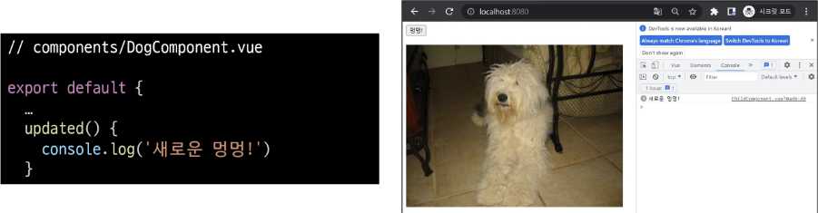

---

### | Lifecycle Hooks 특징

- instance마다 각각의 Lifecycle을 가지고 있음
  
  (↓ 사진의 ChildCompnent.vue가 아니라 DogComponent.vue여야 함!)
  
  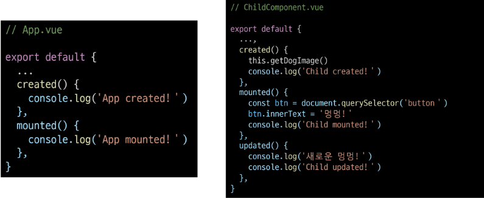

- Lifecycle Hooks는 컴포넌트별로 정의할 수 있음

- 현재 해당 프로젝트는
  
  App.vue 생성 => ChildComponent 생성 => ChildComponent 부착
  
  => App.vue 부착 => ChildComponent 업데이트 순으로 동작한 것

- 부모 컴포넌트의 mounted hook이 실행되었다고 해서
  
  자식이 mount 된 것이 아니고,
  
  부모 컴포넌트가 updated hook이 실행되었다고 해서
  
  자식이 updated 된 것이 아님
  
  - 부착 여부가 부모 - 자식 관계에 따라 순서를 가지고 있지 않은 것

- `instance마다 각각의 Lifecycle을 가지고 있기 때문`

---

---

----

# ◆ Todo with Vuex

### | 개요

- Vuex를 사용한 Todo 프로젝트 만들기

- 구현 기능
  
  - Todo CRUD
  
  - Todo 개수 계산
    
    - 전체 Todo
    
    - 완료된 Todo
    
    - 미완료된 Todo

- 컴포넌트 구성
  
  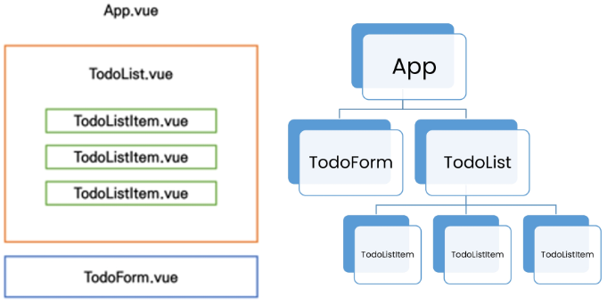

- 완성 화면
  
  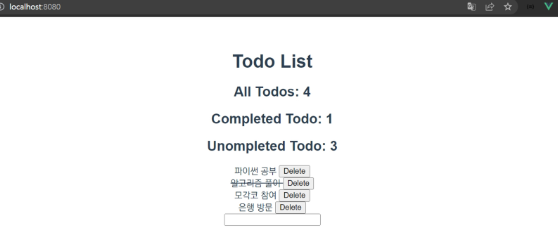

---

---

## ◆ 사전 준비

### | Init Project

1. 프로젝트 생성 및 vuex 플러그인 추가
   
   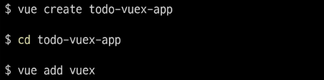

2. HelloWorld 컴포넌트 및 관련 코드 삭제
   
   - App.vue의 CSS 코드는 남김

### | 컴포넌트 작성

- TodoListItem.vue
  
  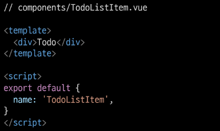

- TodoList.vue
  
  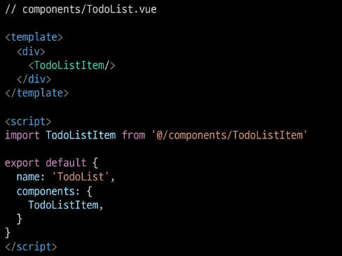

- TodoForm.vue
  
  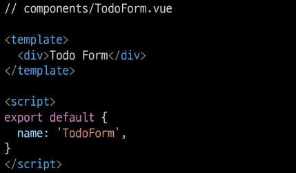

- App.vue
  
  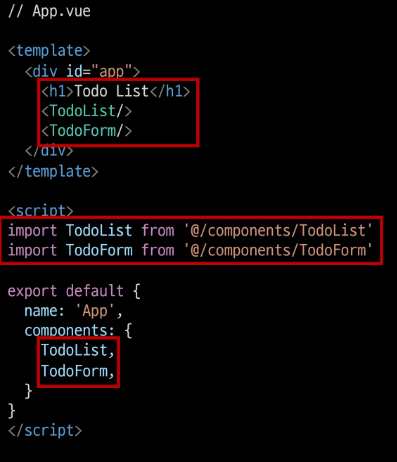

- 페이지 확인
  
  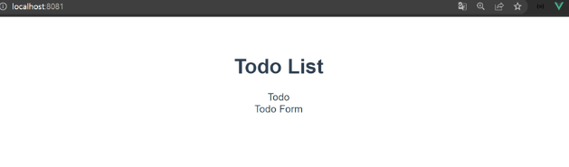

-----

---

## ◆ Read Todo

### | State 세팅

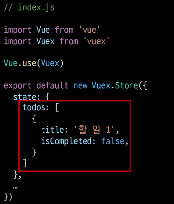

- 출력을 위한 기본 todo 작성

- Vue 개발자 도구에서 state 데이터 확인

### | state 데이터 가져오기

- 컴포넌트에서 Vuex Store의 state에 접근(`$store.state`)

- computed로 계산된 todo 목록을 가져올 수 있도록 설정
  
  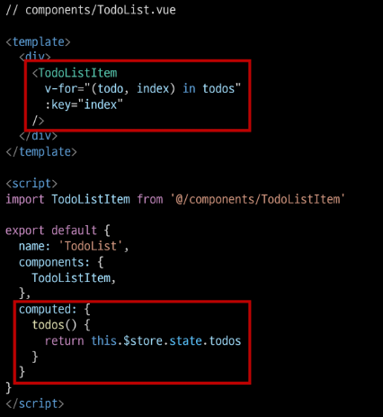

※ v-for의 key는 배열의 각 요소 간의 유일한 식별자 값을 사용해야 하지만, vuex 흐름에 집중하기 위해 index를 key로 사용하도록 함

### | Pass Props

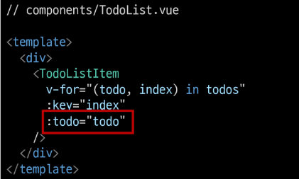

- TodoList.vue => TodoListItem.vue

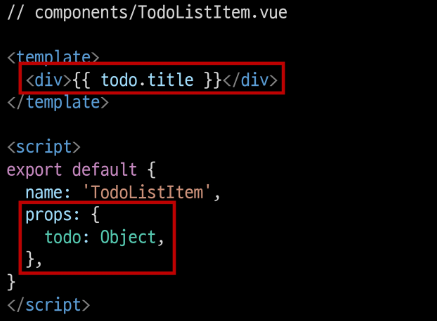

- TodoList.vue => Todo.vue

- todo 데이터 내려받기

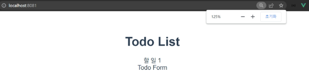

- 출력 확인

---

---

## ◆ Create Todo

### | TodoForm

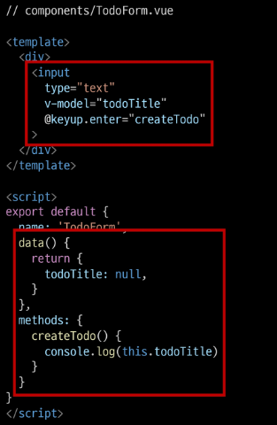

- todoTitle을 입력 받을 input 태그 생성

- todoTitle을 저장하기 위해 data를 정의하고 input과 v-model을 이용해 양방향 바인딩

- enter 이벤트를 사용해 createTodo 메서드 출력 확인

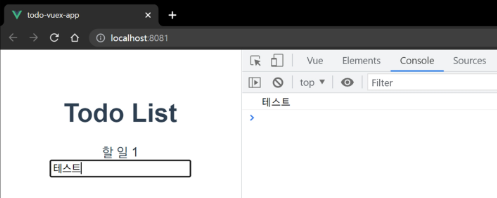

- 출력 확인

### | Actions

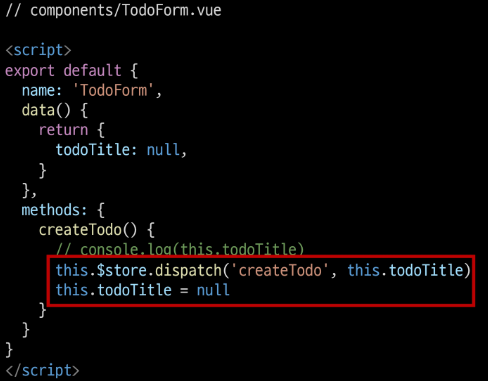

- createTodo 메서드에서 actions을 호출 (`dispatch`)

- todoTitle까지 함께 전달하기

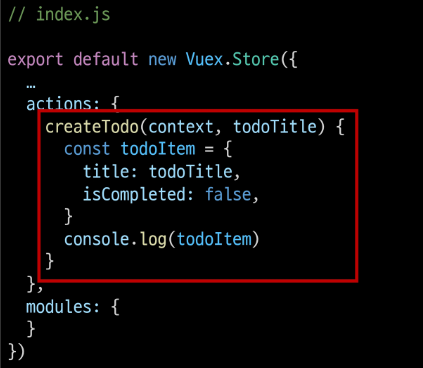

※ actions에는 보통 비동기 관련 작업이 진행되지만 현재 별도의 비동기 관련 작업이 불필요하기 때문에 입력 받은 todo 제목(todoTitle)을 todo 객체(todoItem)로 만드는 과정을 Actions에서 작성할 예정

- createTodo에서 보낸 데이터를 수신 후 todoItem object를 생성

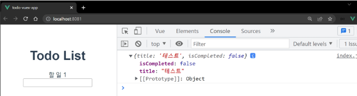

- actions 동작 확인

### | Mutations

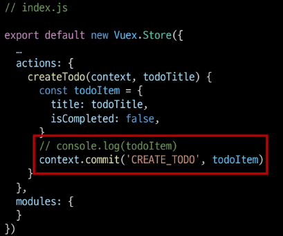

- CREATE_TODO mutations 메서드에 todoItem을 전달하며 호출(`commit`)

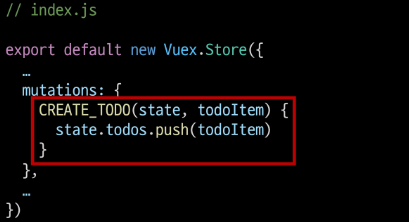

- mutations에서 state의 todos에 접근해 배열에 요소를 추가

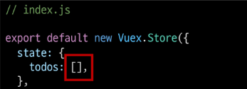

- Todos의 기존 dummy 데이터를 삭제

- 빈 배열로 수정

### | 공백 문자가 입력되지 않도록 처리하기

- `v-model.trim` & `if (this.todoTitle)`
  
  - 좌우 공백 삭제
  
  - 빈 문자열이 아닐 경우만 작성

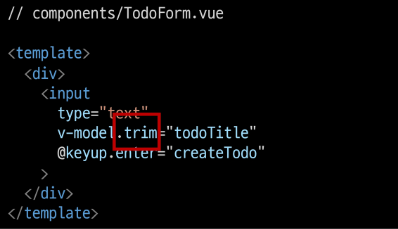 

↑ `v-model.trim`

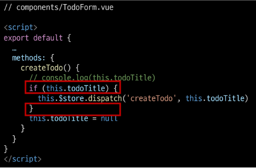 

↑ `if (this.todoTitle)`

### | 중간 정리

- Vue 컴포넌트의 method에서 `dispatch()`를 사용해 actions 메서드를 호출

- Actions에 정의된 함수는 `commit()`을 사용해 mutations를 호출

- Mutations에 정의된 함수가 최종적으로 state를 변경

---

---

## ◆ Delete Todo

### | TodoListItem

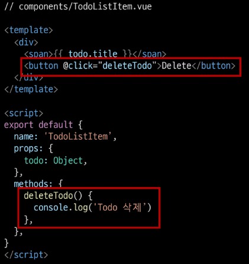

- TodoListItem 컴포넌트에 삭제 버튼 및 deleteTodo 메서드 작성

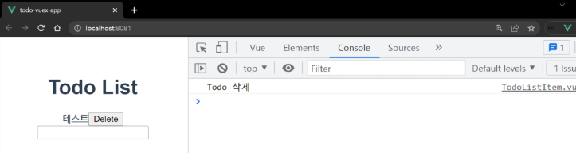

- deleteTodo 메서드 동작 확인

### | Actions

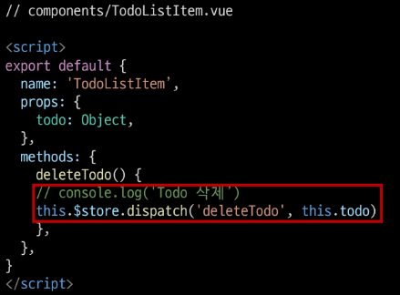

- deleteTodo 메서드에서 deleteTodo actions 메서드 호출(`dispatch`)

- 삭제되는 todo를 함께 전달

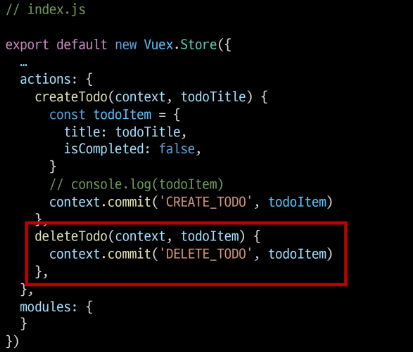

- deleteTodo actions 메서드에서 DELETE_TODO mutations 메서드 호출(`commit`)

### | Mutations

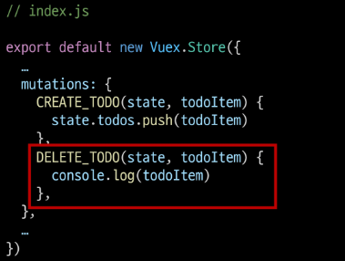

- DELETE_TODO 메서드 작성

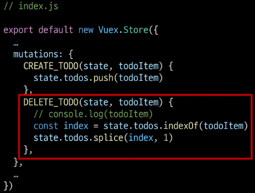

- 전달된 todoItem에 해당하는 todo 삭제

- 작성 후 삭제 테스트

---

---

## ◆ Update Todo

### | TodoListItem

- todo를 클릭하면 완료 표시의 의미로 취소선 스타일을 적용하는 기능 구현
  
  - 즉 todo의 isCompleted 값 토글하기

- TodoListItem 컴포넌트에 클릭 이벤트를 추가 후 관련 actions 메서드 호출

### | Actions

- updateTodoStatus 메서드 작성

- 관련 mutations 메서드 호출

### | Mutations

- UPDATE_TODO_STATUS 메서드 작성 후 동작 확인

- map 메서드를 활용해 선택된 todo의 isCompleted를 반대로 변경 후 기존 배열 업데이트

- 특정 todo 선택 후 isCompleted 값이 변경되는 것을 확인할 수 있다.

### | 취소선 스타일링

- CSS 작성

- v-bind를 활용해 isCompleted 값에 따라 css 클래스가 토글 방식으로 적용되도록 작성하기

- 동작 확인

---

----

## ◆ 상태별 todo 개수 계산

### | 전체 todo 개수

- **allTodosCount** getters 작성

- state에 있는 todos 배열의 길이 계산

- getters에 계산된 값을 각 컴포넌트의 computed에서 사용하기

### | 완료된 todo 개수

- **completedTodosCount** getters 작성

- isCompleted가 true인 todo들만 필터링한 배열을 만들고 길이 계산

- filter를 활용하여 완료 여부에 따른 새로운 객체 목록을 작성 후 길이 반환

- getters에 계산된 값을 각 컴포넌트의 computed에서 사용하기

### | 미완료된 todo 개수

- 미완료된 todo 개수
  
  === 전체 개수 - 완료된 개수

- getters가 두번째 인자로 getters를 받는 것을 활용하기

- **unCompltedTodosCount** getters 작성

- getters에 계산된 값을 각 컴포넌트의 computed에서 사용하기

------

---

# ◆ Local Storage

### | 개요

- 브라우저의 `Local Storage`에 todo 데이터를 저장하여 브라우저를 종료하고 다시 실행해도 데이터가 보존될 수 있도록 하기

### | Window.`localStorage`

- 브라우저에서 제공하는 저장공간 중 하나인 Local Storage에 관련된 속성

- 만료되지 않고 브라우저를 종료하고 다시 실행해도 데이터가 보존됨

- 데이터가 문자열 형태로 저장됨

- 관련 메서드
  
  - `setItem(key, value)` : key, value 형태로 데이터 저장
  
  - `getItem(key)` : key에 해당하는 데이터 조회

- https://developer.mozilla.org/ko/docs/Web/API/Window/localStorage

### | Local Storage 실습

- todos 배열을 Local Storage에 저장하기

- 데이터가 문자열 형태로 저장되어야 하기 때문에 `JSON.stringify`를 사용해 문자열로 변환해주는 과정 필요

- state를 변경하는 작업이 아니기 때문에 mutations가 아닌 actions에 작성

- todo 생성, 삭제, 수정 시에 모두 **saveTodosToLocalStorage** action 메서드가 실행되도록 함

- 그 뒤 개발자도구 => Application => Storage => Local Storage에서 todos가 저장된 것을 확인

- 하지만 아직 Local Storage에 있는 todo 목록을 불러오는 것이 아니기 때문에,
  
  페이지 새로고침 이후 목록이 모두 사라짐

- 불러오기 버튼을 누르면 Local Storage에 저장된 데이터를 가져오도록 할 것
  
  1. 불러오기 버튼 작성
  
  2. **loadTodos** 메서드 작성
  
  3. **loadTodos action** 메서드 작성
  
  4. **LOAD_TODOS** mutation 메서드 작성

1. 불러오기 버튼 작성 ↑

2. loadTodos 메서드 작성 ↑

3. **loadTodos** action 메서드 작성 ↑

4. **LOAD_TODOS** mutation 메서드 작성 ↑
   
   - 문자열 데이터를 다시 object 타입으로 변환 (`JSON.parse`)하여 저장

---

### | vuex-persistedstate

- Vuex state를 자동으로 브라우저의 Local Storage에 저장해주는 라이브러리 중 하나

- 페이지가 새로고침 되어도 Vuex state를 유지시킴

- Local Storage에 저장된 data를 자동으로 state로 불러옴

- https://github.com/robinvdvleuten/vuex-persistedstate

- 설치 ↑

- 적용 ↑

- 이전에 작성한 localStorage 관련 코드를 모두 주석 처리하기
  
  - **App.vue**
    
    - 불러오기 버튼
    
    - loadTodos 버튼
  
  - index.js
    
    - LOAD_TODOS mutation 메서드
    
    - saveTodosToLocalStorage action 메서드
    
    - loadTodos action 메서드
    
    - context.dispatch('saveTodosToLocalStorage') 코드 3줄

- 이제는 불러오기 버튼 없이 자동으로 저장된 데이터를 불러올 수 있음

---

---

## ◆ 마무리

### | mutations으로만 state를 변경해도 되는가?

- 가능은 하다.

- 단, 저장소의 각 컨셉(state, getters, mutations, actions)은 각자의 역할이 존재하도록 설계되어 있음

- 물론 우리가 작성한 todo app처럼 actions의 로직이 특별한 작업없이 단순히 mutations 만을 호출하는 경우도 있으나
  
  이 경우는 Vuex 도입의 적절성을 판단해 볼 필요가 있음

### | Vuex를 사용해야하는 때

- Vuex는 공유된 상태 관리를 처리하는데 유용하지만,
  
  개념에 대한 이해와 시작하는 비용이 큼

- 애플리케이션이 단순하다면 Vuex가 없는 것이 더 효율적일 수 있음

- 그러나 중대형 규모의 SPA를 구축하는 경우, Vuex는 자연스럽게 선택할 수 있는 단계가 오게 됨

- 결과적으로 역할에 적절한 상황에서 활용했을 때
  
  Vuex 라이브러리 효용을 극대화 할 수 있음

- 즉, 필요한 순간이 왔을 때 사용하는 것을 권장

---
