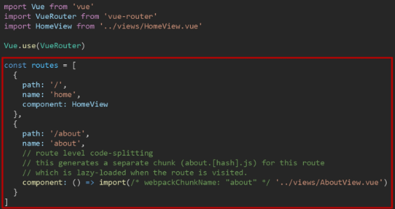
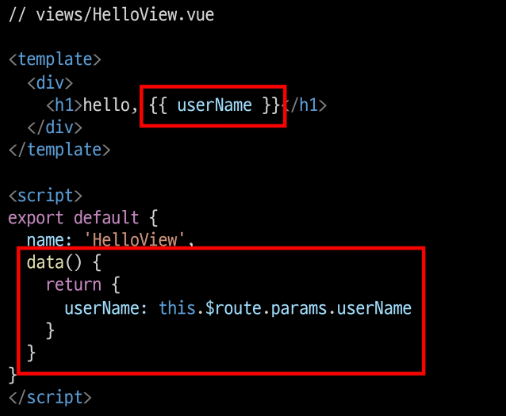
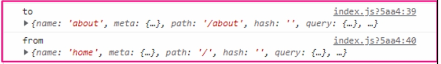
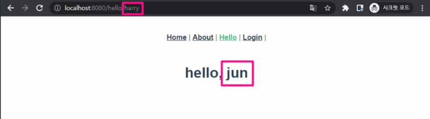
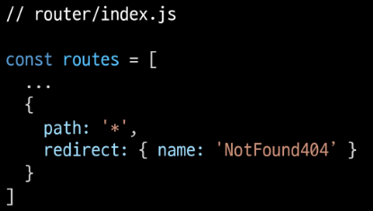

# Vue Router

---

# INDEX

- UX & UI

- Vue Router

- Navigation Guard

- Articles app with Vue

---

# ◆ UX & UI

### | 개요

- 단순한 느낌이나 심미적인 부분만 고려하는 것이 아니라 `체계적인 설계를 통해 기획`해야 한다.
  
  - 비슷한 것끼리 묶거나 내용을 구성해서 인지하는 것이 좋다.
  
  - 유저와 밀접한 부분이기에 매우 중요하며, 모든 서비스에서 반드시 고려되어야 함

### | UX (User eXperience)

- 유저와 가장 가까이에 있는 분야, 데이터를 기반으로 유저를 조사하고 분석해서 개발자, 디자이너가 이해할 수 있게 소통

- 유저가 느끼는 느낌, 태도 그리고 행동을 디자인

### | 좋은 UX를 설계하기 위해서는

- 사람들의 마음과 생각을 이해하고 정리해서 제품에 녹여내는 과정이 필요

- 유저 리서치, 데이터 설계 및 정제, 유저 시나리오, 프로토타입 설계 등이 필요

### | UI (User Interface)

- 유저에게 보여지는 화면을 디자인

- UX를 고려한 디자인을 반영, 이 과정에서 기능 개선 혹은 추가가 필요한 경우 Front-end 개발자와 가장 많이 소통

### | [참고] Interface

- 서로 다른 두 개의 시스템, 장치 사이에서 정보나 신호를 주고받는 경우의 접점
  
  - 즉, 사용자가 기기를 쉽게 동작시키는데 도움을 주는 시스템

- 우리 일상 속에 인터페이스 예시
  
  - CLI(Command-Line Interface)나  GUI(Graphic User Interface)를 사용해서 조작

### | 좋은 UI를 설계하기 위해서는

- 예쁜 디자인, 즉 심미적인 부분만 중요하다기보다는 사용자가 보다 쉽고 편리하게 사용할 수 있도록 하는 부분까지 고려되어야 함

- 통일된 디자인을 위한 디자인 시스템, 소통을 위한 중간 산출물, 프로토타입 등이 필요

- UI 디자인에 있어 가장 중요한 것은 `협업`

### | 디자이너와 기획자, 그리고 개발자

- UX (직무 : UX Researcher, User Researcher)
  
  - (구글) : 사용자의 경험을 이해하기 위한 통계 모델을 설계
  
  - (MS) : 리서치를 기획하고 사용자에 대한 지표를 정의
  
  - (Meta) 정성적인 방법과 정량적인 방법을 사용해서 사용자 조사를 실시

- UI (직무 : Product Designer, Interation Designer)
  
  - (구글) : 다양한 디자인 프로토타이핑 툴을 사용해서 개발 가이드를 제공
  
  - (MS)  : 시각 디자인을 고려해서 체계적인 디자인 컨셉을 보여줌
  
  - (Meta) : 제품을 이해하고 더 나은 UI Flow와 사용자 경험을 디자인

### | [참고] Can't Unsee

- 더 나은 UX/UI를 고민해 볼 수 있는 웹 사이트
  
  - https://cantunsee.space/

### | [참고] Apple의 UI 디자인 원칙

- https://developer.apple.com/kr/design/tips/

---

---

# ◆ Prototyping

### | Software prototyping

- 애플리케이션의 프로토타입을 만드는 것

- 즉, 개발 중인 소프트웨어 프로그램의 완성되기 전 버전을 만드는 것

- 한 번에 완성 버전이 나올 수 없기에 중간마다 현재 상태를 체크하는 과정

### | Prototyping Tool 시장

- UI/UX 디자인을 prototyping 하기 위한 도구는 굉장히 많고 빠른 패러다임의 변화로 인해 치열한 경쟁이 계속되고 있음

- 이전까지는 Sketch라는 툴이 굉장히 많이 사용되었지만, 
  
  현재에는 `Figma`라는 툴이 약 70%의 시장 점유율을 보이고 있음

---

### | Figma

- 인터페이스 디자인을 위한 협업 웹 애플리케이션(2012년 출시)

- `협업`에 중점을 두면서 UI/UX 설계에 초점을 맞춤

### | Why Figma?

- 웹 기반 시스템을 가짐 (웹 환경에서 동작)
  
  - 매우 가벼운 환경에서 실행 가능, 모든 작업 내역이 웹에 저장됨

- `실시간으로 팀원들이 협업`할 수 있는 기능을 제공

- 직관적이고 다양한 디자인 툴을 제공

- Figma 사용자들이 만든 다양한 플러그인이 존재 (VSCode의 확장 프로그램 등)

- `대부분의 기능을 무료로 사용`할 수 있음

### | Figma 성공의 이유

- 성능의 희생을 일부 감수하고 웹 기반으로 원활한 협업이 이루어지도록 함

- 기존 서비스들의 모든 불필요한 과정을 생략하고 `디자인` 그 자체에만 집중할 수 있도록 함

---

### | 프로젝트를 시작하기 전에

- 개발부터 시작하지 말고 반드시 충분한 기획을 거칠 것

- 우리가 완성하고자 하는 대략적인 모습을 그려보는 과정이 필요(프로토타입)

- 이러한 과정을 통해서 기획에서 빠진 화면이나 API 등을 확인할 수 있음

- 설계와 기획이 끝난 후 개발을 시작해야 체계적인 진행이 가능함

### | 프로젝트와 협업

- 협업은 프로젝트와 팀이 성공하기 위한 토대

- 어떻게 효과적으로 잘 협업할 수 있는지 다양한 방법과 도구를 찾아보고 학습하며 여러 프로젝트를 경험하는 과정이 반드시 필요

---

---

# ◆ Vue Router

## ◈ Routing

### | Routing

- 네트워크에서 경로를 선택하는 프로세스

- 웹 서비스에서의 라우팀
  
  - 유저가 방문한 URL에 대해 적절한 결과를 응답하는 것

- 예시
  
  - /articles/index/에 접근하면 articles의 index에 대한 결과를 보내줌

### | Routing in SSR

- Server가 모든 라우팅을 통제

- URL로 요청이 들어오면 응답으로 완성된 HTML 제공
  
  - Django로 보낸 요청의 응답 HTML은 완성본인 상태였음

- 결론적으로, Routing(URL)에 대한 결정권을 서버가 가짐

### | Routing in SPA / CSR

- 서버는 하나의 HTML(index.html)만을 제공

- 이후에 모든 동작은 하나의 HTML 문서 위에서 JavaScript 코드를 활용
  
  - DOM을 그리는데 필요한 추가적인 데이터가 있다면
    
    axios와 같은 AJAX 요청을 보낼 수 있는 도구를 사용하여
    
    데이터를 가져오고 처리

- 즉, `하나의 URL만 가질 수 있음`

### | Why routing?

- Routing이 없다면
  
  - 유저가 URL을 통한 페이지의 변화를 감지할 수 없음
  
  - 페이지가 무엇을 렌더링 중인지에 대한 상태를 알 수 없음
    
    - 새로고침 시 처음 페이지로 돌아감
    
    - 링크를 공유할 시 처음 페이지만 공유 가능
  
  - 브라우저의 뒤로 가기 기능을 사용할 수 없음

---

## ◆ Vue Router

### | Vue Router

- Vue의 공식 라우터

- SPA 상에서 라우팅을 쉽게 개발할 수 있는 기능을 제공

- 라우트(routes)에 컴포넌트를 매핑한 후, 어떤 URL에서 렌더링 할지 알려줌
  
  - 즉, SPA를 MPA처럼 URL을 이동하면서 사용 가능
  
  - SPA의 단점 중 하나인 `"URL이 변경되지 않는다"를 해결`

- [참고] MPA(Multiple Page Application)
  
  - 여러 개의 페이지로 구성된 애플리케이션
  
  - SSR 방식으로 렌더링

### | Vue Router 시작하기 (1/5)

- Vuex와 마찬가지의 방식으로 설치 및 반영
  
  

※ 기존에 프로젝트를 진행하고 있던 도중에 router를 추가하게 되면 App.vue를 덮어쓰므로 필요한 경우, 명령을 실행하기 전에 파일을 백업해두어야 함

### | Vue Router 시작하기 (2/5)

- history mode 사용 여부 -> Yes
  
  

### | History mode

- 브라우저의 History API를 활용한 방식
  
  - 새로고침 없이 URL 이동 기록을 남길 수 있음

- 우리에게 익숙한 URL 구조로 사용 가능
  
  - 예시) http://localhost:8080/index

- [참고] History mode를 사용하지 않으면
  
  Default 값인 hash mode로 설정됨 ('#'을 통해 URL을 구분하는 방식)
  
  - 예시) http://localhost:8080#index

### | Vue Router 시작하기 (3/5)

- App.vue
  
  - router-link 요소 및 router-view가 추가됨
    
    

### | Vue Router 시작하기 (4/5) ~ (5/5)

- **router/index.js** 생성

- **view** 폴더 생성

- 서버 실행하기

---

### | `router-link`

- a 태그와 비슷한 기능 -> URL을 이동시킴
  
  - routes에 등록된 컴포넌트와 매핑됨
  
  - 히스토리 모드에서 router-link는 클릭 이벤트를 차단하여 
    
    a 태그와 달리 브라우저가 페이지를 다시 로드하지 않도록 함

- 목표 경로는 `'to'` 속성으로 지정됨

- 기능에 맞게 HTML에서 a 태그로 rendering 되지만,
  
  필요에 따라 다른 태그로 바꿀 수 있음

- 개발자 도구 확인
  
  

### | `router-view`

- 주어진 URL에 대해 일치하는 컴포넌트를 렌더링하는 컴포넌트

- 실제 component가 DOM에 부착되어 보이는 자리를 의미

- router-link를 클릭하면 routes에 매핑된 컴포넌트를 렌더링

- Django에서의 block tag와 비슷함
  
  - **App.vue**는 base.html의 역할
  
  - **router-view**는 block 태그로 감싼 부분

### | src/router/index.js

- 라우터에 관련된 정보 및 설정이 작성되는 곳

- Django에서의 urls.py에 해당
  
  

- routes에 URL와 컴포넌트를 매핑

### | src/Views

- router-view에 들어갈 component 작성

- 기존에 컴포넌트를 작성하던 곳은 components 폴더 뿐이었지만
  
  이제 두 폴더로 나뉘어짐

- 각 폴더 안의 .vue 파일들이 기능적으로 다른 것은 아님

- **views/**
  
  - **routes에 매핑되는** 컴포넌트,
    
    즉 \<router-view>의 위치에 렌더링되는 컴포넌트를 모아두는 폴더
  
  - 다른 컴포넌트와 구분하기 위해 View로 끝나도록 만드는 것을 권장
  
  - ex) App 컴포넌트 내부의 AboutView & HomeView 컴포넌트

- **components/**
  
  - routes에 매핑된 컴포넌트의 **하위 컴포넌트**를 모아두는 폴더
  
  - ex) HomeView 컴포넌트 내부의 HelloWorld 컴포넌트

---

## Vue Router 실습

### | 주소를 이동하는 2가지 방법

1. 선언적 방식 네비게이션

2. 프로그래밍 방식 네비게이션 

### | 1. 선언적 방식 네비게이션 (1/2)

- router-link의 `to` 속성으로 주소 전달
  
  - routes에 등록된 주소와 매핑된 컴포넌트로 이동

### | Named Routes

- 이름을 가지는 routes
  
  - Django에서 path 함수의 name 인자의 활용과 같은 방식
  
  

### | 1. 선언적 방식 네비게이션 (2/2)

- 동적인 값을 사용하기 때문에 **v-bind**를 사용해야 정상적으로 작동
  
  

### | 2. 프로그래밍 방식 네비게이션 (1/2)

- Vue 인스턴스 내부에서 라우터 인스턴스에 `$router`로 접근할 수 있음

- 다른 URL로 이동하려면 `this.$router.push`를 사용
  
  - history stack에 이동할 URL을 넣는(push) 방식
  
  - history stack에 기록이 남기 때문에 사용자가 브라우저의 뒤로 가기 버튼을 클릭하면 이전 URL로 이동할 수 있음

- 결국 **\<router-link :to="...">** 을 클릭하는 것과
  
  **\$router.push(...)** 를 호출하는 것은 같은 동작
  
  

- 동작 원리는 선언적 방식과 같음

### | Dynamic Route Matching

- 동적 인자 전달
  
  - URL의 특정 값을 변수처럼 사용할 수 있음
  
  - ex) Django에서의 variable routing

- HelloView.vue 작성 및 route 추가

- route를 추가할 때 동적 인자를 명시

- `$route.params`로 변수에 접근 가능

- 다만 HTML에서 직접 사용하기 보다는 data에 넣어서 사용하는 것을 권장
  
  

### | Dynamic Route Matching - 선언적 방식 네비게이션

- App.vue에서 harry에게 인사하는 페이지로 이동해보기

- params를 이용하여 동적 인자 전달 가능
  
  

### | Dynamic Route Matching - 프로그래밍 방식 네비게이션

- AboutView에서 데이터를 입력받아 HelloView로 이동하여 입력받은 데이터에게 인사하기

### | route에 컴포넌트를 등록하는 또다른 방법

- router/index.js에 컴포넌트를 등록하는 또 다른 방식이 주어지고 있음(about)
  
  
  
  - Lazy-loading

### | lazy-loading

- 모든 파일을 한 번에 등록하려고 하면 모든 걸 다 읽는 시간이 매우 오래 걸림

- 미리 로드를 하지 않고 특정 라우트에 방문할 때
  
  매핑된 컴포넌트의 코드를 로드하는 방식을 활용할 수 있음
  
  - 모든 파일을 한 번에 로드하지 않아도 되기 때문에 
    
    최초에 로드하는 시간이 빨라짐
  
  - 당장 사용하지 않을 컴포넌트는 먼저 로드하지 않는 것이 핵심

---

---

# ◆ Navigation Guard

### | 네비게이션 가드

- Vue router를 통해 특정 URL에 접근할 때
  
  다른 url로 redirect를 하거나, 해당 URL로의 접근을 막는 방법
  
  - ex) 사용자의 인증 정보가 없으면 특정 페이지에 접근하지 못하게 함

- https://v3.router.vuejs.org/guide/advanced/navigation-guards.html

### | 네비게이션 가드의 종류

- 전역 가드
  
  - 애플리케이션 전역에서 동작

- 라우터 가드
  
  - 특정 URL에서만 동작

- 컴포넌트 가드
  
  - 라우터 컴포넌트 안에 정의

---

## ◈ 전역 가드

### | Global Before Guard

- 다른 url 주소로 이동할 때 항상 실행

- router/index.js에 `router.beforeEach()`를 사용하여 설정

- 콜백 함수의 값으로 다음과 같이 3개의 인자를 받음
  
  - **to** : 이동할 URL 정보가 담긴 Route 객체
  
  - **from** : 현재 URL 정보가 담긴 Route 객체
  
  - **next** : 지정한 URL로 이동하기 위해 호출하는 함수
    
    - 콜백 함수 내부에서 반드시 한 번만 호출되어야 함
    
    - 기본적으로 **to**에 해당하는 URL로 이동 

- URL이 변경되어 화면이 전환되기 전 **router.beforeEach()** 가 호출됨
  
  - 화면이 전환되지 않고 대기 상태가 됨

- 변경된 URL로 라우팅하기 위해서는 **next()** 를 호출해줘야 함
  
  - `next()가 호출되기전까지 화면이 전환되지 않음`

### | Global Before Guard 실습

- '/home'으로 이동하더라도 라우팅이 되지 않고 아래와 같이 로그만 출력됨

- **next()** 가 호출되지 않으면 화면이 전환되지 않음
  
  
  
  

- **next()** 가 호출되어야 화면이 전환됨
  
  
  
  

- About으로 이동해보기
  
  - to에는 이동할 url인 about에 대한 정보가,
  
  - from에는 현재 url인 home에 대한 정보가 들어있음
    
    

---

### | Login 여부에 따른 라우팅 처리 (1/9)

- Login이 되어있지 않다면 Login 페이지로 이동하는 기능 추가
  
  
  
  

### | Login 여부에 따른 라우팅 처리 (2/9)

- LoginView에 대한 라우터 링크 추가
  
  

### | Login 여부에 따른 라우팅 처리 (3/9)

- HelloView에 로그인을 해야만 접근할 수 있도록 만들어 보기

- 로그인 여부에 대한 임시 변수 생성

- 로그인이 필요한 페이지를 저장
  
  - 로그인이 필요한 페이지들의 이름(라우터에 등록한 name)을 작성

- 앞으로 이동할 페이지(to)가 로그인이 필요한 사이트인지 확인

### | Login 여부에 따른 라우팅 처리 (4/9)

- isAuthRequired 값에 따라 로그인이 필요한 페이지이고
  
  로그인이 되어있지 않으면 Login 페이지로 이동
  
  그렇지 않으면 기존 루트로 이동

- next() 인자가 없을 경우, to로 이동

### | Login 여부에 따른 라우팅 처리 (5/9)

- isLoggedIn이 true인 경우(로그인 상태에서 로그인이 필요한 페이지로 접속)
  
  - `/hello/harry`에 해당하는 컴포넌트가 정상적으로 렌더링
  
  

### | Login 여부에 따른 라우팅 처리 (6/9)

- isLoggedIn이 false인 경우(비로그인 상태에서 로그인이 필요한 페이지로 접속)
  
  - `/hello/harry`을 렌더링하지 않고 Login 페이지로 이동됨
  
  

### | Login 여부에 따른 라우팅 처리 (7/9)

- Home => Login으로 이동했는데 console창에 log가 2개가 찍힌 이유
  
  - 첫번째 출력은 /hello/harry로 접속 시도 후 (전역 가드에 막힘)
    
    전역 가드에서 login으로 이동 요청할 때 출력
  
  - 두번째 출력은 /login으로 이동 요청할 때 출력

### | Login 여부에 따른 라우팅 처리 (8/9)

- `/hello/:userName` 페이지를 제외하고는
  
  전역 가드에서 기존 주소로 이동하기 때문에 정상적으로 작동

- 로그인이 필요한 페이지에 추가하면 비로그인 시 해당 페이지에 접근 불가
  
  

### | Login 여부에 따른 라우팅 처리 (9/9)

- 만약 view들이 여러 개라면 모두 추가해줘야 하나?
  
  - 반대로 Login하지 않아도 되는 페이지들을 모아 둘 수도 있음
    
    

---

---

# ◆ Router Guard

### | 라우터 가드

- 전체 router가 아닌 특정 route에 대해서만 가드를 설정하고 싶을 때 사용

- `beforeEnter()`
  
  - route에 진입했을 때 실행됨
  
  - 라우터를 등록한 위치에 추가
  
  - 단 매개변수, 쿼리, 해시 값이 변경될 때는 실행되지 않고
    
    다른 경로에서 탐색할 때만 실행됨
  
  - 콜백 함수는 to, from, next를 인자로 받음

### | Login 여부에 따른 라우팅 처리

- "이미 로그인 되어있는 경우, HomeView로 이동하기"

- 라우터 가드 실습을 위해, 전역 가드 실습 코드는 주석처리한 뒤 진행

- 로그인 여부에 대한 임시 변수 생성
  
  - 로그인이 되어 있는 경우, home으로이동
  
  - 로그인이 되어 있지 않은 경우, login으로 이동

- isLoggedIn = true인 경우(로그인 상태인 경우)
  
  - `/login`으로 접속을 시도하면 Home으로 이동 ↓

- Login을 제외한 다른 페이지로 이동하면 라우터 가드를 따로 설정해주지 않았기 때문에 라우터 가드가 동작하지 않음

- 이런식으로 특정 라우트만 따로 가드를 하고 싶은 경우에는 라우터 가드를 사용

- isLoggedIn = false로 변경하면 Login 페이지로 정상 이동 가능

---

----

# ◆ 컴포넌트 가드

### | 컴포넌트 가드

- 특정 컴포넌트 내에서 가드를 지정하고 싶을 때 사용

- `beforeRouteUpdate()`
  
  - 해당 컴포넌트를 렌더링하는 경로가 변경될 때 실행

### | Params 변화 감지

- about에서 jun에게 인사하는 페이지로 이동
  
  

- navbar에 있는 Hello를 눌러 harry에게 인사하는 페이지로 이동
  
  - URL은 변하지만 페이지는 변화하지 않음
    
    

- 변화하지 않는 이유
  
  - 컴포넌트가 재사용되었기 때문
  
  - 기존 컴포넌트를 지우고 새로 만드는 것보다 효율적
    
    - 단, lifecycle hook이 호출되지 않음
    
    - 따라서 \$route.params에 있는 데이터를 새로 가져오지 않음

- **beforeRouteUpdate()** 를 사용해서 처리
  
  - userName을 이동할 params에 있는 userName으로 재할당
    
    

------

---

# ◆ 404 Not Found

### | 404 Not Found

- 사용자가 요청한 리소스가 존재하지 않을 때 응답

- http://localhost:8080/404 확인

- 이렇게 직접 요청하는 방식이 아닌, 요청한 리소스가 존재하지 않을 때 404로 이동하도록 하려면 어떻게 해야 할까?
  
  

### | 요청한 리소스가 존재하지 않는 경우

- 모든 경로에 대해서 404 page로 redirect 시키기
  
  - 기존에 명시한 경로가 아닌 모든 경로가 404 page로 redirect 됨
  
  - `이 때, routes의 최하단부에 작성해야 함`
  
  

### | 형식은 유효하지만 특징 리소스를 찾을 수 없는 경우 (1/9)

- 예시) Django에게 `article/1/`로 요청을 보냈지만, 1번 게시글이 삭제된 상태
  
  - 이때는 path: '\*'를 만나 404 page가 렌더링 되는 것이 아니라
    
    기존에 명시한 `articles/:id/`에 대한 components가 렌더링됨
  
  - 하지만 데이터가 존재하지 않기 때문에 정상적으로 렌더링이 되지 않음

- 해결책
  
  - 데이터가 없음을 명시
  
  - 404 page로 이동해야 함

### | 형식은 유효하지만 특정 리소스를 찾을 수 없는 경우 (2/9)

- Dog API 문서( https://dog.ceo/dog-api/ )를 참고하여
  
  동적 인자로 강아지 품종을 전달해
  
  품종에 대한 랜덤 이미지를 출력하는 페이지를 만들어 보기

### | 형식은 유효하지만 특정 리소스를 찾을 수 없는 경우 (3/9)

1. Axios 설치

2. DogView 컴포넌트 작성

3. routes에 등록
   
   - '\*'보다 상단에 등록

### | 형식은 유효하지만 특정 리소스를 찾을 수 없는 경우 (4/9)

- Dog api 문서를 참고하여 axios 로직을 작성

### | 형식은 유효하지만 특정 리소스를 찾을 수 없는 경우 (5/9)

- /dog/hound 에 접속하면 hound 품종에 대한 랜덤 사진이 출력
  
  

### | 형식은 유효하지만 특정 리소스를 찾을 수 없는 경우 (6/9)

- axios 요청이 오는 중 동작하고 있음을 표현하기 위한 로딩 메시지 정의
  
  
  
  

### | 형식은 유효하지만 특정 리소스를 찾을 수 없는 경우 (7/9)

- 결과 화면
  
  

### | 형식은 유효하지만 특정 리소스를 찾을 수 없는 경우 (8/9)

- axios 요청이 실패할 경우, 자료가 없음을 표현하기
  
  

### | 형식은 유효하지만 특정 리소스를 찾을 수 없는 경우 (9/9)

- `/dog/abc`에 접속
  
  

----

### | 404 Not Found

- 이전처럼 메시지를 바꿀수도 있지만
  
  axios 요청이 실패할 경우, 404 페이지로 이동시킬 수도 있음
  
  

---

---

---

----

# ◆ Article with Vue

### | 개요

- 지금까지 배운 내용들을 종합하여 Django에서 만들었던 게시판 만드릭

- 구현 기능
  
  - Index 및 CRUD
  
  - 404

- 컴포넌트 구성
  
  

- 완성 화면
  
  

### | 사전 준비

- 프로젝트 시작

- App.vue는 아래 코드만 남김 (CSS 코드는 유지)

------

---

## ◆ Index

### | 개요

- article의 목록을 보여주는 index 페이지 작성

### | Index 구현 (1/7)

- state

- 게시글의 필드는 id, 제목, 내용, 생성 일자

- DB의 AUTO INCREMENT를 표현하기 위해 article_id를 추가로 정의해줌
  
  (다음 article의 id로 사용 예정)

### | Index 구현 (2/7)

- IndexView 컴포넌트 및 라우터 작성
  
  

### | Index 구현 (3/7)

- state에서 불러온 articles 출력하기
  
  

### | Index 구현 (4/7)

- ArticleItem 컴포넌트 작성
  
  

### | Index 구현 (5/7)

- IndexView 컴포넌트에서 ArticleItem 컴포넌트 등록 및 props 데이터 전달

### | Index 구현 (6/7)

- props 데이터 선언 및 게시글 출력
  
  

### | Index 구현 (7/7)

- 결과 확인
  
  

---

---

### | Create 구현 (1/11)

- CreateView 컴포넌트 및 라우터 작성
  
  

### | Create 구현 (2/11)

- Form 생성 및 데이터 정의
  
  

### | Create 구현 (3/11)

- **v-on:{event}.prevent** 를 활용하여 submit 이벤트 동작을 취소하기
  
  

### | Create 구현 (4/11)

- actions에 여러 개의 데이터를 넘길 때 하나의 object로 만들어서 전달
  
  

### | Create 구현 (5/11)

- **v-model.trim**을 활용하여 입력 값의 공백을 제거
  
  

### | Create 구현 (6/11)

- 데이터가 없는 경우 alert & 데이터가 있는 경우 actions로 전달
  
  

### | Create 구현 (7/11)

- actions에서는 넘어온 데이터를 활용하여 article 생성 후 mutations 호출
  
  - 이때 id로 article_id 활용
  
  

### | Create 구현 (8/11)

- mutations에서는 전달된 article 객체를 사용해 게시글 작성
  
  - 다음 게시글을 위해 article_id 값 1 증가
  
  

### | Create 구현 (9/11)

- CreateView 컴포넌트에 Index 페이지로 이동하는 뒤로가기 링크 추가
  
  

### | Create 구현 (10/11)

- 게시글 생성 후 Index 페이지로 이동하도록 네비게이터 작성
  
  

### | Create 구현 (11/11)

- IndexView 컴포넌트에 게시글 작성 페이지로 이동하는 링크 추가
  
  

----

---

# ◆ Detail

### | Detail 구현 (1/7)

- DetailView 컴포넌트 및 라우터 작성

- id를 동적인자로 전달
  
  

### | Detail 구현 (2/7)

- article 정의 및 state에서 articles 가져오기
  
  

### | Detail 구현 (3/7)

- articles에서 동적인자를 통해 받은 id에 해당하는 article 가져오기

- 이때, 동적 인자를 통해 받은 id는 str이므로 형변환을 해서 비교
  
  

### | Detail 구현 (4/7)

- article 출력
  
  

### | Detail 구현 (5/7)

- created lifecycle hook을 통해 인스턴스가 생성되었을 때, article을 가져오는 함수 호출
  
  

### | 만약 서버에서 데이터를 가져왔다면? (1/3)

- 우리는 현재 state를 통해 데이터를 동기적으로 가져오지만,
  
  실제로는 서버로부터 가져옴
  
  - 데이터를 가져오는데 시간이 걸림

- created를 주석 처리하고 데이터가 서버로부터 오는데 시간이 걸림을 가정해보자
  
  

- 그런데 article이 null이기 때문에 id 등의 속성을 가져올 수 없음

- optional chaining(`?.`)을 통해 article 객체가 있을 때만 출력되도록 수정

- created  주석을 다시 해제
  
  

### | [참고] Optional Chaining

- Optional Chaining(`?.`) 앞의 평가 대상이 undefined나 null이면 에러가 발생하지 않고 undefined를 반환 (ES2020에서 추가된 문법)

### | Date in JavaScript

- JavaScript에서 시간을 나타내는 Date 객체는 1970년 1월 1일 UTC(협정 세계시) 자정과의 시간 차이를 밀리초로 나타내는 정수 값을 담음
  
  - **Date().toLocaleString()** 을 사용하여 변환

- 로컬 시간으로 변환해주는 computed 값 작성 및 출력
  
  
  
  

### | Detail 구현 (6/7)

- DetailView 컴포넌트에 뒤로가기 링크 추가
  
  

### | Detail 구현 (7/7)

- 각 게시글을 클릭하면 detail 페이지로 이동하도록 ArticleItem에 이벤트 추가

- v-on 이벤트 핸들러에도 인자 전달 가능
  
  

-----

---

# ◆ Delete

### | Delete 구현

- DetailView 컴포넌트에 삭제 버튼을 만들고, mutations를 호출
  
  
  
  

- mutations에서 id에 해당하는 게시글을 지움
  
  

- 삭제 후 index 페이지로 이동하도록 네비게이션 작성
  
  

---

---

## ◆ 404 Not Found

### | 404 페이지 구현

- NotFound404 컴포넌트 및 라우터 작성

- Detail에 대한 route보다 먼저 등록해줘야 함
  
  - 또한, /404로 등록하면 404번째 게시글과 혼동할 수 있게 됨
  
  

- DetailView 컴포넌트에 id에 해당하는 article이 없으면 404 페이지로 이동
  
  

- 요청한 리소스가 존재하지 않는 경우
  
  없는 id가 아닌 전혀 다른 요청에도 대비하여 404 page로 **redirect** 시키기
  
  - **\$router.push** 와 마찬가지로 name을 이용하여 이동할 수 있음
    
    
    
    - 최하단에 작성해야 함
