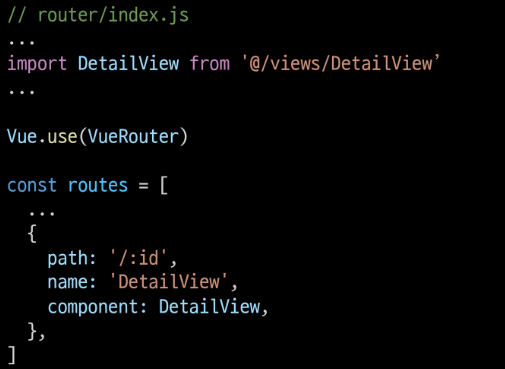
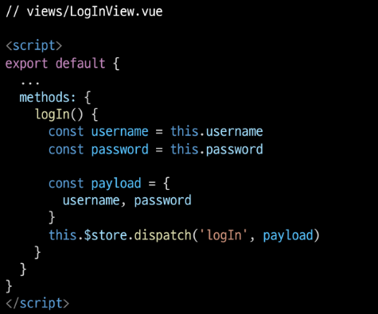

# Vue

---

## INDEX

1. Vue with DRF

2. CORS

3. DRF Auth System

4. DRF Auth with Vue

5. DRF-spectacular

---

---

## ◆ Vue with DRF

### | 개요

- Server와 Client의 통신 방법 이해하기

- CORS 이슈 이해하고 해결하기

- DRF Auth System 이해하기

- Vue와 API server 통신하기

---

## ◈ Server & Client

### | Server

- 서버(server)란?
  
  - 클라이언트에게 `정보`와 `서비스`를 제공하는 컴퓨터 시스템
  
  - 서비스 전체를 제공 == Django Web Service
  
  - 정보를 제공 == DRF API Service

- 서비스 전체를 제공 == Django Web Service
  
  - Django를 통해 전달받은 HTML에는 하나의 웹페이지를 구성할 수 있는 모든 데이터가 포함
  
  - 즉, 서버에서 모든 내용을 렌더링
    
    - 하나의 HTML 파일로 제공
  
  - 정보를 포함한 web 서비스를 구성하는 모든 내용을 서버 측에서 제공

- **정보만을 제공** == DRF API Service
  
  - Django를 통해 관리하는 정보만을 클라이언트에게 제공
  
  - DRF를 사용하여 JSON으로 변환

### | Client

- 클라이언트(client)란?
  
  - `Server가 제공하는 서비스에 적절한 요청`을 통해
    
    `Server로부터 반환받은 응답을 사용자에게 표현`하는 기능을 가진 프로그램 혹은 시스템

- Server가 제공하는 서비스에 적절한 요청
  
  - Server가 정의한 방식대로 요청 인자를 넘겨 요청
  
  - Server는 정상적인 요청에 적합한 응답 제공

- 잘못된 요청 예
  
  - 아래와 같은 모델이 정의되어 있다면
    
    
    
    잘못된 필드 명으로 요청을 보낼 경우, 처리할 수 없음
    
    

- **Server로부터 반환받은 응답을 사용자에게 표현**
  
  - 사용자의 요청에 적합한 data를 server에 요청하여 응답받은 결과로 **적절한 화면을 구성**

### | 정리

- Server는 정보와 서비스를 제공
  
  - DB와 통신하며 데이터를 "생성, 조회, 수정, 삭제"(CRUD)를 담당
  
  - 요청을 보낸 Client에게 정상적인 요청이었다면 처리한 결과를 응답

- Client는 사용자의 정보 요청을 처리, server에게 응답받은 정보를 표현
  
  - Server에게 정보(데이터)를 요청
  
  - 응답받은 정보를 가공하여 화면에 표현

---

---

# ◆ DRF

### | 주어진 Skeleton Code 확인

- `back-server` 코드 역할

- 모델 구조 확인
  
  

- 요청 경로 확인
  
  
  
  

- 더미 데이터 확인
  
  

- 데이터 삽입
  
  

- 서버 실행 후, 전체 게시글 조회
  
  - Browser에서 server에 전체 게시글 조회 요청 => 데이터 반환 확인
    
    
  
  - Postman에서 올바른 방법으로 요청 => 데이터 반환 확인
    
    

---

---

# ◆ Vue

### | 주어진 Skeleton Code 확인

- `front-server` 역할

- 폴더 구조 확인 및 서버 구동 준비
  
  
  
  

### | 컴포넌트 구조 확인

### | 메인 페이지 구성 (1/9)

- `views/ArticleView.vue` component 확인 및 route 등록

### | 메인 페이지 구성 (2/9)

- `src/App.vue` router-link 주석 해제 및 결과 확인

### | 메인 페이지 구성 (3/9)

- `components/ArticleList.vue` 확인
  
  - 전체 게시물을 표현할 컴포넌트
  
  - 화면 구성을 위한 최소한의 style 포함

### | 메인 페이지 구성 (4/9)

- `views/ArticleView.vue` 주석 해제

- "ArticleList" 하위 컴포넌트 등록
  
  1. 불러오기
  
  2. 등록하기
  
  3. 보여주기

### | 메인 페이지 구성 (5/9)

- `components/ArticleListItem.vue` 확인
  
  - 각 게시글들을 정보를 표현할 컴포넌트
  
  - 데이터 없이 최소한의 기본 구조만 확인

### | 메인 페이지 구성 (6/9)

- `components/ArticleList.vue` 주석 해제

- "ArticleListItem" 하위 컴포넌트 등록
  
  1. 불러오기
  
  2. 보여주기
  
  3. 등록하기

### | 메인 페이지 구성 (7/9)

- `store/index.js` 주석 해제

- stete에 articles 배열 정의

- 화면 표현 체크용 데이터 생성

### | 메인 페이지 구성 (8/9)

- `components/ArticleList.vue` 코드 수정
  
  - state에서 articles 데이터 가져오기
  
  - v-for 디렉티브를 활용하여 
    
    하위 컴포넌트에서 사용할 article 단일 객체 정보를 pass props

### | 메인 페이지 구성 (9/9)

- `comonents/ArticleListItem.vue` 수정
  
  - 내려받은 props 데이터로 화면 구성
  
  - prop 데이터의 타입은 명확하게 표기할 것

---

---

# ◆ Vue with DRF

### | AJAX 요청 준비 (1/3)

- `axios` 설정
  
  - 설치
    
    `$ npm install axios`
  
  - `store/index.js`에서 불러오기
    
    - 요청 보낼 API server 도메인 변수에 담기
    
    

### | AJAX 요청 준비 (2/3)

- `store/index.js` 주석 해제
  
  - 'getArticles' 메서드 정의
  
  - 요청 보낼 경로 확인 필수
  
  - 성공 시 .then
  
  - 실패 시 .catch

### | AJAX 요청 준비 (3/3)

- `views/ArticleView.vue` 주석 해제
  
  - 'getArticles' **actions** 호출
  
  - 인스턴스가 생성된 직후, 요청을 보내기 위해 **created()** hook 사용

### | 요청 결과 확인

- Vue와 Django 서버를 모두 켠 후 메인 페이지 접속

- Server에서는 200을 반환하였으나 Client Console에서는 Error를 확인
  
  
  
  - 데이터를 확인할 수 없는 이유 : **CORS policy**에 의해 **blocked**되었기 때문

---

---

# CORS(Cross - Origin Resource Sharing)

### | What Happend?

- 브라우저가 요청을 보내고 서버의 응답이 브라우저에 도착
  
  - Server의 log는 200(정상) 반환
  
  - 즉 Server는 정상적으로 응답했지만 브라우저가 막은 것

- 보안상의 이유로 브라우저는 `동일 출처 정책(SOP)`에 의해 다른 출처의 리소스와 상호작용하는 것을 제한함

### | SOP(Same-Origin Policy)

- "동일 출처 정책"

- 불러운 문서나 스크립트가
  
  다른 출처에서 가져온 리소스와 상호작용하는 것을 제한하는 보안 방식

- 잠재적으로 해로울 수 있는 문서를 분리함으로써 공격받을 수 있는 경로를 줄임

### | Origin - "출처"

- `URL의 Protocol, Host, Port를 모두 포함`하여 출처라고 부름

- Same Origin 예시
  
  - 아래 세 영역이 일치하는 경우에만 동일 출처로 인정
  
  
  
  - `http://localhost:3000/posts/3/`을 기준으로 출처를 비교
  
  

### | CORS - 교차 출처 리소스 공유

- 추가 `HTTP Header`를 사용하여, 특정 출처에서 실행 중인 웹 어플리케이션이 `다른 출처의 자원에 접근할 수 있는 권한`을 부여하도록 브라우저에 알려주는 체제
  
  - 어떤 출처에서 자신의 컨텐츠를 불러갈 수 있는지 **서버에 지정**할 수 있는 방법

- 리소스가 자신의 출처와 다를 때, 교차 출처 HTTP 요청을 실행
  
  - 만약 다른 출처의 리소스를 가져오기 위해서는 이를 제공하는 서버가 브라우저에게 **다른 출처지만 접근해도 된다는 사실을 알려야 함**
  
  - "교차 출처 리소스 공유 정책(CORS policy)"

### | CORS policy - 교차 출처 리소스 공유 정책

- 다른 출처에서 온 리소스를 공유하는 것에 대한 정책

- CORS policy에 위배되는 경우 브라우저에서 해당 응답 결과를 사용하지 않음
  
  - Server에서 응답을 주더라도 브라우저에서 거절

- 다른 출처의 리소스를 불러오려면 그 출처에서 `올바른 CORS header`를 포함한 응답을 반환해야 함

---

## How to set CORS

### | How to set CORS

- CORS 표준에 의해 추가된 HTTP Response Header를 통해 이를 통제 가능

- HTTP Response Header 예시
  
  - `Access-Control-Allow-Origin`/Access-Control-Allow-Credentials/Access-Control-Allow-Headers/Access-Control-Allow-Methods

- Access-Control-Allow-Origin
  
  - 단일 출처를 지정하여 브라우저가 해당 출처가 리소스에 접근하도록 허용

### | django-cors-headers library 사용하기 (1/4)

- django-cors-headers github에서 내용 확인
  
  - https://github.com/adamchainz/django-cors-headers

- `응답에 CORS header를 추가`해주는 라이브러리

- 다른 출처에서 Django 애플리케이션에 대한 브라우저 내 요청을 허용함

### | django-cors-headers library 사용하기 (2/4)

- 라이브러리 설치 및 `requirements.txt` 업데이트

### | django-cors-headers library 사용하기 (3/4)

- `App` 추가 및 `MIDDLEWARE` 추가 주석 해제
  
  - 주의) CorsMiddleware는 가능한 CommonMiddleware보다 먼저 정의되어야 함
  
  

### | django-cors-headers library 사용하기 (4/4)

- `CORS_ALLOWED_ORIGINS`에 교차 출저 자원 공유를 허용할 Domain 등록
  
  

- 만약 모든 Origin을 허용하고자 한다면
  
  

### | 결과 확인

- console 창에 정상적으로 출력되는 데이터 확인 가능

- 개발자 도구 -> Network -> Headers의 응답에 Access-Control-Allow-Origin 헤더가 있는 것을 확인 가능 

---

---

---

# Vue with DRF(feat. CORS)

## ◆ Article Read

### | Article Read

- 응답받은 데이터 구조 확인
  
  - `data Array`에 각 게시글 객체
  
  
  
  - 각 게시글 객체는 다음으로 구성
    
    1. id
    
    2. title
    
    3. content

- `store/index.js` 수정
  
  - 기존 articles 데이터 삭제
  
  - Mutations 정의
    
    - 응답 받아온 데이터를 state에 저장
    
    

- 결과 확인
  
  - 사전에 **ArticleList.vue**에서 state로 화면을 구성하도록 설정
  
  - 정상적으로 데이터 출력 확인

---

## ◆ Article Create

### | Article Create (1/8)

- `views/CreateView.vue` 코드 확인
  
  
  
  - 게시글 생성을 위한 form을 제공
  
  - `v-model.trim`을 활용해 사용자 입력 데이터에서 공백 제거
  
  - `.prevent`를 활용해 form의 기본 이벤트 동작 막기

### | Article Create (2/8)

- `views/CreateView.vue` 코드 확인
  
  
  
  - title, content가 비었다면 `alert`를 통해 경고창을 띄우고
  
  - AJAX 요청을 보내지 않도록 `return` 시켜 함수를 종료

### | Article Create (3/8)

- `views/CreateView.vue` 코드 확인
  
  
  
  - axios를 사용해 server에 게시글 생성 요청

- actions를 사용하지 않는 이유
  
  - state를 변화시키는 것이 아닌, DB에 게시글을 생성한 후,
    
    `ArticleView`로 이동할 것이므로 methods에서 직접 처리

### | Article Create (4/8)

- `router/index.js` 주석 해제
  
  

### | Article Create (5/8)

- `views/ArticleView.vue` 주석 해제
  
  - router-link를 통해 CreateView로 이동
  
  

### | Article Create (6/8)

- 게시글 작성 요청 결과 확인
  
  
  
  - 정상 작동 확인

### | Article Create (7/8)

- `views/CreateView.vue` 코드 수정
  
  
  
  - **createArticle method** 수정
    
    게시글 생성 완료 후, ArticleView로 이동

- 응답 확인을 위해 정의한 인자 **`res`** 제거

### | Article Create (8/8)

- 게시글 작성 요청 결과 재확인
  
  - 게시글 생성 후, ArticleView로 이동
  
  - 새로 생성된 게시글 확인 가능

- 어떻게 router로 이동만 했는데 보일까?
  
  - ArticleView가 create될 때마다 server에 게시글 전체 데이터를 요청하고 있기 때문

### | [참고] 현재 요청 방식의 효율성 여부

- 비효율적인 부분이 존재
  
  - 전체 게시글 정보를 요청해야 새로 생성된 게시글을 확인할 수 있음
  
  - 만약 vuex state를 통해 전체 게시글 정보를 관리하도록 구성한다면
    
    내가 새로게 생성한 게시글을 확인할 수 있겠지만...
  
  - 나 이외의 유저들이 새롭게 생성한 게시글의 경우, 언제 불러와야 할까?
  
  - 무엇을 기준으로 새로운 데이터가 생겼다는 것을 확인할 수 있을까?

- 내가 구성하는 서비스에 따라 데이터 관리 방식을 고려해보아야 함

---

---

### | Article Detail (1/7)

- `views/DetailView.vue` 코드 확인
  
  
  
  - 게시글 상세 정보를 표현할 컴포넌트
  
  - AJAX 요청으로 응답받아올 article의 상세 정보들을 표현

### | Article Detail (2/7)

- `router/index.js` 주석 해제
  
  
  
  - id를 동적 인자로 입력받아 특정 게시글에 대한 요청

### | Article Detail (3/7)

- `components/ArticleListItem.vue` 주석 해제
  
  
  
  - router-link를 통해
    
    특정 게시글의 id 값을 동적 인자로 전달
  
  - 게시글 상세 정보를 Server에 요청

### | Article Detail (4/7)

- `views/DetailView.vue` 코드 확인
  
  
  
  - **this.\$route.params**를 활용해 컴포넌트가 create될 때, 
    
    넘겨받은 id로 상세 정보 AJAX 요청

### | Article Detail (5/7)

- 게시글 상세 정보 요청 결과 확인
  
  
  
  - 정상 작동 확인
  
  - 넘겨받은 데이터 구조 확인 , 적절하게 화면 구성

### | Article Detail (6/7)

- `views/DetailView.vue` 수정
  
  
  
  - 응답 받은 정보를 data에 저장
  
  - data에 담기까지 시간이 걸리므로 optional chaining을 활용해 데이터 표기

### | Article Detail (7/7)

- 최종 결과 확인
  
  

---

---

---

# ◆ DRF Auth System

## ◈ Authentication & Authorization

### | Authentication - 인증, 입증

- 자신이라고 주장하는 사용자가 누구인지 확인하는 행위

- 모든 보안 프로세스의 첫번째 단계 (가장 기본 요소)

- 즉, 내가 누구인지를 확인하는 과정

- 401 Unauthorized
  
  - 비록 HTTP 표준에서는 "미승인(unauthorized)"을 명확히 하고 있지만,
    
    의미상 이 응답은 "비인증(unauthenticated)"을 의미

### | Authorization - 권한 부여, 허가

- 사용자에게 특정 리소스 또는 기능에 대한 액세스 권한을 부여하는 과정 (절차)

- 보안 환경에서 권한 부여는 항상 인증이 먼저 필요함
  
  - 사용자는 조직에 대한 액세스 권한을 부여받기 전에 먼저 자신의 ID가 진짜인지 먼저 확인해야 함

- 서류의 등급, 웹 페이지에서 글을 조회 & 삭제 & 수정할 수 있는 방법, 제한 구역
  
  - 인증이 되었어도 모든 권한을 부여받는 것은 아님

- 403 Forbidden
  
  - 401과 다른 점은 서버는 클라이언트가 누구인지 알고 있음

### | Authentication and authorization work together

- 회원 가입 후, 로그인 시 서비스를 이용할 수 있는 권한 생성
  
  - 인증 이후에 권한이 따라오는 경우가 많음

- 단, 모든 인증을 거쳐도 권한이 동일하게 부여되는 것은 아님
  
  - Django에서 로그인을 했더라도
    
    다른 사람의 글까지 수정 / 삭제가 가능하진 않음

- 세션, 토큰, 제 3자를 활용하는 등의 다양한 인증 방식이 존재

---

---

---

# ◆ How to authentication determined

### | 인증 여부 확인 방법 (1/3)

- DRF 공식 문서에서 제안하는 인증 절차 방법
  
  - https://www.django-rest-framework.org/api-guide/authentication/
  
  

- BasicAuthentication, SessionAuthentication은 뭘까?

### | 인증 여부 확인 방법 (2/3)

- settings.py에 작성하여야 할 설정
  
  - "기본적인 인증 절차를 어떠한 방식으로 둘 것이냐"를 설정하는 것
  
  - 예시의 2가지 방법 외에도 각 framework마다 다양한 인증 방식이 있음

- 우리가 사용할 방법은 DRF가 기본으로 제공해주는 인증 방식 중 하나인
  
  `TokenAuthentication`

- 모든 상황에 대한 인증 방식을 정의하는 것이므로, 각 요청에 따라 다른 인증 방식을 거치고자 한다면 다른 방식이 필요

### | 인증 여부 확인 방법 (3/3)

- view 함수마다 (각 요청마다) 다른 인증 방식을 설정하고자 한다면 decorator 활용
  
  

- [참고] permission_classes
  
  - 권한 관련 설정
  
  - 권한 역시 특정 view 함수마다 다른 접근 권한을 요구할 수 있음

### | 다양한 인증 방식

- **BasicAuthentication**
  
  - 가장 기본적인 수준의 인증 방식
  
  - 테스트에 적합

- **SessionAuthentication**
  
  - Django에서 사용하였던 session 기반의 인증 시스템
  
  - DRF와 Django의 session 인증 방식은 보안적 측면을 구성하는 방법에 차이가 있음

- **RemoteUserAuthentication**
  
  - Django의 Remote user 방식을 사용할 때 활용하는 인증 방식

- **TokenAuthentication**
  
  - 매우 간단하게 구현할 수 있음
  
  - 기본적인 보안 기능 제공
  
  - 다양한 외부 패키지가 있음

- (중요) settings.py에서 `DEFAULT_AUTHENTICATION_CLASSES`를 정의
  
  - **TokenAuthentication** 인증 방식을 사용할 것임을 명시

### | TokenAuthentication 사용 방법

- INSTALLED_APPS에 `rest_framework.authtoken` 등록
  
  

- 각 User마다 고유 Token 생성
  
  

- 생성한 Token을 각 User에게 발급
  
  - User는 발급 받은 Token을 요청과 함께 전송
  
  - Token을 통해 User 인증 및 권한 확인

- Token 발급 방법
  
  

- User는 발급받은 Token을 headers에 담아 요청과 함께 전송
  
  - 단, 반드시 `Token` 문자열 함께 삽입
    
    - 삽입해야 할 문자열은 각 인증 방식마다 다름 (ex. Bearer, Auth, JWT 등)
  
  - 주의 ) Token 문자열과 발급받은 실제 token 사이를 `' '(공백)`으로 구분

- Authorization HTTP headers 작성 방법
  
  

### | 토큰 생성 및 관리 문제점

- 기본 제공 방식에서 고려하여야 할 사항들
  
  1. Token 생성 지점
  
  2. 생성한 Token 관리 방법
  
  3. User와 관련된 각종 기능 관리 방법
     
     - 회원 가입
     
     - 로그인
     
     - 회원 정보 수정
     
     - 비밀번호 변경 등....

---

---

# ◆ dj-rest-auth

### | dj-rest-auth

- 회원가입, 인증(소셜미디어 인증 포함), 비밀번호 재설정, 사용자 세부정보 검색, 회원 정보 수정 등을 위한 REST API end point 제공

- 주의) django-rest-auth는 더 이상 업데이트를 지원하지 않음(`dj-rest-auth` 사용) 

- https://github.com/iMerica/dj-rest-auth

### | dj-rest-auth 사용 방법

1. 패키지 설치

2. App 등록

3. url 등록

### | 시작하기 전에...

- 시작하기 전, auth.User를 `accounts.User`로 변경 필요

- auth.User로 설정된 DB 제거
  
  - db.sqlite3 삭제

- `my_api/settings.py` 주석 해제
  
  - `AUTH_USER_MODEL = 'accounts.User'`

### | dj-rest-auth 사용하기 (1/4)

- `dj-rest-auth` 설치
  
  

- `my_api/settings.py` 주석 해제
  
  

### | dj-rest-auth 사용하기 (2/4)

- `migrate`
  
  `$ python manage.py migrate`

- `my_api/urls.py` 주석 해제
  
  

### | dj-rest-auth 사용하기 (3/4)

- 결과 확인
  
  - `/accounts/`로 이동
  
  - 회원 가입 기능 없음

### | dj-rest-auth 사용하기 (4/4)

- Github 재확인
  
  - 상세 옵션은 공식 문서 참고

- 공식 문서로 이동
  
  - Registration (optional) 확인

---

### | Registration (1/4)

- Registration 기능을 사용하기 위해 추가 기능 등록 및 설치 필요
  
  - dj-rest-auth는 소셜 회원가입을 지원한다.
  
  - dj-rest-auth의 회원가입 기능을 사용하기 위해서는 `django-allauth` 필요
    
    

- django-allauth 설치
  
  `$ pip install 'dj-rest-auth[with_social]'`

### | Registration (2/4)

- `my_api/settings.py` 주석 해제
  
  
  
  - App 등록 및 SITE_ID 설정

- [참고] SITE_ID란?
  
  - Django는 하나의 컨텐츠를 기반으로 여러 도메인에 컨텐츠를 게시 가능하도록 설계됨
  
  - 다수의 도메인이 하나의 데이터베이스에 등록
  
  - 현재 프로젝트가 첫번째 사이트임을 나타냄

### | Registration (3/4)

- `my_api/urls.py` 주석 해제
  
  

- migrate
  
  

### | Registration (4/4)

- `/accounts/signup/` 페이지 확인

- Get method는 접근 불가

- 회원가입 POST 요청 양식 제공
  
  - email은 생략 가능

---

### | Sign up & Login

- 회원 가입 요청 후 결과 확인
  
  
  
  - 요청에 대한 응답으로 Token 발급

- 로그인 시에도 동일한 토큰 발급
  
  
  
  - 정상적인 로그인 가능

- 발급 받은 토큰은 **테스트를 위해 기록**

---

### | Password change (1/5)

- `/accounts/password/change/` 기능 확인
  
  - 로그인 되어 있거나, 인증이 필요한 기능
  
  - DRF 자체 제공 HTML form에서는 토큰을 입력할 수 있는 공간이 없음
  
  - Postman에서 진행

- [참고] Raw data에서 직접 headers 추가 가능
  
  

### | Password change (2/5)

- Postman으로 양식에 맞춰 POST 요청
  
  - body/form-data에 값 입력
  
  

### | Password change (3/5)

- headers에 Token 입력
  
  - `Authorization: Token {your token}` 형식에 맞춰 입력
    
    

### | Password change (4/5)

- 실패 이유는?
  
  - **인증 방법이 입증되지 않음**

- `my_api/settings.py` 주석 해제
  
  

### | Password change (5/5)

- 최종 결과 확인
  
  - 정상적으로 비밀번호 변경 완료
  
  

---

---

# ◆ Permission setting

### | Permission setting

- 권한 설정 방법 확인
  
  - DRF 공식 문서 > API Guide > Permissions 확인
  
  - https://www.django-rest-framework.org/api-guide/permissions/

- 권한 세부 설정
  
  1. 모든 요청에 대해 인증을 요구하는 설정
  
  2. 모든 요청에 대해 인증이 없어도 허용하는 설정

- 설정  위치 == 인증 방법을 설정한 곳과 동일하게
  
  - 우선 모든 요청에 대해 허용 설정
    
    

- `my_api/settings.py` 주석 해제
  
  - 모두 허용만 주석 해제
    
    

---

### | Article List Read

- `articles/views.py` 주석 해제
  
  

- 게시글 조회 및 생성 요청 시, 인증된 경우만 허용하도록 권한 부여
  
  - decorator를 활용

- `/articles/` 조회 요청 확인

- 게시글 조회 시 로그인 필요
  
  

---

### | Article Create

- `/articles/` 생성 요청 확인
  
  - Postman으로 진행

- 결과 확인
  
  - 게시글 생성 성공
    
    

---

### | Article Detail Read

- `/articles/1/` 상세 조회 요청 확인
  
  
  
  - headers에 token을 담지 않아도 조회 가능
  
  - 인증 필요 권한 설정을 따로 하지 않았기 때문

---

### | 정리

1. 인증 방법 설정
   
   - DEFAULT_AUTHENTICATION_CLASSES

2. 권한 설정하기
   
   - DEFAULT_PERMISSION_CLASSES

3. 인증 방법, 권한 세부 설정도 가능
   
   - \@authentication_classes
   
   - \@permission_classes

4. 인증 방법은 다양한 방법이 있으므로 내 서비스에 적합한 방식을 선택

---

---

---

# ◆ DRF Auth with Vue

### | Vue Server 요청 정상 작동 여부 확인

- 정상 작동하던 게시글 전체 조회 요청이 작동하지 않음
  
  - 401 status code 확인
  
  - 인증되지 않은 사용자이므로 조회 요청이 불가능해진 것

---

### | SignUp Page

- `views.SignUpView.vue`  코드 확인
  
  
  
  - Server에서 정의한 field명 확인
    
    1. username
    
    2. password1
    
    3. password2

- `router/index.js` 주석 해제
  
  

- `src/App.vue` 주석 해제
  
  - 파이프 라인 등을 활용하여 링크 간 공간 확보
    
    

- `views/SignUpView.vue` 결과 확인
  
  

---

### | SignUp Request

- 회원가입을 완료 시 응답받을 정보 Token을 store에서 관리할 수 있도록 actions를 활용하여 요청 후, state에 저장할 로직 작성
  
  - 회원 가입이나 로그인 후 얻을 수 있는 Token은 Server를 구성 방식에 따라 
    
    매 요청마다 요구할 수 있으므로, 다양한 컴포넌트에서 쉽게 접근할 수 있도록
    
    중앙 상태 저장소인 vuex에서 관리

- `views/SignUpView.vue` 코드 확인
  
  - 사용자 입력 값을 하나의 객체 : payload에 담아 전달
    
    

- `store/index.js` 주석 해제
  
  
  
  - payload가 가진 값을 각각 할당
  
  - AJAX 요청으로 응답받은 데이터는 다수의 컴포넌트에서 사용해야 함
  
  - state에 저장할 것

- `store/index.js` 주석 해제
  
  
  
  - token을 저장할 위치 확인
  
  - mutations를 통해 state 변화

- 요청 결과 확인
  
  - 정상 응답 확인 가능

---

### | 토큰 관리

- 게시물 전체 조회와 달리, 인증 요청의 응답으로 받은 Token은 매번 요청하기 힘듦
  
  - 비밀번호를 항상 보관하고 있을 수는 없음
  
  - localStorage에 token 저장을 위해 `vuex-persistedstate` 활용

- 설치
  
  `$ npm install vuex-persistedstate`

- `store/index.js` 주석 해제
  
  

- 결과 확인
  
  - localStorage에 저장
  
  

### | [참고] User 인증 정보를 localStorage에 저장해도 되는가?

- 안전한 방법으로 볼 수는 없음

- 따라서, vuex-persistedstate는 아래의 2가지 방법을 제공
  
  1. 쿠키를 사용하여 관리
  
  2. 로컬 저장소를 난독화하여 관리

- 실습의 편의를 위해 localStorage를 사용할 예정

---

---

## ◆ Login Request

### | Login Page

- `views/LogInView.vue` 코드 확인
  
  
  
  - 회원가입 로직과 동일
  
  - Server에서 정의한 field 명 확인
    
    1. username
    
    2. password

- `router/index.js` 주석 해제
  
  

- `src/App.vue` 주석 해제
  
  - 파이프 라인 등을 활용하여 링크간 공간 확보
  
  

- `views/LoginView.vue` 결과 확인
  
  

---

### | Login Request

- signUp과 다른 점은 password1, password2가 password로 바뀐 것일 뿐

- 요청을 보내고 응답을 받은 Token을 state에 저장하는 것싸지도 동일
  
  - mutations가 처리해야 하는 업무가 동일
  
  - SIGN_UP mutations를 `SAVE_TOKEN mutations`로 대체 가능

- `views/LogInView.vue` 코드 확인
  
  
  
  - 사용자 입력 값을 하나의 객체 payload에 담아 전달

- `store/index.js` 주석 해제
  
  
  
  - payload가 가진 값을 각각 할당
  
  - AJAX 요청으로 응답받은 데이터는 다수의 컴포넌트에서 사용해야 함
  
  - state에 저장할 것
    
    - 이 때, mutations는 SAVE_TOKEN 호출 확인

- `store/index.js` 주석 해제
  
  
  
  - **signUp이 호출할 mutations도 함께 변경**

- 최종 결과 확인
  
  - 정확한 결과 확인을 위해 기존 토큰 삭제 추천
  
  
  
  - 정상 작동 확인

---

---

## ◆ IsAuthenticated in Vue

### | IsAuthenticated in Vue

- 회원가입, 로그인 요청에 대한 처리 후
  
  state에 저장된 token을 직접 확인하기 전까지 인증 여부 확인 불가

- 인증되지 않았을 시, 게시글 정보를 확인할 수 없으나 그 이유를 알 수 없음
  
  - 로그인 여부를 확인할 수 있는 수단이 없음

- `store/index.js` 주석 해제
  
  
  
  - 로그인 여부 판별 코드 확인
    
    - Token이 있으면 true,  없으면 false 반환

- `Views/ArticleView.vue` 주석 해제
  
  
  
  - isLogin 정보를 토대로 게시글 정보를 요청할 것인지,
    
    LoginView로 이동시킬 것인지 결정

- `store/index.js` 주석 해제
  
  
  
  - 단, store/index.js에서는 \$router에 접근할 수 없음
    
    - router를 import 해야 함

- 결과 확인
  
  1. localStorage에서 token 삭제 후, 새로 고침
  
  2. Article 링크 클릭 시 LoginPage로 이동
     
     - 인증되지 않은 사용자를 LoginPage로 이동시키는데 성공

### | 로그인 후, Article은

- 인증은 받았지만, 게시글 조회 시 인증 정보를 담아 보내고 있지 않음
  
  

- 원인
  
  - 로그인은 했으나, Django에서는 로그인 한 것으로 인식하지 못함
    
    => 발급 받은 token을 요청으로 보내지 않았기 때문

---

---

## ◆ Request with Token

### | 시작하기 전

- 이제 인증 여부를 확인하기 위한 Token이 준비되었으니,
  
  headers HTTP에 Token을 담아 요청을 보내면 된다.

### | Article List Read with Token

- `store/index.js` 주석 해제
  
  
  
  - headers에 Authorizations와 token 추가

- 결과 확인
  
  - 404 발생 원인은 view 함수가 그렇게 처리하기로 하였기 때문
  
  - 게시글 생성 기능 완성 후, 다시 결과 확인
    
    

---

### | Article Create with Token

- `views/CreateView.vue` 주석 해제
  
  
  
  - headers에 Authorization와 token 추가

- 결과 확인
  
  
  
  - 정상 작동 확인

---

### | Create Article with User (1/7)

- `articles/models.py` 주석 해제
  
  
  
  - 게시글을 작성 시
    
    User 정보를 포함하여 작성하도록 수정
    
    - User 정보를 Vue에서도 확인 가능하도록 정보 제공

### | Create Article with User (2/7)

- `makemigrations` & `migrate`
  
  - 기존 게시글에 대한 User 정보 default 값 설정
    
    

### | Create Article with User (3/7)

- `articles/serializers.py` 주석 해제 및수정
  
  - AriticleListSerializer에서 user는 사용자가 작성하지 않음 -> fields에 추가
  
  - ArticleSerializer에서 user는 읽기 전용으로 제공됨
  
  - username을 확인할 수 있도록 **username field** 정의 필요
    
    - comment_count field 정의 방법 참고

### | Create Article with User (4/7)

- `articles/serializers.py` 주석 해제 및 수정
  
  

### | Create Article with User (5/7)

- `articles/views.py` 수정
  
  - 게시글 생성 시 user 정보 저장
  
  

### | Create Article with User (6/7)

- `components/ArticleListItem.vue` 주석 해제
  
  
  
  - article이 가지고 있을 user 정보 표현

### | Create Article with User (7/7)

- 결과 확인
  
  
  
  - 작성자 정보 확인 가능

---

---

# ◆ drf-spectacular

### | swagger란?

- 스웨거(Swagger)는 개발자가 REST 웹 서비스를 설계, 빌드, 문서화, 소비하는 일을 도와주는 오픈 소스 소프트웨어 프레임워크
  
  - 즉, API를 설계하고 문서화 하는데 도움을 주는 라이브러리

### | 다양한 DEF API

- 스웨거(Swagger)를 생성할 수 있도록 도움을 주는 라이브러리
  
  - drf-spectacular
  
  - https://github.com/tfranzel/drf-spectacular

- 과거에는 다양한 라이브러리가 있었으나, OpenAPI Specification이 3.0으로 업ㄷ이트 되며 새 버전을 지원하지 않는 라이브러리들이 있으니 사용 시 유의

### | drf-spectacular

- Open API 3.0을 지원하는 DRF API OpenAPI 생성기

- 지속적인 업데이트와 관리로 최신 Django, DRF 버전 지원
  
  

- 설치
  
  

- 등록
  
  

- 기본 설정
  
  

- URL 설정
  
  

- `/api/v1/swagger/` 결과 확인
  
  
  
  - 정상 작동 확인
